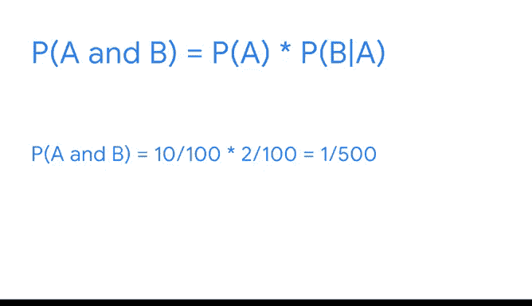

# 017：条件概率 📊

在本节课中，我们将学习条件概率。条件概率用于计算在另一个事件已经发生的情况下，某个事件发生的概率。这对于理解事件之间的依赖关系至关重要，并在金融、保险、科学和机器学习等领域有广泛应用。

---

## 从独立事件到依赖事件

上一节我们介绍了独立事件的概率计算。本节中我们来看看依赖事件。

两个事件是独立的，如果一个事件的发生不影响另一个事件的结果，例如两次抛硬币。两个事件是依赖的，如果一个事件的发生改变了另一个事件的概率，这意味着第一个事件影响了第二个事件的结果。

以下是依赖事件的例子：

*   访问网站依赖于拥有互联网接入。
*   出国旅行依赖于持有护照。
*   从一副标准扑克牌中抽一张A（事件A），然后从同一副牌中再抽一张A（事件B）。第二次抽到A的概率会因第一次抽走一张牌而改变。

---

## 理解条件概率

条件概率是指在另一个事件（B）已经发生的条件下，某个事件（A）发生的概率。其核心概念可以用以下公式描述：

**公式1：**
`P(A|B) = P(A ∩ B) / P(B)`
其中，`P(A|B)` 表示“在B发生的条件下A发生的概率”，`P(A ∩ B)` 表示“A和B同时发生的概率”。

这个公式也可以从乘法法则推导出来：

**公式2：**
`P(A ∩ B) = P(B) * P(A|B)`

根据已知信息的不同，可以选择使用更便捷的公式形式。

---

## 条件概率计算示例

让我们通过具体例子来应用这些公式。

### 示例1：连续抽到两张A

*   **事件A**：第一次抽到A。概率 `P(A) = 4/52`。
*   **事件B|A**：在第一次抽到A的条件下，第二次抽到A。此时牌堆剩51张牌，其中3张A，所以 `P(B|A) = 3/51`。

计算连续抽到两张A的概率，即 `P(A ∩ B)`：
`P(A ∩ B) = P(A) * P(B|A) = (4/52) * (3/51) = 1/221 ≈ 0.5%`

### 示例2：大学录取与奖学金

*   **事件A**：被大学录取。概率 `P(A) = 10/100`。
*   **事件B|A**：在被录取的条件下，获得奖学金。概率 `P(B|A) = 2/100`。

计算被录取且获得奖学金的概率，即 `P(A ∩ B)`：
`P(A ∩ B) = P(A) * P(B|A) = (10/100) * (2/100) = 1/500 = 0.2%`

---

## 条件概率的应用

条件概率帮助我们更好地理解依赖事件之间的关系。作为数据专业人士，我经常使用条件概率来预测诸如广告活动等事件将如何影响销售收入。随后，我会将分析结果分享给利益相关者，以支持他们做出更明智的商业决策。

---

## 本节总结

本节课中我们一起学习了条件概率。我们明确了依赖事件与独立事件的区别，掌握了条件概率的核心公式，并通过扑克牌和大学申请两个实例演练了计算过程。理解条件概率是分析事件间关联、进行精准预测的重要基础。