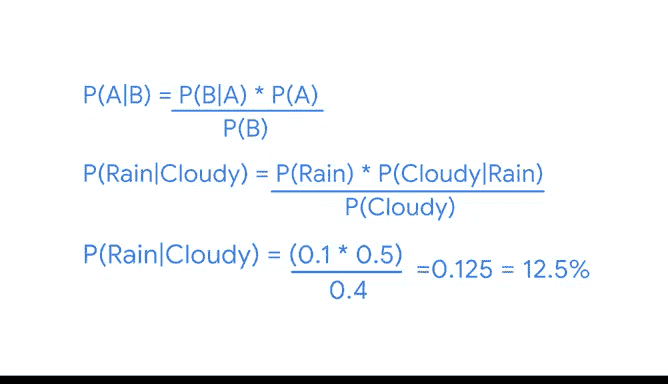

# 018：探索贝叶斯定理 📊

在本节课中，我们将学习**贝叶斯定理**。贝叶斯定理是一个用于计算**条件概率**的数学公式，它允许我们根据新信息来更新对事件发生概率的估计。这是现代数据分析，特别是贝叶斯统计推断中的核心工具。

---

## 什么是条件概率？

上一节我们介绍了概率的基本概念，本节中我们来看看**条件概率**。

条件概率指的是在已知另一个事件已经发生的情况下，某个事件发生的概率。例如，从一副扑克牌中抽出一张A后，再抽出一张A的概率就发生了变化。

---

## 贝叶斯定理简介

理解了条件概率后，我们正式引入**贝叶斯定理**。

贝叶斯定理，也称为贝叶斯法则，是一个用于确定条件概率的数学公式。它以18世纪英国数学家托马斯·贝叶斯命名。该定理提供了一种方法，可以根据事件的新信息来更新该事件的概率。

在贝叶斯统计中：
*   **先验概率**：指在收集新数据**之前**，事件发生的概率。
*   **后验概率**：指在获得新数据**之后**，更新的事件发生概率。“后验”意为“发生在之后”。后验概率是通过使用贝叶斯定理更新先验概率计算得出的。

例如，假设某种医疗状况与年龄相关。你可以使用贝叶斯定理，根据年龄更准确地判断一个人患有该状况的概率。先验概率是“一个人患有该状况”的概率；后验概率则是“如果一个人处于某个特定年龄组，他患有该状况”的概率。

---

## 贝叶斯定理的应用领域

贝叶斯定理是**贝叶斯统计**（也称为**贝叶斯推断**）领域的基础，是现代数据分析中用于分析和解释数据的强大方法。

以下是贝叶斯定理在各领域的应用实例：
*   **金融**：金融机构使用贝叶斯分析来评估贷款风险或预测投资成功概率。
*   **电子商务**：在线零售商使用贝叶斯算法预测用户是否会喜欢某些产品和服务。
*   **市场营销**：营销人员依赖贝叶斯定理从客户反馈中识别积极或消极的回应。

---

## 贝叶斯定理公式

现在，让我们来看看定理本身。请记住，无需死记硬背，重点是理解其逻辑。

贝叶斯定理指出，对于任意两个事件A和B，事件A在事件B发生的条件下发生的概率，等于事件A的概率乘以事件B在事件A发生的条件下的概率，再除以事件B的概率。

用数学公式表示为：

**P(A|B) = [P(A) * P(B|A)] / P(B)**

其中：
*   **P(A)** 是先验概率，即事件A发生的概率。
*   **P(A|B)** 是后验概率，即我们最终想求的、在事件B发生条件下事件A发生的概率。
*   **P(B|A)** 是在事件A发生条件下事件B发生的概率。
*   **P(B)** 是事件B发生的概率。

贝叶斯定理的关键在于，它同时包含了 **P(B|A)** 和 **P(A|B)** 这两个条件概率。如果你知道其中一个，贝叶斯定理可以帮助你确定另一个。

---

## 实例解析：户外派对的天气决策

为了更直观地理解，我们来看一个具体例子。

假设你正在策划一个大型户外活动，例如毕业派对，活动的成功依赖于好天气。在活动当天早上，你发现天空多云。你想知道在早晨多云的情况下，下雨的概率有多大。如果下雨概率高，你可能决定将活动移至室内或取消。

你掌握以下信息：
1.  在这个季节，总体下雨概率是 **10%**。
2.  早晨多云很常见，**40%** 的日子以多云开始。
3.  在所有下雨的日子中，有 **50%** 是以多云早晨开始的。

在这个例子中：
*   **先验概率 P(A)**：是总体下雨概率，即 **10%**。
*   **新数据 (事件B)**：早晨是“多云”的。
*   **后验概率 P(A|B)**：我们最终想求的是在“多云”条件下“下雨”的概率。

我们可以使用贝叶斯定理，根据“早晨多云”这一新数据来更新下雨的先验概率。

**步骤分解：**
1.  定义事件：
    *   事件 A：下雨。
    *   事件 B：早晨多云。
2.  代入已知数值：
    *   P(A) = 下雨概率 = 0.1
    *   P(B) = 早晨多云概率 = 0.4
    *   P(B|A) = 在下雨条件下早晨多云的概率 = 0.5
3.  套用贝叶斯公式计算 P(A|B)：
    P(下雨 | 多云) = [P(下雨) * P(多云 | 下雨)] / P(多云)
    = (0.1 * 0.5) / 0.4
    = 0.05 / 0.4
    = 0.125 或 **12.5%**

计算结果，在早晨多云的情况下，今天下雨的概率是 **12.5%**。这就是你的后验概率，即根据新数据更新后的概率。概率仍然对你有利，因此你可以决定继续举行户外派对。

---

## 总结

本节课中我们一起学习了**贝叶斯定理**。我们了解到：
1.  贝叶斯定理是一个基于新信息（证据）来更新事件发生概率的数学工具。
2.  它涉及**先验概率**（更新前）和**后验概率**（更新后）的概念。
3.  其核心公式为：**P(A|B) = [P(A) * P(B|A)] / P(B)**。
4.  贝叶斯定理在金融、电商、医疗等多个领域有广泛应用。
5.  通过一个“户外派对天气决策”的实例，我们一步步演示了如何应用贝叶斯定理解决实际问题。

掌握贝叶斯定理，能帮助你在数据分析中更灵活、更动态地根据证据调整预测和判断。