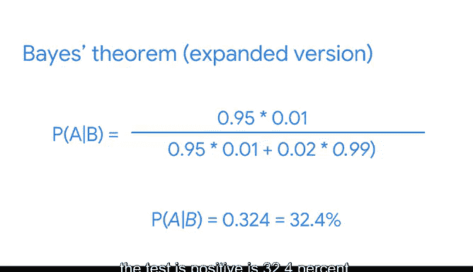

# 019：贝叶斯定理的扩展版本 🧮

在本节课中，我们将学习贝叶斯定理的扩展版本，并了解如何利用它来评估测试的准确性。

你已经了解到，贝叶斯定理描述了如何根据事件的新数据来更新该事件的概率。但贝叶斯定理存在多个不同的版本。它们以不同的方式书写，并用于解决不同类型的问题。

上一节我们介绍了贝叶斯定理的基本形式，本节中我们来看看它的一个扩展版本。

## 扩展版贝叶斯定理公式 📝

贝叶斯定理的扩展版本公式较长。如果你不是经验丰富的统计学家，它可能看起来相当令人生畏。你无需担心记忆这个公式，重要的是了解在某些情况下，扩展版本比基本版本更适用。

该定理表述如下：

**P(A|B) = [P(B|A) * P(A)] / [P(B|A) * P(A) + P(B|¬A) * P(¬A)]**

你可以使用贝叶斯定理的两个版本来处理不同类型的问题。例如，有时你不知道事件B的概率，而事件B的概率是基本贝叶斯定理公式分母的一部分。在这种情况下，你可以使用贝叶斯定理的扩展版本，因为使用扩展版本时你不需要知道事件B的概率。

## 扩展定理的应用场景：测试评估 🔬

这个更长的贝叶斯定理版本通常用于评估测试，例如医学诊断测试、质量控制测试或软件测试（如垃圾邮件过滤器）。在评估测试的准确性时，贝叶斯定理可以考虑测试错误的概率，即假阳性和假阴性。

以下是相关概念的定义：
*   **假阳性**：指测试结果表明某物存在，但实际上并不存在的结果。例如，垃圾邮件过滤器可能错误地将合法电子邮件识别为垃圾邮件。假阳性通常指医学测试，但也适用于软件测试等其他领域。例如，防病毒软件可能指示某个计算机文件是病毒，即使该文件是正常的。
*   **假阴性**：指测试结果表明某物不存在，但实际上存在的结果。例如，垃圾邮件过滤器可能错误地将垃圾邮件识别为合法邮件。假阴性也适用于制造业中的各种测试。例如，质量控制测试可能错误地将有缺陷的部件识别为合格部件。

接下来，让我们通过一个详细的例子来探索如何使用扩展版贝叶斯定理来评估测试。

## 实例分析：花生过敏诊断测试 🥜

假设你想评估一项检查花生过敏存在的诊断测试的准确性。

已知条件如下：
*   假设有1%的人口对花生过敏。
*   根据历史数据，如果一个人过敏，测试呈阳性的概率为95%。
*   如果一个人不过敏，测试仍有2%的概率呈阳性。这是一个假阳性，因为这是对实际不过敏的人得出的阳性结果。

你想知道的是：**在一个人测试呈阳性的条件下，他实际上过敏的几率是多少？**

你也可以从先验概率和后验概率的角度来思考这种情况。你从一个先验概率开始，即一个人过敏的概率为1%。然后，你将根据测试结果（真阳性和假阳性的概率）的新数据来更新这个先验概率。最终，你想找出在测试呈阳性的条件下过敏存在的后验概率。

这种情况涉及两个主要事件：
1.  实际上过敏（事件A）。
2.  测试呈阳性（事件B）。

请记住，这两个事件是不同的，因为你可能测试呈阳性但并不过敏，这就是假阳性。

现在，让我们回顾一下已知信息：
*   一个人实际过敏的概率是1%。所以 **P(A) = 1%**。
*   如果一个人过敏，测试呈阳性的概率是95%。这是一个条件概率：在过敏存在的条件下测试呈阳性的概率。所以 **P(B|A) = 95%**。
*   假阳性结果：在过敏不存在的条件下测试呈阳性的概率是2%。这是另一个条件概率：**P(B|¬A) = 2%**。
*   最后，利用补集规则，你还可以计算出一个概率：不过敏的概率。补集规则指出，事件A不发生的概率等于1减去事件A发生的概率。所以，如果 **P(A) = 1% 或 0.01**，那么不过敏的概率 **P(¬A) = 1 - 0.01 = 0.99 或 99%**。

这些是你已知的概率。**你不知道的是事件B的概率，即一个人获得阳性测试结果的概率 P(B)**。这正是你使用基本版贝叶斯定理会遇到困难的地方，因为事件B的概率是公式的一部分。相反，你可以使用扩展版本，因为该公式不需要知道事件B的概率。

## 代入公式计算 🧮

现在，你可以将已知信息代入扩展版贝叶斯定理公式：
*   P(A) = 0.01
*   P(¬A) = 0.99
*   P(B|A) = 0.95
*   P(B|¬A) = 0.02

计算过程如下：
P(A|B) = (0.95 * 0.01) / (0.95 * 0.01 + 0.02 * 0.99)
P(A|B) = 0.0095 / (0.0095 + 0.0198)
P(A|B) = 0.0095 / 0.0293
P(A|B) ≈ 0.324 或 32.4%

所以，**P(A|B)**，即在测试呈阳性的条件下过敏存在的概率，约为 **32.4%**。

如果32.4%这个数字看起来很低，那是因为过敏本身就很罕见。一个随机的人既测试呈阳性又真正过敏的可能性并不大。贝叶斯定理的扩展版本通过考虑多个概率，让你对测试的准确性有了更好的理解。

## 总结 📋

本节课中我们一起学习了贝叶斯定理的扩展版本。我们了解到，当缺乏事件B的直接概率时，可以使用这个扩展公式。我们通过一个花生过敏诊断测试的例子，演示了如何应用该公式计算后验概率，并理解了假阳性和假阴性在评估测试准确性中的重要性。扩展版贝叶斯定理为我们提供了一种更全面的工具，用于在现实世界的不确定性中做出更明智的判断。