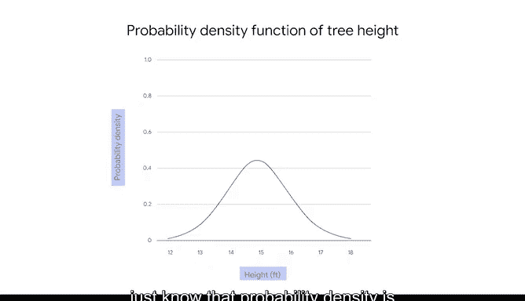

# 020：《统计的力量》课程笔记 📊

## 课程概述

在本节课中，我们将要学习概率分布的核心概念。我们将探讨随机变量的两种类型，并学习如何用概率分布来描述随机事件的可能结果。理解这些基础知识对于后续学习更复杂的统计模型至关重要。

---

## 随机变量：离散与连续

上一节我们介绍了基础概率，本节中我们来看看概率分布的核心描述对象——随机变量。

随机变量代表随机事件可能结果的值。随机变量主要分为两种类型：离散型和连续型。

以下是两种随机变量的主要区别：

*   **离散型随机变量**：拥有可数个可能值。通常，离散变量是可以计数的整数。
    *   例如，掷骰子五次，你可以数出数字“2”出现的次数。
    *   例如，抛硬币五次，你可以数出正面朝上的次数。

*   **连续型随机变量**：在某个数字范围内取所有可能的值。连续变量处理的是小数值，而非整数。
    *   例如，1到2之间的所有小数值，如1.1、1.12、1.125等。这些值是不可数的，因为1和2之间可能存在的小数位数没有限制。
    *   通常，这些是可以测量的十进制值，如身高、体重、时间或温度。例如，测量一个人的身高，你可以不断提高测量精度：70.2英寸、70.23英寸、70.237英寸等。可能值的数量是无限的。

为了帮助区分这两种类型，你可以使用以下通用准则：

*   如果可以**计数**结果的数量，你处理的是**离散型随机变量**。例如，计数硬币正面朝上的次数。
*   如果可以**测量**结果，你处理的是**连续型随机变量**。例如，测量一个人跑完马拉松所需的时间。

---

## 概率分布简介

现在我们已经探讨了随机变量，让我们回到概率分布的主题，它描述了随机变量每个可能值的概率。

离散分布代表离散型随机变量，连续分布代表连续型随机变量。一旦知道了随机变量的样本空间，你就可以为每个可能值分配概率。

在统计学中，你可以使用术语“样本空间”来描述随机变量所有可能值的集合。

*   例如，单次抛硬币是一个具有两个可能值的随机变量：正面和反面。所以样本空间是 {正面， 反面}。
*   例如，掷一个六面骰子，你有一个具有六个可能值的随机变量，样本空间为 {1, 2, 3, 4, 5, 6}。

---

## 离散概率分布示例

让我们看一个离散概率分布的例子。以熟悉的随机事件——单次掷骰子为例。

单次掷骰子的样本空间是 {1, 2, 3, 4, 5, 6}。每个结果的概率相同，都是六分之一，或约16.7%。

你可以将离散概率分布显示为表格或图形。

分布表总结了每个可能结果的概率。顶行列出了骰子掷出的每个结果，底行列出了相应的概率。

条形图（或直方图）以不同的形式显示了相同的概率分布。对于离散概率分布，随机变量沿x轴绘制，相应的概率沿y轴绘制。

在本例中，x轴代表单次掷骰子的每个可能结果（1到6），y轴代表每个结果的概率。

---

## 连续概率分布

连续概率分布及其图形的工作方式与离散分布略有不同。这是由于离散型和连续型随机变量之间的差异造成的。

离散型随机变量的概率分布可以告诉你变量每个可能值的精确概率。例如，掷骰子得到3的概率是六分之一，约16.7%。

连续型随机变量的概率分布只能告诉你变量取某个值**范围**的概率。

让我们看一个例子来了解更多。连续型随机变量可能具有无限数量的可能值。

假设你想测量从附近森林中随机挑选的一棵橡树的高度。在这个例子中，树的高度是一个连续型随机变量。树的高度可能是，比如说，15英尺，或15.2英尺，或15.2187英尺，等等。你可以无限地继续为测量值添加另一个小数位。

现在，假设你想知道橡树的高度**恰好**是15.2英尺的概率。因为树的高度可以是15英尺到16英尺之间范围内的任何小数值，所以树的高度恰好是任何一个特定值的概率基本上为零。

在这个例子中，你需要使用连续概率分布来告诉你橡树高度在某个**范围或区间**内的概率，例如在15英尺到16英尺之间。任何特定值的概率为0，因此只讨论**区间**的概率才有意义。

在图表上用曲线显示值范围或区间的概率是一种便捷的方式。连续分布表现为曲线。你可能听说过钟形曲线，它指的是称为正态分布的连续分布的图形。

在曲线上，x轴代表你正在测量的变量值（本例中是橡树高度），y轴代表称为**概率密度**的东西。这是一个处理区间值的数学函数。你现在不需要专注于数学细节，只需知道概率密度与概率不是一回事。

---

## 课程总结

本节课中我们一起学习了概率分布的基础知识。我们定义了随机变量，区分了离散型与连续型随机变量，并通过掷骰子和测量树高的例子，了解了两种类型概率分布的表现形式及其核心差异。概率分布是建模和分析数据模式的强大工具，掌握这些概念是理解更高级统计方法的关键。

关于概率分布以及它们如何帮助你建模不同类型的数据，还有很多需要学习。这些主题比较复杂，所以欢迎你随时重看视频以巩固这部分内容。