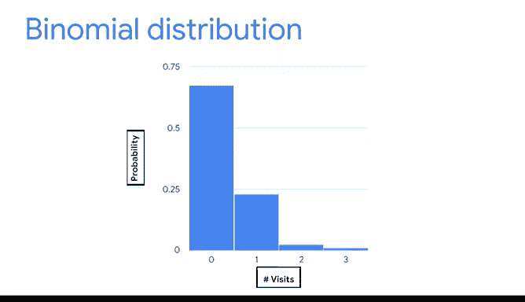

# 021：二项分布 📊

## 概述

在本节课中，我们将要学习一种在数据分析中极为重要的离散概率分布——二项分布。二项分布专门用于描述只有两种可能结果（例如成功或失败）的重复性独立事件。掌握它，能帮助我们更好地理解和预测现实世界中许多二元决策事件的结果。

---

## 从离散分布到二项分布

上一节我们介绍了离散概率分布，它用于描述像抛硬币或掷骰子这类结果是可数的随机事件。例如，抛10次硬币得到正面的次数。

本节中，我们来看看其中最常用的一种离散分布：二项分布。二项分布是一种**离散分布**，它专门为那些只有两种可能结果（成功或失败）的事件建模。该定义基于两个核心假设：每个事件是**独立**的（即一个事件的结果不影响其他事件的概率），并且每次试验的**成功概率**是相同的。

例如，连续抛同一枚硬币10次就符合二项分布的条件。请注意，“成功”和“失败”只是为了分析方便而贴的标签。在抛硬币的例子中，结果只有正面或反面。你可以根据分析需要，将其中任意一个结果定义为“成功”。无论你如何定义，关键是要知道这两个结果必须是**互斥**的。

作为快速回顾，如果两个结果不能同时发生，它们就是互斥的。在一次抛硬币中，你不可能同时得到正面和反面，只能是其中之一。

---

## 二项分布的应用领域

数据专家在不同领域使用二项分布来建模数据，例如医学、银行、投资和机器学习。

以下是几个具体应用场景：
*   在医学中，用于模拟新药产生副作用的概率。
*   在金融风控中，用于判断一笔信用卡交易是否为欺诈。
*   在投资中，用于模拟股票价格上涨或下跌的概率。
*   在机器学习中，二项分布常用于数据分类。例如，数据专家可以训练一个算法来判断一张动物的数字图片是否是猫。

---

## 认识二项实验

二项分布所代表的随机事件类型被称为**二项实验**。

二项实验是一种随机实验。你可能还记得，随机实验是一个其结果无法被确定预测的过程。所有随机实验都有三个共同点：实验可以有多个可能结果；每个可能结果都可以预先表示；实验结果取决于机会。

而一个二项实验则具有以下特定属性：
*   实验由一系列重复的试验组成。
*   每次试验只有两种可能的结果。
*   每次试验的成功概率相同。
*   每次试验都是独立的。

让我们用一个例子来理解这些属性。连续抛硬币10次就是一个二项实验，因为它具备以下特征：
*   实验由10次重复试验（即抛掷）组成。
*   每次试验只有两种结果：正面或反面。
*   每次试验的成功概率相同。如果你定义“成功”为正面，那么每次抛掷的成功概率都是相同的50%。
*   每次试验是独立的。一次抛掷的结果不会影响任何其他抛掷的结果。

---

## 另一个二项实验的例子

让我们看看另一个例子，以巩固理解。假设你想知道某一天有多少顾客向百货商店退货。

假设每天有100名顾客光顾商店，并且所有顾客中有10%会退货。你将“退货”标记为“成功”。这是一个二项实验，原因如下：
*   有100次重复试验（即顾客访问）。
*   每次试验只有两种可能结果：退货或不退货。
*   每次试验的成功概率相同。如果将退货视为成功，那么每位顾客访问的成功概率都是相同的10%。
*   每次试验是独立的。一位顾客的访问结果不会影响其他任何顾客的访问结果。

理解二项实验的特征至关重要，因为**二项分布只能为这类事件的数据建模**。如果你处理的是不同类型事件的数据，就需要使用其他类型的概率分布（例如泊松分布）来建模。

---

## 二项分布公式与计算

一旦你确定你的数据分布是二项的，就可以应用二项分布公式来计算概率。你无需记忆公式，可以用计算机进行计算。如果你想深入了解，可以查阅相关阅读材料。

简而言之，二项分布公式帮助你确定在特定次数的试验中，获得特定次数成功结果的概率。例如，在特定次数的抛硬币中得到特定次数正面的概率。

公式如下：
`P(X = k) = C(n, k) * p^k * (1-p)^(n-k)`

在这个公式中：
*   `k` 指成功的次数。
*   `n` 指试验的总次数。
*   `p` 指单次试验的成功概率。
*   `C(n, k)`（也写作 `n choose k`）指在 `n` 次试验中获得 `k` 次成功有多少种不同的组合方式。

---

## 实例解析：商店退货概率

让我们用商店的例子来更好地理解公式如何工作。这次，假设所有顾客中有10%会退货，并且有三位顾客访问了商店。你仍将退货标记为成功。

你可以使用公式来确定在这三位顾客中，获得0、1、2和3次退货的概率。在计算中，`x` 指退货的次数。

我们跳过计算步骤，直接看结果：
*   当 `x = 0`（0次退货）的概率是 **0.729**。
*   当 `x = 1`（1次退货）的概率是 **0.243**。
*   当 `x = 2`（2次退货）的概率是 **0.027**。
*   当 `x = 3`（3次退货）的概率是 **0.001**。

---

## 可视化二项分布

然后，你可以使用直方图来可视化这个概率分布。对于像二项分布这样的离散概率分布，随机变量（这里是退货次数）绘制在x轴上，对应的概率绘制在y轴上。

在本例中，x轴显示每小时退货次数：0、1、2、3。y轴显示获得该结果的概率。

---

## 总结

本节课中，我们一起学习了二项分布。二项分布让你能够为只有两种可能结果（成功或失败）的事件建模概率。识别数据的分布是任何分析中的关键一步，它能帮助你基于数据对未来结果做出更明智的预测。