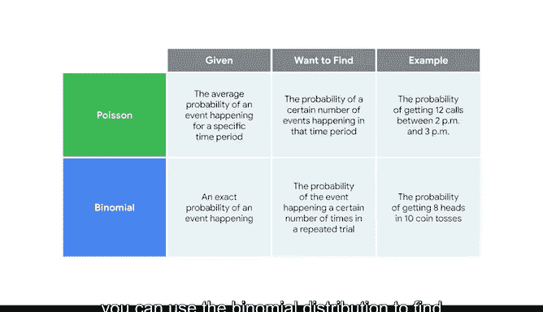

# 022：泊松分布 📊

在本节课中，我们将要学习泊松分布。泊松分布是一种重要的离散概率分布，它用于描述在固定时间或空间内，事件发生次数的概率。掌握泊松分布能帮助我们更好地理解和预测现实世界中的随机事件，例如网站访问量、客服电话数量等。

---

## 概率分布的重要性

作为数据专业人士，了解概率分布非常有用，因为不同类型的分布能帮助你为不同类型的数据建模。

每次处理新数据集时，我都会尝试理解数据分布中是否存在某种模式。

了解数据的概率分布也有助于我选择效果最佳的机器学习模型。

这样，我就能在更短的时间内获得更好的结果。

数据专业人士会用到许多不同类型的概率分布。

随着你在职业生涯中不断进步和学习，你可以探索不同的分布，并发现它们如何应用于你的工作。

---

## 离散概率分布：二项分布与泊松分布

在本课程的这个部分，我们将重点介绍两种最常见的离散概率分布：二项分布和泊松分布。

上一节我们介绍了二项分布，它描述了每次试验只有两种可能结果（成功或失败）的重复实验。

本节中，我们来看看泊松分布的主要特征。

泊松分布是一种概率分布，它模拟在特定时间段内发生一定数量事件的概率。

泊松分布也可用于表示在特定空间（如距离、面积或体积）内发生的事件数量。但在本课程中，我们将重点关注时间。

---

## 泊松分布的起源与应用

泊松分布最初由法国数学家西莫恩·德尼·泊松于1830年推导出来。他开发这个分布是为了描述赌徒在大量尝试中赢得一个困难机会游戏的次数。

数据专业人士使用泊松分布来为以下类型的数据建模：
*   客服呼叫中心每小时预期的电话数量。
*   网站每小时的访问者数量。
*   餐厅每天的顾客数量。
*   城市每月发生的严重风暴次数。

---

## 泊松实验的特征

泊松分布代表一种称为泊松实验的随机实验。泊松实验具有以下属性：

以下是泊松实验的三个关键属性：
1.  实验中的事件数量是可数的。
2.  已知在特定时间段内发生的平均事件数。
3.  每个事件都是独立的。

让我们探索一个例子。

假设你是一名数据专业人士，为一家大型快餐连锁店工作。

你知道一家餐厅的得来速服务平均每分钟收到两份订单。

你想确定餐厅在给定一分钟内收到特定数量订单的概率。

这是一个泊松实验，因为：
*   实验中的事件数量是可数的：你可以计算订单数量。
*   已知在特定时间段内发生的平均事件数：平均每分钟两份订单。
*   每个结果都是独立的：一个人下单的概率不影响另一个人下单的概率。

---

## 泊松分布公式

一旦确定你正在处理泊松分布，就可以应用泊松分布公式来计算概率。

简而言之，该公式帮助你确定在特定时间段内发生一定数量事件的概率。

泊松概率质量函数公式为：
`P(X = k) = (λ^k * e^(-λ)) / k!`

在这个公式中：
*   **λ** 是希腊字母 Lambda，指在特定时间段内发生的平均事件数。
*   **k** 指事件的数量。
*   **e** 是一个常数，约等于 **2.71828**。
*   **!** 代表阶乘。这是一个函数，将一个数乘以它以下的所有正整数直到1。例如，`2! = 2 * 1`。

---

## 公式应用示例

让我们继续使用我们的连锁餐厅例子，以更好地理解公式的工作原理。

回顾一下，餐厅的得来速服务平均每分钟收到两份订单。你可以使用泊松公式来确定餐厅在给定一分钟内收到0、1、2或3份订单的概率。

了解这些信息可能有助于餐厅为得来速服务安排人员配置。

我将跳过计算过程，直接给出结果：
*   当 `X = 0` 份订单时，概率 `P ≈ 0.1353`。
*   当 `X = 1` 份订单时，概率 `P ≈ 0.2707`。
*   当 `X = 2` 份订单时，概率 `P ≈ 0.2707`。
*   当 `X = 3` 份订单时，概率 `P ≈ 0.1805`。

然后，你可以使用直方图来可视化概率分布。
*   X轴显示事件数量，本例中是每分钟订单数。
*   Y轴显示发生概率。

例如：
*   一分钟内收到零份订单的概率约为 **0.1353** 或 **13.53%**。
*   收到一份订单的概率是 **0.2707** 或 **27.07%**。
*   收到两份订单的概率也是 **0.2707** 或 **27.07%**。
*   收到三份订单的概率是 **0.1805** 或 **18.05%**。

---

## 二项分布与泊松分布的比较

在结束之前，让我们比较一下你最近学到的两种离散概率分布：二项分布和泊松分布。

有时，弄清楚应该使用二项分布还是泊松分布可能具有挑战性。为了帮助你在两者之间做出选择，你可以使用以下一般准则：

以下是选择分布类型的关键依据：
*   **使用泊松分布**：如果你已知事件在特定时间段内的平均发生概率，并且你想找出在该时间段内发生一定数量事件的概率。
    *   *例如*：如果一个呼叫中心平均每小时接到10个客服电话，你可以使用泊松分布来找出在下午2点到3点之间接到12个电话的概率。
*   **使用二项分布**：如果你已知事件发生的确切概率，并且你想找出该事件在重复试验中发生一定次数的概率。
    *   *例如*：如果任何一次抛硬币得到正面的概率是50%，你可以使用二项分布来找出在10次抛硬币中得到8次正面的概率。

---

## 总结

本节课中，我们一起学习了泊松分布。我们了解了它的定义、起源、应用场景以及核心公式 `P(X = k) = (λ^k * e^(-λ)) / k!`。通过餐厅订单的例子，我们看到了如何计算和解释泊松概率。最后，我们比较了泊松分布与二项分布，明确了它们各自的使用场景。

在你未来作为数据专业人士的职业生涯中，你将使用像二项分布和泊松分布这样的离散分布来更好地理解你的数据，并对未来结果做出明智的预测。