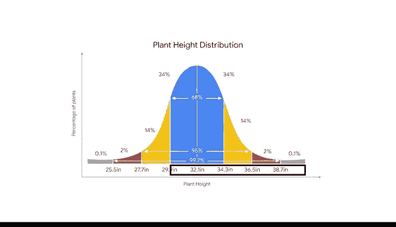

# 023：正态分布 📊

在本节课中，我们将学习统计学中最重要的概率分布之一：正态分布。我们将从离散分布过渡到连续分布，详细介绍正态分布的特征、图形表示以及其核心应用——经验法则。通过具体的例子，你将理解如何在实际数据分析中运用正态分布。

---

## 从离散分布到连续分布

上一节我们讨论了离散概率分布，其结果是可数的整数，例如掷骰子的点数。本节中，我们来看看连续概率分布。

连续概率分布处理的结果可以在一个数字范围内取任意值，通常是可测量的十进制数值，如身高、体重、时间或温度。例如，时间可以不断被更精确地测量：1.1秒、1.12秒、1.1257秒等。

在本视频中，我们将探讨统计学中应用最广泛的概率分布：正态分布。

---

## 什么是正态分布？🔔

正态分布是一种连续概率分布，它在均值两侧对称，呈钟形。

正态分布常被称为“钟形曲线”，因为其图形中心有一个峰值，两侧向下倾斜。它也被称为高斯分布，以德国数学家卡尔·高斯命名，他首次描述了该分布的公式。

如果你想了解更多关于这个公式的细节，请查阅相关阅读材料。

正态分布是统计学中最常见的概率分布，因为许多不同类型的数据集都呈现出钟形曲线。例如，如果你随机抽样100人，对于身高、体重、血压、智商分数、薪资等连续变量，你都会发现正态分布曲线。

以标准化考试成绩为例。大多数人的分数接近平均分或均值。分数低于或高于平均分的人数较少，且离均值越远，人数越少。分数极高或极低、远离均值的人只占很小比例。这种分数分布就形成了钟形曲线。

大多数数据值相对接近均值。一个值离均值越远，在正态曲线上出现的可能性就越低。X轴代表你测量的变量值，Y轴代表你观察到该值的可能性。在考试成绩的例子中，X轴是原始分数，Y轴是获得该分数的人口百分比。

数据专业人士使用正态分布来模拟商业、科学、政府、机器学习等领域的各种数据集。理解正态分布对于更高级的统计方法（如假设检验和回归分析）也很重要，这些你将在后续课程中学习。此外，许多机器学习算法都假设数据是正态分布的。

---

## 正态分布的特征

所有正态分布都具有以下特征：
*   形状呈钟形曲线。
*   均值位于曲线的中心。
*   曲线在中心两侧对称。
*   曲线下的总面积等于1。

为了阐明正态分布的特征，让我们绘制蜜脆苹果重量的图表。假设蜜脆苹果的重量近似服从正态分布，均值为100克，标准差为15克。

首先，在曲线中心找到均值。这也是曲线的最高点或峰值。这个数据点代表了数据集中最可能的结果：平均重量100克。

其次，注意曲线在均值两侧对称。50%的数据在均值以上，50%在均值以下。

第三，一个点离均值越远，这些结果出现的概率就越低。离均值最远的点代表了数据集中最不可能出现的结果，即重量极低或极高的苹果。

最后，曲线下的面积等于1。这意味着曲线下的面积占分布中所有可能结果的100%。

---

## 标准差与正态分布

在正态分布上，数据点与均值的距离通常用标准差来衡量。回顾一下，标准差计算的是数据点与数据均值的典型距离。均值代表数据的中心，而标准差衡量的是数据的离散程度。标准差越大，数据值相对于均值就越分散。

在我们的苹果例子中，平均重量是100克，标准差是15克。
*   一个位于均值以上一个标准差的苹果重115克（即100克 + 15克）。
*   一个位于均值以下一个标准差的苹果重85克（即100克 - 15克）。
*   一个位于均值以上两个标准差的苹果重130克。
*   一个位于均值以下两个标准差的苹果重70克。

---

## 经验法则 📏

正态曲线上的值根据其与均值的距离以规则模式分布。这被称为经验法则。

它指出，对于一个给定的正态分布数据集：
*   **68%** 的值落在均值的一个标准差范围内。
*   **95%** 的值落在均值的两个标准差范围内。
*   **99.7%** 的值落在均值的三个标准差范围内。

经验法则可以让你清楚地了解数据集中值的分布情况，这有助于你节省时间并更好地理解数据。

让我们继续苹果的例子。经验法则告诉你，大多数苹果（68%）的重量会落在平均重量100克的一个标准差范围内。这意味着68%的苹果重量在85克（均值以下一个标准差）到115克（均值以上一个标准差）之间。

95%的苹果重量在70克到130克之间，即在均值的两个标准差范围内。

几乎所有的苹果（99.7%）重量在55克到145克之间，即在均值的三个标准差范围内。

---

## 经验法则的应用

经验法则对于估计数据非常有用，特别是对于像整个人口的身高和体重这样的大型数据集。你可以使用经验法则来初步估计数据集中值的分布，例如有多少百分比的值会落在均值1个、2个或3个标准差范围内。这可以节省时间并帮助你更好地理解数据。

此外，了解值在正态分布上的位置对于检测异常值很有用。回顾一下，异常值是与其余数据显著不同的值。通常，数据专业人士认为位于均值三个标准差以上或以下的值是异常值。识别异常值很重要，因为一些极端值可能是由于数据收集或数据处理中的错误造成的，这些错误值可能会扭曲你的分析结果。

让我们探索另一个例子，看看经验法则如何帮助你更好地理解数据。

假设你有一个花园，植物的高度服从正态分布，均值为32.1英寸，标准差为2.2英寸。假设你想找出高度大于29.9英寸的植物占多少百分比，因为你希望植物至少有这么高，作为你后院景观设计计划的一部分。

首先，找出值29.9在分布上的位置。29.9位于均值以下一个标准差处。

经验法则告诉你，68%的值落在均值的一个标准差范围内。这些值中的一半（34%）落在均值以下。

现在，你知道有34%的值在29.9和均值之间，因为29.9是均值以下一个标准差。此外，在正态分布中，所有值的50%落在均值或曲线中心以上。

这两个百分比之和将告诉你大于29.9的值的总百分比。34%加上50%等于84%，所以你的植物中有84%高于29.9英寸。

经验法则帮助你快速理解数据值的整体分布。现在，你知道你的大多数植物都足够高，符合你的景观设计计划。

---

## 总结

本节课中，我们一起学习了统计学中的核心概念——正态分布。我们从离散与连续分布的区别入手，详细介绍了正态分布的钟形特征、对称性以及均值与标准差的作用。我们重点探讨了经验法则，它描述了数据在正态分布中围绕均值的分布规律（68-95-99.7规则），并通过苹果重量和植物高度的例子演示了如何应用该法则来估算数据比例和识别异常值。作为未来的数据专业人士，掌握正态分布将帮助你识别各种数据集中的重要模式，并为学习更高级的统计和机器学习方法奠定坚实基础。