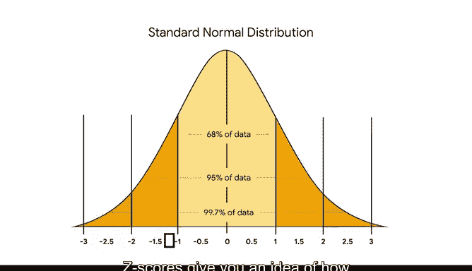

# 024：使用Z分数标准化数据 📊

在本节课中，我们将要学习Z分数的概念及其应用。Z分数是一种统计工具，它能帮助我们比较来自不同类型正态分布数据集中的数值。通过标准化数据，我们可以消除不同数据集之间单位、均值和标准差的差异，从而进行有意义的比较。

## 正态分布与Z分数简介

上一节我们介绍了正态分布及其在多种数据集中的应用。本节中，我们来看看Z分数，以及它如何帮助我们比较不同类型正态分布数据集中的数值。

Z分数衡量的是一个数据点距离总体均值有多少个标准差。它可以帮助我们了解数据点与均值的偏离程度。

*   如果数值等于均值，则Z分数为 **0**。
*   如果数值大于均值，则Z分数为**正数**。
*   如果数值小于均值，则Z分数为**负数**。

## 标准化的意义

Z分数有助于标准化数据。在统计学中，标准化是将不同变量置于同一尺度上的过程。我们稍后会查看其计算公式。

Z分数也被称为标准分数，因为它基于所谓的**标准正态分布**。标准正态分布是一个均值为 **0**、标准差为 **1** 的正态分布。Z分数的范围通常在 **-3** 到 **3** 之间。

标准化非常有用，因为它允许你比较来自不同数据集的分数，这些数据集可能具有不同的单位、均值和标准差。

## Z分数的应用场景

数据专业人员使用Z分数来更好地理解单个数据集内以及不同数据集之间数据值的关系。

以下是Z分数的一个主要应用领域：

*   **异常检测**：用于发现数据集中的异常值。异常检测的应用包括发现金融交易中的欺诈、制造产品中的缺陷、计算机网络中的入侵等。

为了说明其比较价值，假设有三个不同的客户满意度调查，它们使用不同的评分标准：

*   调查A的评分范围为 **1 到 20**。
*   调查B的评分范围为 **500 到 1500**。
*   调查C的评分范围为 **130 到 180**。

如果同一产品在调查A中得分为 **9**，在调查B中得分为 **850**，在调查C中得分为 **142**，这些数字本身意义不大。但如果你知道它们的Z分数都是 **1**（即高于均值一个标准差），你就可以有意义地比较不同调查的评分了。

## 如何解读Z分数

一个数值的Z分数可以按以下方式解读：

*   Z分数为 **1**，表示该数值**高于均值1个标准差**。
*   Z分数为 **1.5**，表示该数值**高于均值1.5个标准差**。
*   Z分数为 **-2.3**，表示该数值**低于均值2.3个标准差**。

## 计算Z分数

你可以使用以下公式计算Z分数：

**z = (x - μ) / σ**

在这个公式中：
*   **x** 代表单个数据值或原始分数。
*   **μ**（希腊字母 mu）代表总体均值。
*   **σ**（希腊字母 sigma）代表总体标准差。

因此，我们也可以说：**z = (原始分数 - 均值) / 标准差**。

### 示例一：标准化测试

假设你参加了一项标准化测试，你的成绩是 **133**。该测试的平均分是 **100**，标准差是 **15**。假设成绩呈正态分布，你可以使用公式计算你的Z分数。

你的Z分数 = (原始分数 133 - 平均分 100) / 标准差 15 = (33) / 15 = **2.2**

Z分数为 **2.2** 表明你的测试成绩比平均分高出 **2.2个标准差**。这是一个非常好的成绩。回想一下经验法则，95%的数值落在均值两侧两个标准差之内。你的成绩 **2.2** 超过了均值以上两个标准差。

### 示例二：课堂考试

现在来看一个不同评分标准的考试。假设你得了 **85** 分，你想知道相对于班上其他同学，这是否是一个好成绩。它是否是好成绩取决于所有考试成绩的均值和标准差。

假设考试成绩呈正态分布，平均分为 **90**，标准差为 **4**。你可以计算原始分数 **85** 的Z分数。

你的Z分数 = (原始分数 85 - 平均分 90) / 标准差 4 = (-5) / 4 = **-1.25**

Z分数为 **-1.25** 表明你的考试成绩 **85** 分比平均分低 **1.25个标准差**。

## 总结与展望

本节课中，我们一起学习了Z分数的核心概念、计算公式及其在数据比较和异常检测中的应用。Z分数通过标准化，为我们提供了一种衡量单个数值在分布中相对位置的强大工具。

作为数据专业人员，你将使用Z分数来更好地理解数据集中特定值之间的关系。在实际工作中，你很可能会使用像Python这样的编程语言在计算机上计算Z分数，这将在后续视频中学习。