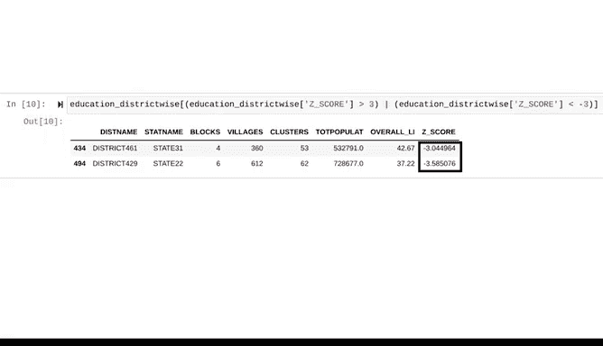

# 025：在Python中使用概率分布 📊


## 概述

在本节课中，我们将学习如何使用Python对数据进行概率分布建模。我们将重点探讨正态分布，并学习如何计算Z分数来识别数据中的异常值。通过本教程，你将掌握利用Python进行数据分布分析和异常值检测的基本技能。

## 准备工作与库导入

上一节我们介绍了数据分析的基本流程。本节中，我们来看看如何用Python实现具体的分布分析。

首先，我们需要导入必要的Python库。这些库将帮助我们进行数据处理、统计计算和可视化。

以下是需要导入的库及其常用缩写：

```python
import numpy as np
import pandas as pd
import matplotlib.pyplot as plt
import statsmodels.api as sm
from scipy import stats
```

*   **NumPy (np)**: 用于数值计算。
*   **Pandas (pd)**: 用于数据处理和分析。
*   **Matplotlib.pyplot (plt)**: 用于数据可视化。
*   **Statsmodels (sm)**: 用于探索数据和执行统计检验。
*   **Scipy.stats (stats)**: SciPy库中的统计模块，提供丰富的统计函数。

## 探索数据分布：绘制直方图

在尝试用概率分布建模数据之前，第一步是可视化数据的形状。这有助于我们判断数据是否近似于某种已知的分布。

我们将使用Matplotlib的直方图功能来可视化地区识字率数据的分布。假设我们的数据存储在名为`df`的Pandas DataFrame中，且识字率数据位于`overall_LI`列。

```python
plt.hist(df['overall_LI'], bins=30, edgecolor='black')
plt.xlabel('Literacy Rate (%)')
plt.ylabel('Number of Districts')
plt.title('Distribution of District Literacy Rates')
plt.show()
```

生成的直方图显示，识字率数据的分布呈钟形，并且关于均值对称。正态分布正是一种连续的概率分布，其形状为钟形且关于均值对称。图中均值（约73%）位于中心位置。因此，正态分布可能是建模此数据的合适选择。

## 验证正态性：经验法则

为了验证数据是否服从正态分布，我们可以使用Python来检查数据是否符合经验法则。

经验法则指出，对于任何正态分布：
*   约68%的值落在均值的一个标准差范围内。
*   约95%的值落在均值的两个标准差范围内。
*   约99.7%的值落在均值的三个标准差范围内。

首先，我们计算数据的均值和标准差。

```python
mean_overall_LI = df['overall_LI'].mean()
std_overall_LI = df['overall_LI'].std()
print(f"Mean Literacy Rate: {mean_overall_LI:.2f}%")
print(f"Standard Deviation: {std_overall_LI:.2f}%")
```

假设计算得到均值约为73.4%，标准差约为10%。如果数据服从正态分布，我们预期大约68%的值会落在63%（73 - 10）到83%（73 + 10）的区间内。

现在，我们计算实际落在该区间内的数据比例。

```python
lower_limit = mean_overall_LI - 1 * std_overall_LI
upper_limit = mean_overall_LI + 1 * std_overall_LI

within_one_std = ((df['overall_LI'] >= lower_limit) & (df['overall_LI'] <= upper_limit)).mean()
print(f"Percentage within one standard deviation: {within_one_std:.3f} or {within_one_std*100:.1f}%")
```

输出显示，约有66.4%的地区识字率落在均值的一个标准差范围内，这与经验法则预测的68%非常接近。

我们可以使用相同的代码结构，通过修改标准差的倍数（2或3），来计算落在两个和三个标准差范围内的数据比例。结果可能显示，约有95.4%的值落在两个标准差内，99.6%的值落在三个标准差内。这些值（66.4%， 95.4%， 99.6%）与经验法则的预测（68%， 95%， 99.7%）高度吻合。至此，我们可以有把握地说，该数据服从正态分布。

## 应用：使用Z分数识别异常值

了解数据服从正态分布对分析非常有用，因为许多统计检验和机器学习模型都假设数据服从正态分布。此外，当数据服从正态分布时，我们可以使用Z分数来衡量值的相对位置并找出异常值。

Z分数表示一个数据点低于或高于总体均值多少个标准差。它有助于我们理解一个值在分布中的位置。例如，仅知道识字率为80%信息有限，但如果知道其Z分数为2，我们就知道该值高于均值两个标准差。

数据专业人员常使用Z分数进行异常值检测。通常，他们将Z分数小于-3或大于3的观测值视为异常值，即那些落在均值三个标准差之外的值。

首先，我们在数据集中创建一个新列`Z_score`，用于存储每个地区识字率的Z分数。

```python
df['Z_score'] = stats.zscore(df['overall_LI'])
```

Python的`stats.zscore`函数会自动完成所有计算。接下来，我们编写代码来识别异常值，即Z分数绝对值大于3的地区。

```python
outliers = df[(df['Z_score'] > 3) | (df['Z_score'] < -3)]
print(outliers[['district_id', 'overall_LI', 'Z_score']])
```



通过Z分数分析，我们可能识别出两个异常地区，例如地区461和地区429。这两个地区的识字率低于总体均值超过三个标准差，意味着它们的识字率异常低。这一分析结果提供了重要信息，政府或许希望向这两个地区提供更多资金和资源，以期显著提高识字率。

## 总结


本节课中，我们一起学习了如何在Python中使用概率分布对数据进行建模。我们首先通过绘制直方图来探索数据形状，然后利用经验法则验证数据是否服从正态分布。最后，我们应用Z分数来识别数据中的异常值。概率分布对于数据建模至关重要，并能帮助我们决定在分析中使用何种统计检验。除了正态分布，Python还能帮助我们处理各种广泛的概率分布。