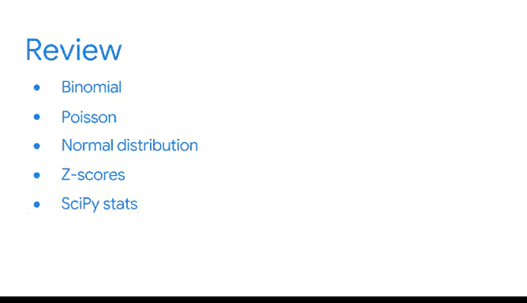

# 026：《统计的力量》课程总结 🎯

在本节课中，我们将对概率论部分的学习内容进行总结。我们回顾了概率的基本概念、规则、概率分布及其在数据科学中的应用。

---

## 概率论的核心概念与应用

你已经完成了概率论的入门学习。你学到了许多重要的概念。做得很好。

在这一过程中，我们探讨了数据专业人员如何利用概率对不确定事件做出合理预测，并帮助个人和组织做出数据驱动的决策。

基础概率是数据科学的基石，它也为更高级的统计方法（如假设检验和回归分析）提供了基础，这些内容你将在后续课程中探索。

在你的数据专业职业生涯中，你将使用**概率分布**来发现数据中的重要模式。此外，掌握概率分布的知识对于机器学习至关重要，而机器学习是现代数据科学的核心工具。

---

## 概率的类型与基本规则

我们首先回顾了两种主要的概率类型：**客观概率**和**主观概率**。数据专业人员使用客观概率来分析和解释数据。

接着，我们回顾了概率的基本规则，例如**补集规则**、**加法规则**和**乘法规则**。

---

## 条件概率与贝叶斯定理

然后，你学习了**条件概率**，它帮助你更好地理解相关事件之间的关系。

我们还讨论了**贝叶斯定理**，它可以根据事件的新数据来更新该事件的概率。

---

## 从基础概率到概率分布

之后，我们从基础概率过渡到**概率分布**。概率分布用于描述随机事件可能结果的可能性，可以是**离散的**或**连续的**。数据专业人员使用概率分布来在复杂数据集中发现有意义的模式。

---

## 离散概率分布

接下来，我们探讨了离散概率分布，例如**二项分布**和**泊松分布**，并发现了它们如何帮助你为不同类型的数据建模。

---

## 连续概率分布

然后，我们转向连续概率分布。我们重点介绍了**正态分布**（或称钟形曲线），这是统计学中使用最广泛的分布。我们还讨论了**Z分数**如何帮助你更好地理解数值与标准正态分布之间的关系。

---

## 实用工具：SciPy Stats 模块

最后，你了解到 **SciPy Stats 模块** 是处理概率分布的一个强大工具。

你使用正态分布为数据建模并获得有用的见解。

---

## 后续安排与复习建议

接下来，你将准备一个分级评估。请查看列出了所有新术语的阅读材料。

在下次见面之前，欢迎随时重温涵盖关键概念的**视频**、**阅读材料**和其他资源。祝你好运。

---

## 总结

本节课中，我们一起学习了概率论的基础知识，包括概率的类型、基本规则、条件概率、贝叶斯定理，以及离散和连续概率分布。我们还了解了这些概念在数据科学和机器学习中的实际应用，并介绍了 SciPy Stats 这一实用工具。掌握这些内容将为你的数据分析之旅奠定坚实的基础。