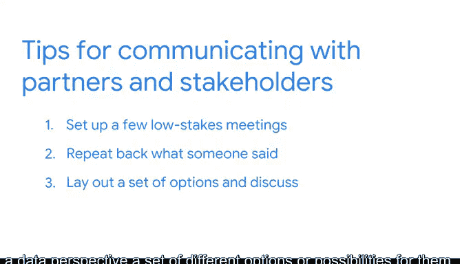

# 028：重视每个人的贡献 👥

在本节课中，我们将学习谷歌员工规划与人力分析负责人Cliff分享的工作方法。他将介绍如何通过数据驱动决策，并强调团队合作与有效沟通在解决复杂问题中的核心作用。

---

我叫Cliff，是谷歌的员工规划与人力分析负责人。我利用数据帮助员工提高工作效率、增强联系，并整体改善他们的福祉。我也使用数据来改进我们的人力资源实践，重点关注混合办公政策以及办公地点策略。

我一直对员工发展、人才战略和人力资源问题感兴趣。但我没有预料到数据分析会在我的工作中扮演如此核心的角色，也没想到自己会如此热爱它。

在这个领域，帮助我建立自信的一个关键认识是：我们是在团队中跨职能工作的。我不需要为问题提供所有解决方案。我会带来关于如何利用数据解决问题的视角，但同时，与我合作的同事也带来了丰富的技能。我将此视为一种伙伴关系，关键在于发挥团队中每个人的最大优势。这种认识为我的工作带来了极大的信心。

---

上一节我们了解了Cliff的背景和工作理念，本节中我们来看看他与合作伙伴沟通的具体策略。

在与合作伙伴沟通时，我的首选策略是首先安排几次非正式的会议，以了解他们更广泛的业务目标。我甚至不会考虑我们正在合作的具体项目，而是更广泛地思考他们如何定义成功。这帮助我理解我们所做的工作如何融入他们更大的蓝图背景中。

从沟通的角度，我做的第二件事是尝试复述我认为我听到的内容。无论是复述我对他们问题的理解，还是他们希望从数据中看到的产出，都是为了测试我是否真正理解了他们的目标。

---

当我们探讨了初步沟通策略后，接下来看看如何深入挖掘问题的核心。

当我与某人合作，并感觉我们没有触及问题或疑问的根源时，我发现一个非常有用的方法是：从数据的角度，为他们列出一系列不同的选项或可能性，并围绕哪些选项真正能引起他们的共鸣展开对话。

因此，这是在倾听与引导之间找到平衡，作为一种方式来激发他们自己可能未曾想到的想法。

---

本节课中我们一起学习了Cliff在数据分析工作中强调团队合作与有效沟通的方法。核心要点包括：认识到团队协作的价值、通过初步会议理解业务全局、通过复述确认理解，以及在遇到瓶颈时通过提供数据选项来引导对话、激发新思路。这些策略共同强调了**重视每个人的贡献**是成功进行数据驱动决策的关键。