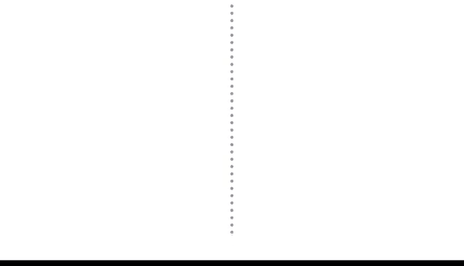

# 030：抽样过程 📊

在本节课中，我们将学习抽样过程的主要阶段。抽样是数据分析的基础，理解抽样过程如何运作，直接影响样本数据的质量。我们将通过一个具体的例子，逐步拆解抽样的五个关键步骤。

---

## 概述

作为数据专业人员，你会经常处理样本数据。这些数据可能来自其他研究者，也可能由你的团队自行收集。无论来源如何，了解抽样过程至关重要，因为它直接决定了样本是否能够代表总体，以及样本是否存在偏差。例如，如果仅基于职业篮球运动员的样本来估计一个国家全体成年人的平均身高，结果必然不准确。

接下来，我们将详细探讨典型抽样过程的五个主要阶段，为你提供一个理解抽样如何实施以及如何影响样本数据的实用框架。

---

## 抽样过程的五个步骤

为了清晰地概述抽样过程，我们将其分为五个步骤。

1.  确定目标总体
2.  选择抽样框
3.  选择抽样方法
4.  确定样本量
5.  收集样本数据

我们将以一项民意调查为例进行说明。假设加拿大温哥华市政府计划修建一个新的地铁系统，并将通过公众投票决定是否推进该项目。市政府希望了解公众对该项目的支持度，因此委托你进行一项民意调查，以估计支持该项目的成年居民比例（法定成年年龄为18岁及以上）。

---

### 第一步：确定目标总体

抽样过程的第一阶段是确定你的**目标总体**。目标总体是你感兴趣并希望深入了解的完整元素集合。

在我们的例子中，目标总体包括该市所有18岁及以上、拥有投票资格的居民。假设该市符合此条件的居民有10万人。

由于对目标总体中的每一个人进行调查既困难又昂贵，你决定抽取一个样本。

---

### 第二步：选择抽样框

抽样过程的下一步是创建**抽样框**。抽样框是你的目标总体中所有个体的列表。本质上，它是你研究感兴趣的所有人或事物的完整名录。

目标总体与抽样框的区别在于：总体是概括性的，而框是具体化的。因此，如果你的目标总体是10万名18岁及以上、有投票资格的市民，那么你的抽样框可能就是一份包含从“Alana Aoki”到“Zoe Zpa”所有这些居民姓名的列表。

然而，由于实际原因，你的抽样框可能无法精确匹配目标总体，因为你可能无法接触到总体中的每一个成员。例如，市政府可能没有每位居民可靠的联系方式，或者并非所有有资格的选民都实际进行了注册登记（而他们的意见对这项由选举决定的地铁项目来说无关紧要）。

由于这些原因，你的抽样框不会与目标总体完全重合。抽样框将包含你能够获取有效信息的、18岁及以上的居民列表。因此，**抽样框是你的目标总体中可触及的部分**。

---

### 第三步：选择抽样方法

接下来，你需要选择抽样方法，这是抽样过程的第三步。选择正确的抽样方法是帮助确保样本具有代表性的关键途径。

抽样方法主要分为两大类：**概率抽样**和**非概率抽样**。在后续课程中，我们将更详细地探讨具体方法。目前，你只需知道：
*   **概率抽样**使用随机选择来生成样本。
*   **非概率抽样**通常基于便利性或研究者的个人偏好，而非随机选择。

由于概率抽样方法基于随机选择，总体中的每个人都有同等机会被选入样本。这为你获得代表性样本提供了最佳机会，因为你的结果更有可能准确反映总体情况。

因此，假设你有足够的预算和时间，可以为你的地铁项目民意调查使用概率抽样方法。使用随机选择能最大程度地获得一个能代表总体的样本。

---

### 第四步：确定样本量

抽样过程的第四步是确定样本的最佳大小，因为你没有资源对抽样框中的每个人进行调查。

在统计学中，**样本量**指的是为研究或实验所选择的个体或项目的数量。样本量有助于确定你对总体所做预测的准确性。通常，样本量越大，你的预测就越准确。

根据你调查所期望的准确度水平，你可以决定样本中应包含多少符合条件的选民。

---

### 第五步：收集样本数据

这是抽样过程的最后一步。为了调查被选入样本的居民，你决定进行一项问卷调查。

根据问卷调查的回复，你确定支持拟议地铁项目的、18岁及以上合格选民的比例。然后，你将此信息分享给市领导，以帮助他们做出更明智的决策。

---

## 总结

本节课我们一起学习了抽样过程的五个核心步骤：确定目标总体、选择抽样框、选择抽样方法、确定样本量以及收集样本数据。有效的抽样能确保你的样本数据能够代表目标总体。这样，当你使用样本数据对总体进行推断时，你就可以合理地确信你的推断是可靠的。

你进行的民意调查将为市领导提供关于新地铁项目公众支持度的更好参考，并有助于为该项目未来的决策提供信息。你在抽样过程每一步所做的决策都会影响样本数据的质量。理解抽样过程将使你成为一名更优秀的数据专业人员，无论你是分析其他研究者收集的数据，还是亲自进行调查。