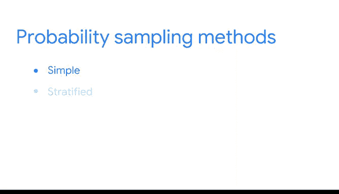

# 031：概率抽样方法详解 📊

在本节课中，我们将要学习四种主要的概率抽样方法。上一节我们介绍了概率抽样与非概率抽样的区别，并了解了抽样过程的第三步是执行概率抽样。本节中，我们将详细探讨每种概率抽样方法的具体操作、优势与局限性。

概率抽样方法共有四种：简单随机抽样、分层随机抽样、整群随机抽样和系统随机抽样。

## 简单随机抽样 🎲

在简单随机抽样中，总体中的每个成员被随机选择，且被选中的机会均等。你可以使用随机数生成器或其他随机选择方法来完成。

例如，假设你想调查一家拥有1000名员工的公司的员工工作体验。你可以为数据库中的每位员工分配一个1到1000的编号，然后使用随机数生成器选择100人作为样本。

简单随机抽样的主要优势在于其通常具有较好的代表性，因为总体中的每个成员都有同等机会被选中。随机抽样有助于避免偏差，从而获得更准确的结果。

然而，在实践中，进行大规模的简单随机抽样通常成本高昂且耗时。此外，如果样本量不够大，总体中的某些特定群体可能在样本中代表性不足。使用更大的样本量能使样本更准确地反映总体。

## 分层随机抽样 📊

在分层随机抽样中，你将总体划分为不同的组（称为“层”），然后从每一层中随机选择部分成员组成样本。层可以按年龄、性别、收入或你感兴趣的任何类别来划分。

例如，假设你想调查高中生周末用于学习的时间。你可以将学生总体按年龄（14岁、15岁、16岁、17岁）分层，然后从每个年龄组中调查同等数量的学生。

分层随机抽样有助于确保总体中每个群体的成员都被纳入调查。这种方法允许你对相关群体得出更准确的结论。例如，14岁和17岁的学生对周末学习的看法可能不同，分层抽样能捕捉到这两种视角。

分层抽样的一个主要缺点是，如果你对总体缺乏了解，可能难以确定研究中合适的分层标准。例如，在研究收入中位数时，你可能需要按职业类型、行业、地点或教育水平分层，但若不了解这些类别与收入中位数的相关性，则难以做出最佳选择。

## 整群随机抽样 🏢

进行整群随机抽样时，你将总体划分为若干“群”，随机选择某些群，并将选中群内的所有成员纳入样本。整群抽样与分层随机抽样类似，但区别在于：分层抽样是从每组中随机选择部分成员，而整群抽样是选中某组的所有成员。

群可以按年龄、性别、地点或你希望研究的任何识别细节来划分。例如，假设你想对一家全球性公司的员工进行调查。该公司在全球不同城市设有10个办事处，每个办事处员工数量和职位构成相似。你可以随机选择三个城市的三个办事处作为群，并将这三个办事处的所有员工纳入样本。

这种方法的一个优势是，当每个群都能整体反映总体时，整群抽样能获取特定群的所有成员信息。这对于处理具有明确定义子群的大规模、多样化总体非常有用。例如，如果研究人员想了解挪威奥斯陆小学生的偏好，他们可以用一所学校作为该市所有学校的代表性样本。

整群抽样的一个主要缺点是，可能难以创建能准确反映整体总体的群。例如，出于实际原因，你可能只能接触到位于美国的办事处，而美国员工的特征和价值观可能与其他国家的员工不同。

## 系统随机抽样 🔢

在系统随机抽样中，你将总体中的每个成员按顺序排列成一个序列。然后，在序列中随机选择一个起点，并按固定间隔选择样本成员。

假设你想调查一所社区大学的学生。进行系统随机抽样时，你可以将学生姓名按字母顺序排列，随机选择一个起点，然后每隔五个名字选取一个作为样本。

系统随机抽样通常能代表总体，因为每个成员被纳入样本的机会均等。学生的姓氏是B还是R不会影响其特征。此外，当你拥有完整的总体成员名单时，系统抽样快速且方便。

系统抽样的一个缺点是，在开始前你需要知道研究总体的大小。如果没有这些信息，则难以选择一致的间隔。

## 总结 📝

本节课我们一起学习了四种基于随机选择的概率抽样方法：简单随机抽样、分层随机抽样、整群随机抽样和系统随机抽样。这些方法是大多数数据专业人士首选的抽样方式，能帮助你创建具有代表性的样本。在接下来的视频中，我们将探讨一些非概率抽样方法，并了解为何它们不被视为具有代表性。