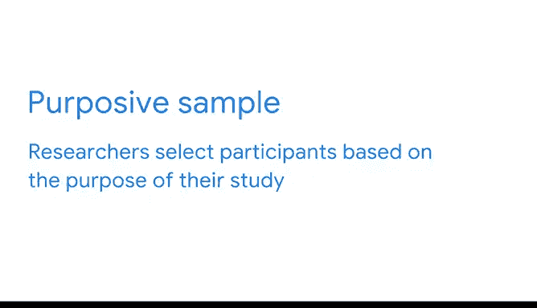
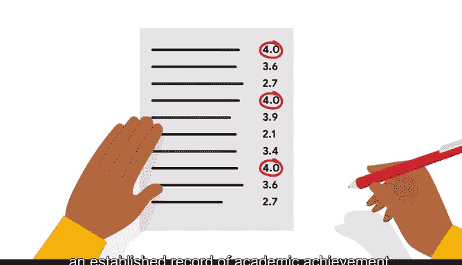

# 032：抽样偏差的影响 📊

在本节课中，我们将学习抽样偏差如何影响数据分析，并探讨四种非概率抽样方法。理解这些概念对于确保数据结论的公平性和准确性至关重要。

作为一名数据专业人员，我经常使用样本数据来帮助构建机器学习模型。如今，机器学习模型可能帮助决定一个人是否能获得贷款批准、工作面试机会或准确的医疗诊断。基于代表性样本构建的模型更有可能在贷款或工作面试的决策上做出公平且无偏的判断。使用能代表总体中不同类型人群的样本，有助于确保每个人都能获得最适合他们的对待。

然而，偏差会影响样本数据。当样本不能代表整个总体时，就会发生抽样偏差。为了消除偏差，我尝试使用能代表整体总体的样本。从非代表性样本中得出结论的后果可能很严重。

上一节我们介绍了概率抽样方法使用随机选择，这有助于避免抽样偏差。随机选择的样本意味着总体中的所有成员都有平等的机会被包含在内。相比之下，非概率抽样方法不使用随机选择，因此它们通常不会生成代表性样本。事实上，它们常常导致有偏的样本。然而，非概率抽样通常成本更低，对研究者来说也更方便。有时由于预算、时间或其他原因，使用概率抽样并不可行。此外，非概率方法对于探索性研究很有用，这类研究旨在初步了解一个总体，而不是对总体整体得出结论或做出预测。

本节中，我们将讨论四种非概率抽样方法，并了解抽样偏差如何影响每种方法。

以下是四种非概率抽样方法：

*   **便利抽样**：在这种方法中，你选择那些易于联系或接触的总体成员。顾名思义，进行便利抽样涉及从对你来说更方便的地方收集样本，例如你的工作场所、当地学校或公园。例如，为了进行民意调查，研究人员可能会在白天站在当地一所高中前，对碰巧路过的人进行民意调查。因为这些样本是基于研究者的便利性，而不是更广泛的总体样本，所以便利样本经常表现出**覆盖不足偏差**。当总体中的某些成员在样本中代表性不足时，就会发生覆盖不足偏差。例如，不在该学校工作或上学的人在样本中的代表性就会不足。
*   **自愿响应抽样**：这种类型的样本由自愿参与研究的总体成员组成。例如，一家餐厅的老板想知道人们对他们晚餐选择的看法。他们要求常客参与一项关于餐厅食品质量的在线调查。自愿响应样本往往受到**无响应偏差**的影响，当某些群体的人不太可能提供回应时，就会发生这种偏差。自愿回应的人可能比总体中的其他人有更强烈的意见，无论是正面还是负面。这使得餐厅的自愿顾客成为一个非代表性样本。
*   **滚雪球抽样**：在滚雪球抽样中，研究人员招募初始参与者进行研究，然后要求他们招募其他人参与研究。就像滚雪球一样，随着更多参与者的加入，样本量变得越来越大。例如，如果一项研究调查大学生作弊行为，潜在的参与者可能不愿意站出来，但如果研究人员能找到几个愿意参与的学生，这两个学生可能认识其他也在考试中作弊的人。然后，初始参与者可以通过分享研究的好处并向他们保证保密性来招募其他人。尽管研究参与者帮助建立样本似乎很方便，但这种招募方式可能导致抽样偏差，因为初始参与者自行招募其他参与者，很可能他们中的大多数人都具有相似的特征，而这些特征可能无法代表所研究的总体。
*   **目的抽样**：在目的抽样中，研究人员根据研究目的选择参与者。因为参与者是根据研究需求被选入样本的，不符合要求的申请者会被拒绝。例如，一位研究人员想调查学生对其大学特定教学方法有效性的看法。研究人员只想包括那些经常上课且有良好学业记录的学生，因此他们选择平均绩点最高的学生参与研究。在目的抽样中，研究人员经常有意将某些群体排除在样本之外，以专注于他们认为与研究最相关的特定群体。在这种情况下，研究人员排除了平均绩点不高的学生。这可能导致有偏的结果，因为样本中的学生不太可能代表整个学生群体。

作为一名数据专业人员，你必须从开始收集样本数据的那一刻起，到呈现结论之时，始终考虑偏差和公平性问题。一旦你意识到一些常见的偏差形式，你就可以对任何形式的偏差保持警惕。

本节课中，我们一起学习了抽样偏差对数据分析的潜在影响，并详细探讨了便利抽样、自愿响应抽样、滚雪球抽样和目的抽样这四种非概率抽样方法。理解这些方法的局限性，对于在数据工作中识别和避免偏差、确保结论的公正与有效至关重要。