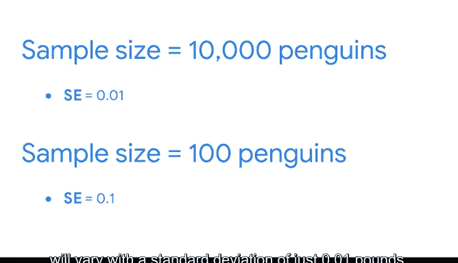

# 033：抽样如何影响数据 📊

在本节课中，我们将要学习抽样过程如何影响数据，以及如何利用样本统计量来估计总体参数。我们将重点讨论抽样分布的概念，并解释如何通过样本均值来估计总体均值。此外，我们还将介绍标准误差的概念及其在衡量估计准确性中的作用。

---

在之前的视频中，你已经学习了抽样过程的工作原理，以及各种抽样方法的优缺点。作为一名数据专业人员，我经常使用样本数据来对未来销售额或产品表现做出有根据的预测。理解抽样如何从正面和负面两方面影响你的数据，对于你未来在数据分析领域的职业生涯至关重要。

例如，数据专业人员使用样本统计量的一种方式是估计总体参数。你可能还记得，**统计量**是样本的特征，而**参数**是总体的特征。

例如，随机抽取的100只企鹅的平均体重是一个统计量。而总数10000只企鹅的总体的平均体重是一个参数。数据专业人员可能会使用这100只企鹅样本的平均体重来估计总体的平均体重。这种估计被称为**点估计**。点估计使用单个值来估计总体参数。

在本视频中，我们将讨论**抽样分布**的概念，以及它如何帮助你表示随机样本的可能结果。你还将学习样本均值的抽样分布如何帮助你做出总体均值的点估计。

---

## 什么是抽样分布？ 📈

抽样分布是样本统计量的概率分布。回想一下，概率分布表示随机变量的可能结果，例如抛硬币或掷骰子。同样地，抽样分布表示样本统计量（如均值）的可能结果。

想象你从一个人群中重复抽取相同大小的简单随机样本。由于每个样本都是随机的，样本的均值会因样本而异，这种变化无法确定性地预测。

为了更好地理解均值的抽样分布，让我们继续以企鹅为例。假设你正在研究一个由10000只小蓝企鹅组成的种群，这是所有已知企鹅物种中最小的。你想找出这个种群中蓝企鹅的平均体重。

由于定位并称量每一只企鹅耗时太长，你转而从总体中收集样本数据。假设你从总体中重复抽取简单随机样本，每个样本包含10只企鹅。换句话说，你从群体中随机选择10只企鹅，称重，然后用另一组10只企鹅重复这个过程。

*   对于你的第一个样本，你发现10只企鹅的平均体重是3.1磅。
*   对于你的第二个样本，10只企鹅的平均体重是2.9磅。
*   对于你的第三个样本，平均体重是2.8磅，依此类推。

假设这个种群中企鹅的真实平均体重是3磅（尽管在实践中，除非你称量每一只企鹅，否则你不会知道这一点）。每次你抽取10只企鹅的样本时，样本中企鹅的平均体重很可能接近总体均值3磅，但不完全是3磅。偶尔，你可能会得到一个全是小于平均体型的企鹅的样本，平均体重为2.5磅或更少；或者你可能会得到一个全是大于平均体型的企鹅的样本，平均体重为3.5磅或更多。平均体重会随样本不同而随机变化。

**抽样变异性**指的是估计值在不同样本之间的变化程度。你可以使用抽样分布来表示所有不同样本均值的频率。我发现将其可视化为直方图会很有帮助。

让我们绘制10个简单随机样本（每个样本10只企鹅）的均值。最常出现的样本均值将在3磅左右。最不常见的样本均值将是更极端的体重，例如2.3磅或3.7磅。

---

## 样本大小的影响 📏

随着样本大小的增加，你样本数据的平均体重将更接近总体的平均体重。换句话说，如果你对整个总体进行抽样（即实际称量所有10000只企鹅），你的样本均值将与你的总体均值相同。

但是，为了获得总体均值的准确估计，你不必称量10000只企鹅。如果你从总体中抽取足够大的样本量，比如100只企鹅，你的样本均值将是总体均值的准确估计。

这一点基于**中心极限定理**，我们将在课程后面更详细地探讨。目前只需知道，如果你的样本足够大，你的样本均值将大致等于总体均值。

例如，假设你收集了100只企鹅的样本，发现样本的平均体重是3磅。这意味着你对整个企鹅种群平均体重的最佳估计也是3磅。

---

## 衡量估计的准确性：标准误差 🔍

你也可以使用你的样本数据来估计任何给定样本的平均体重在多大程度上准确地代表了总体平均体重。了解这一点很有用，因为均值因样本而异，任何给定样本都不一定是总体均值的精确反映。

例如，企鹅种群的真正平均体重可能是3磅，但任何给定企鹅样本的平均体重可能是3.3磅、2.8磅、2.4磅等等。你的样本数据变异性越大，样本均值作为总体均值准确估计的可能性就越小。

数据专业人员使用**样本均值的标准差**来衡量这种变异性。回想一下，标准差衡量数据的变异性或数据值的分散程度。数据值之间的分布越广，标准差就越大。

在统计学中，样本统计量的标准差被称为**标准误差**。**均值的标准误差**衡量所有样本均值之间的变异性。

*   较大的标准误差表明样本均值更分散，或者说变异性更大。
*   较小的标准误差表明样本均值更接近，或者说变异性更小。

标准误差越小，你的样本均值作为总体均值准确估计的可能性就越大。

例如，假设你抽取三个随机样本，每个样本10只企鹅。第一个样本的平均体重是3.3磅，第二个是3.1磅，第三个是2.9磅。这三个样本均值之间没有太大变异性，数值都很接近。标准误差将相对较小。

现在，假设你抽取另外三个随机样本，每个样本10只企鹅。第一个样本的平均体重是2.2磅，第二个是3.2磅，第三个是4.2磅。这三个样本均值之间有更大的变异性，数值更分散。标准误差将相对较大。

请注意，标准误差的概念基于**重复抽样**的实践。在现实中，研究人员通常只处理一个样本，因为对一个人群进行重复抽样通常太复杂、昂贵或耗时。相反，统计学家基于重复抽样的数学假设推导出了一个计算标准误差的公式。

---

## 计算标准误差 🧮

你可以使用以下公式计算样本均值的标准误差：

**标准误差 = S / √n**

其中：
*   **S** 是样本标准差
*   **n** 是样本大小

例如，在你的企鹅体重研究中，假设一个100只企鹅的样本平均体重为3磅，标准差为1磅。你可以通过将样本标准差（1）除以样本大小（100）的平方根来计算标准误差。

1 / √100 = 0.1

这意味着你对所有企鹅真实总体平均体重的最佳估计是3磅。但你应该预期，从一个样本到下一个样本的平均体重会以大约0.1的标准差变化。

随着样本量的增大，你的标准误差会变小。这是因为标准误差衡量的是你的样本均值与实际总体均值之间的差异。随着样本变大，你的样本均值更接近实际总体均值。对总体均值的估计越准确，标准误差就越小。

假设你收集了10000只企鹅的样本，而不是100只。你发现样本平均体重是3磅，样本标准差是1磅。标准误差是 1 / √10000 = 0.01。你对样本均值的最佳估计仍然是3磅，但现在你可以预期，从一个企鹅样本到下一个样本的平均体重变化的标准差仅为0.01。

---

## 总结 📝

在本节课中，我们一起学习了：

1.  **抽样分布**是样本统计量（如均值）的概率分布，它展示了从同一总体中重复抽样时，统计量可能取值的分布情况。
2.  随着**样本大小**的增加，样本均值会越来越接近总体均值，这使得基于大样本的估计更加可靠。
3.  **标准误差**是衡量样本统计量（特别是均值）变异性的关键指标，它等于样本标准差除以样本大小的平方根（**S / √n**）。标准误差越小，表明样本估计越精确。
4.  总体而言，当样本量增大、标准误差减小时，你可以对你的估计有更多的信心，因为抽样分布的均值更接近总体均值。

接下来，当我们讨论中心极限定理时，我们将进一步探讨这个想法。