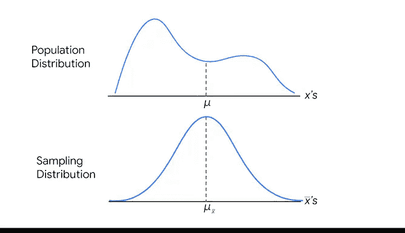

# 034：中心极限定理 📊

在本节课中，我们将要学习**中心极限定理**。这是一个强大的统计学概念，它允许数据专业人员通过样本数据来估计整个总体的参数，例如平均收入、平均身高或平均通勤时间。无论总体数据的分布形状如何，中心极限定理都为我们提供了一种可靠的方法来推断总体特征。

---

## 中心极限定理的核心概念

上一节我们介绍了样本与总体的基本关系，本节中我们来看看中心极限定理如何具体运作。

**中心极限定理**指出：随着样本量的增加，样本均值的抽样分布会趋近于一个**正态分布**（即钟形曲线）。这意味着，如果你从总体中抽取足够大的样本，样本均值将大致等于总体均值。

用公式可以表示为：
当 `n → ∞` 时，`样本均值的分布 → N(μ, σ²/n)`，其中 `μ` 是总体均值，`σ` 是总体标准差，`n` 是样本量。

---

## 定理的应用条件与样本量

中心极限定理的强大之处在于它适用于**任何总体**。你不需要事先知道总体分布的形状。只要样本量足够大，抽样分布就会呈现正态分布。

以下是关于样本量的一些关键点：
*   通常认为样本量达到 **30 或更多** 就足够了。
*   所需的样本量具体取决于数据集，可以通过探索性数据分析来确定。
*   在实践中，样本量的选择还受到预算、时间、资源和所需置信水平等因素的影响。

---

## 定理的实际案例

为了理解中心极限定理如何在实际中发挥作用，让我们来看两个例子。

### 案例一：美国收入分布

美国2010年的家庭年收入分布图显示，数据严重**右偏**，远非正态分布。这种偏斜是由于最富裕家庭的收入异常高。

然而，根据中心极限定理，如果你从所有家庭中随机抽取收入数据，并且样本量足够大，那么这些样本均值的分布将遵循**正态分布**。即使总体分布（每个美国家庭的收入）不是正态的，抽样分布的均值也能为你提供对总体平均收入的准确估计。

### 案例二：咖啡饮用量研究

假设你想研究美国咖啡饮用者（约1.5亿人）的平均每日咖啡饮用量，但无法调查每一个人。

以下是你可以采取的步骤：
1.  从总体中反复随机抽取样本，比如每次抽取100名咖啡饮用者。
2.  计算每个样本的日均咖啡饮用量均值。例如，第一个样本均值可能是22.5盎司，第二个是28.2盎司，第三个是25.4盎司，依此类推。
3.  理论上，你可以抽取10个、50个或100个样本，并不断增加样本量。

中心极限定理告诉我们，随着样本量的增加，这些样本均值的分布形状将越来越接近**钟形曲线**。如果你从总体中抽取一个足够大的样本，其抽样分布的均值就等于总体均值。这样，你就可以准确地估计出整个人群的日均咖啡饮用量（根据观察，美国人平均每天喝大约24盎司，即3杯咖啡；如果是数据专业人员，这个平均值可能更高）。

---

## 总结

本节课中我们一起学习了**中心极限定理**。我们了解到，无论原始总体数据呈何种分布（如偏斜的收入分布），只要样本量足够大，样本均值的分布就会趋近于正态分布。这一定理是统计学中一项基础且强大的工具，使数据专业人员能够通过可管理的样本数据，对经济、科学、商业等领域的总体参数进行有效且可靠的估计。