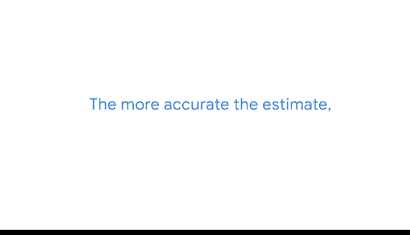
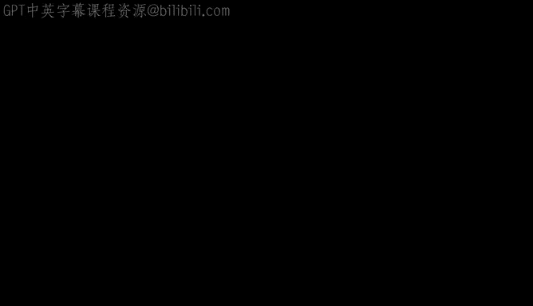

# 035：比例的抽样分布 📊

在本节课中，我们将学习数据专业人员如何使用样本统计量来估计总体参数。上一节我们介绍了如何使用**均值的抽样分布**来估计总体均值。本节中，我们将探讨如何利用**比例的抽样分布**来估计总体比例。

## 概述

数据专业人员经常需要估计总体中具有某一特征的个体所占的百分比，这被称为**总体比例**。例如，估计喜欢公司食堂食物的员工比例，或网站访客的购买转化率。由于调查整个总体通常不现实，我们会从总体中抽取样本，并利用样本比例来推断总体比例。本节将解释比例的抽样分布概念、其重要性以及如何计算**比例的标准误**来衡量估计的准确性。

## 比例的抽样分布

想象你在一家市场研究公司工作，客户是一家运动鞋制造商，希望了解智利圣地亚哥16至19岁青少年对“一脚蹬”式运动鞋的偏好。该年龄段总共有10万名青少年。由于无法调查所有人，你决定从总体中抽取随机样本。

假设你从总体中重复抽取了多个简单随机样本，每个样本包含100名青少年。在第一个样本中，你发现12%的青少年偏好“一脚蹬”运动鞋。第二个样本中，这个比例是8%。第三个样本中，比例是11%。

这种现象被称为**抽样变异性**，即样本统计量（如比例）会因样本不同而波动。与样本均值类似，样本比例也存在变异性。

## 中心极限定理与比例

**中心极限定理**同样适用于样本比例。随着样本量增大，样本比例的分布会趋近于**正态分布**。分布曲线的中心是总体比例的真值。

例如，如果我们已知总体中真正偏好“一脚蹬”运动鞋的青少年比例是10%，那么大多数样本的比例会接近10%，但不会完全等于10%。偶尔也会有比例极低或极高的样本。

你可以用抽样分布来展示所有不同样本比例出现的频率。例如，抽取10个样本后，可以用直方图展示比例的分布。出现最频繁的值会集中在10%附近，而像5%或15%这样的极端值则出现较少。

## 比例的标准误

与样本均值一样，我们可以使用**比例的标准误**来衡量抽样变异性。它表示一个特定的样本比例可能与真实总体比例相差多少。

了解这一点很重要，因为样本比例会因样本而异，任何一个给定的样本比例都可能不等于真实的总体比例。真实比例可能是10%，但某个样本的比例可能是12%、9%或7%等。样本数据的变异性越大，样本比例作为总体比例估计值的准确性就越低。

利益相关者的决策通常基于你提供的估计值，因此理解估计的准确性至关重要。

以下是计算比例标准误的公式：

**公式：**
`标准误 = sqrt( p_hat * (1 - p_hat) / n )`

其中：
*   `p_hat` 是**样本比例**（作为总体比例的估计值）。
*   `n` 是**样本量**。

## 计算示例

假设你调查了100名青少年，发现估计有10%（即0.1）的人偏好“一脚蹬”运动鞋。那么，`p_hat = 0.1`，`n = 100`。

代入公式计算：
`标准误 = sqrt( 0.1 * (1 - 0.1) / 100 ) = sqrt( 0.1 * 0.9 / 100 ) = sqrt( 0.09 / 100 ) = sqrt(0.0009) = 0.03`

因此，比例的标准误是0.03或3%。

## 样本量的影响

随着样本量增大，标准误会变小。因为标准误衡量的是样本比例与真实总体比例之间的差异。样本越大，样本比例通常越接近总体比例，估计也就越准确，标准误自然越小。

基于你的估计结果，运动鞋公司的利益相关者可以做出产品开发决策。例如，如果偏好“一脚蹬”式样的比例较低，他们可能会减少在这类产品上的研发投入。

## 后续步骤：置信区间

通常，数据专业人员的下一步是使用标准误来构建**置信区间**。置信区间描述了估计的不确定性，并为利益相关者提供了关于结果的更详细信息。在本课程后续部分，你将学习如何计算和解释置信区间，从而更准确地预测总体偏好。

## 总结

本节课中，我们一起学习了：
1.  **总体比例**的概念及其在商业和研究中的应用。
2.  如何使用**比例的抽样分布**来估计总体比例。
3.  **中心极限定理**如何确保大样本下比例分布接近正态。
4.  如何计算**比例的标准误**以衡量估计的准确性和抽样变异性。
5.  理解了**样本量**对标准误和估计精度的影响。

掌握比例的抽样分布是进行统计推断的基石，它使我们能够基于样本数据，对总体特征做出合理、量化的估计。