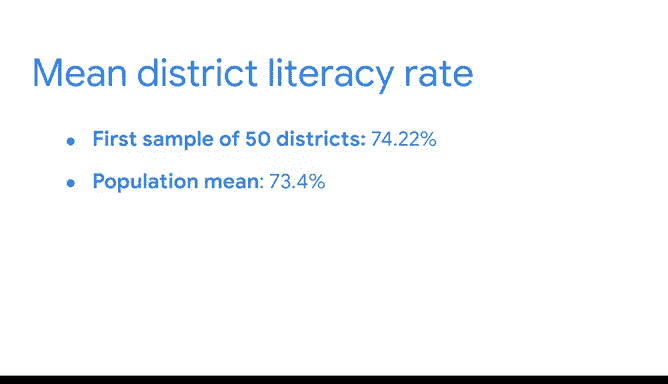

# 036：使用Python处理抽样分布 📊


## 概述

在本节课中，我们将学习如何使用Python进行随机抽样，并基于样本数据对总体参数进行点估计。我们将通过一个具体的案例——估计某国所有地区的平均识字率——来演示整个过程。

上一节我们讨论了数据专业人员如何使用样本数据对总体参数进行点估计。本节中，我们将动手使用Python来模拟这一过程。

## 导入必要的库

首先，我们需要导入将要使用的Python包和库。为了节省时间，我们使用缩写来重命名它们。

```python
import numpy as np
import pandas as pd
import statsmodels.api as sm
import matplotlib.pyplot as plt
from scipy import stats
```

## 获取随机样本

现在，我们将从数据集中随机抽取50个地区作为样本。Python的`pandas`库提供了便捷的`sample`函数来模拟随机抽样。

以下是`sample`函数及其参数的简要说明：

*   **n**: 所需的样本大小，即样本中包含的项目数量。
*   **replace**: 表示是“有放回抽样”还是“无放回抽样”。
*   **random_state**: 随机数种子，用于确保结果可重现。

对于我们的例子，我们将进行有放回抽样，并设置一个任意的随机种子。

```python
sampled_data = your_dataframe['literacy_column'].sample(n=50, replace=True, random_state=31208)
print(sampled_data)
```

运行上述代码后，输出将显示从数据集中随机选择的50个地区及其识字率。

## 计算样本均值（点估计）

获得随机样本后，我们可以计算其均值，以此作为总体均值的点估计。

```python
estimate1 = sampled_data.mean()
print(f"第一个样本的识字率点估计为: {estimate1:.2f}%")
```

根据我们的第一个随机样本，地区识字率的样本均值约为74.22%。这就是基于50个地区样本对总体均值的点估计。

需要记住，由于抽样变异性，样本均值通常不会与总体均值完全相同。

## 抽样变异性

为了理解抽样变异性，让我们基于另一个随机样本计算第二个点估计。

```python
estimate2 = your_dataframe['literacy_column'].sample(n=50, replace=True, random_state=56801).mean()
print(f"第二个样本的识字率点估计为: {estimate2:.2f}%")
```

第二个样本的均值约为74.24%。它与第一个估计值（74.22%）略有不同，但非常接近。这种差异正是抽样变异性的体现。

中心极限定理告诉我们，当样本量足够大时，样本均值的分布会接近正态分布。并且，从总体中抽取的观测值越多，样本均值就越接近总体均值。样本量越大，对总体均值的估计通常就越准确。

## 模拟抽样分布

现在，假设我们重复这项研究10,000次，获得10,000个均值点估计。也就是说，我们抽取10,000个大小为50的随机样本，并计算每个样本的均值。

根据中心极限定理，抽样分布的均值将大致等于总体均值。我们可以用Python来计算这个包含10,000个样本的抽样分布的均值。

以下是实现步骤的代码：

```python
# 1. 创建一个空列表来存储每个样本的均值
estimate_list = []

# 2. 设置一个循环，运行10,000次
for i in range(10000):
    # 3. 在每次迭代中：抽取一个随机样本，计算其均值，并添加到列表中
    sample_mean = your_dataframe['literacy_column'].sample(n=50, replace=True).mean()
    estimate_list.append(sample_mean)

# 4. 将列表转换为数据框以便分析
estimate_df = pd.DataFrame(estimate_list, columns=['sample_mean'])

# 5. 计算这10,000个样本均值的平均值（即抽样分布的均值）
mean_of_sample_means = estimate_df['sample_mean'].mean()
print(f"10,000个样本均值的平均值（抽样分布均值）为: {mean_of_sample_means:.2f}%")
```

运行代码后，抽样分布的均值约为73.41%。这与你完整数据集的总体均值（约73.4%）基本一致。

## 可视化与核心结论

为了直观展示抽样分布与正态分布的关系，我们可以将两者绘制在同一张图上（此处不深入代码细节）。从这样的图表中，我们可以得出三个关键结论：

1.  正如中心极限定理所预测的，抽样分布的直方图可以很好地用正态分布来近似。直方图的轮廓紧密跟随正态曲线。
2.  抽样分布的均值（蓝色虚线）与总体均值（绿色实线）重叠。这表明两个均值基本相等。
3.  我们第一个基于50个地区的估计值（红色虚线）离中心较远。这是由于抽样变异性造成的。

中心极限定理表明，随着样本量的增加，你的估计会变得更准确。对于足够大的样本，样本均值紧密遵循正态分布。

## 实际应用与总结



你的第一个50个地区样本估计的平均识字率为74.22%，这与73.4%的总体均值相对接近。为了确保你的估计对政府有用，你可以将该国的识字率与其他基准（如全球识字率或同等水平国家的识字率）进行比较。如果该国的识字率低于这些基准，这可能有助于说服政府投入更多资源来提高全国识字率。

通过抽样来估计总体参数是统计推断的一种强大形式。当你处理大量数据和复杂计算时，Python可以帮助你快速做出准确的估计。

本节课中，我们一起学习了如何使用Python模拟随机抽样、计算样本均值作为点估计、理解抽样变异性，并通过模拟大量样本来验证中心极限定理。这些技能是进行统计推断和数据分析的基础。