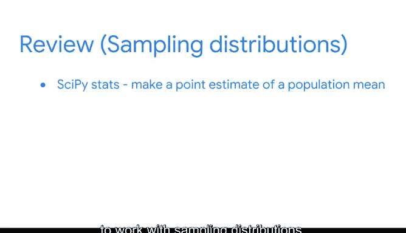

# 037：抽样总结 📊


在本节课中，我们将回顾并总结抽样相关的核心概念。抽样是数据分析的基础，它使数据专业人员能够基于样本数据对总体进行推断、预测和估计。

---

## 抽样基础回顾

上一节我们介绍了抽样的基本概念，本节中我们来看看抽样的重要性及其在数据职业中的应用。

在数据职业领域，你将经常处理样本数据。数据专业人员使用样本数据对总体进行推断、预测和估计。抽样之所以有用，是因为收集整个总体的数据通常成本过高、耗时过长或过于复杂。有时，完整的数据集可能过大，即使计算机也难以处理。

有效的抽样在现代数据分析中尤为重要，因为数据专业人员经常处理极其庞大的数据集。例如，你可能需要处理包含数千万个数据点的经济数据，并仅使用10,000个数据点的样本。

作为一名数据专业人员，理解用于生成样本数据的抽样过程至关重要，同时需要判断你的样本是否代表总体。此外，正如你现在所知，不同类型的偏差会影响不同的抽样方法。

---

## 抽样过程与主要方法

以下是抽样过程的主要阶段：

1.  选择目标总体
2.  确定抽样框架
3.  选择抽样方法
4.  确定样本量
5.  收集样本数据

抽样方法主要分为两大类：

*   **概率抽样**：每个成员被选中的概率已知。
*   **非概率抽样**：每个成员被选中的概率未知。

我们讨论了每种方法的优缺点，以及随机抽样如何帮助确保样本质量高且能代表总体。

---

## 偏差与抽样分布

我们还讨论了抽样中的不同偏差形式，以及偏差如何影响非概率抽样方法。你了解到，从有偏差的数据中得出的任何见解，对于利益相关者来说可能都不准确或无用。

之后，你学习了样本均值和比例的抽样分布，以及如何估计相应的总体参数。

我们也涵盖了**中心极限定理**，它帮助你估计许多不同类型数据集的总体均值。其核心思想是，无论总体分布如何，当样本量足够大时，样本均值的分布近似正态分布。

**公式示例**：样本均值分布的标准误（Standard Error）可表示为：
`SE = σ / √n`
其中，`σ` 是总体标准差，`n` 是样本量。

---

## Python实践与应用

最后，你学习了如何使用Python的SciPy Stats模块处理抽样分布，并对总体均值进行点估计。

**代码示例**：使用`scipy.stats`计算置信区间
```python
import scipy.stats as st
import numpy as np

# 假设有一个样本数据
sample_data = np.array([...])
sample_mean = np.mean(sample_data)
sample_std = np.std(sample_data, ddof=1) # 使用样本标准差
n = len(sample_data)

# 计算95%置信区间
confidence_level = 0.95
se = sample_std / np.sqrt(n)
ci = st.t.interval(confidence_level, df=n-1, loc=sample_mean, scale=se)
print(f"95%置信区间: {ci}")
```



---

## 总结与后续安排

本节课中，我们一起学习了抽样的完整流程、主要方法、偏差的影响、抽样分布理论（包括中心极限定理）以及使用Python进行实际估计的方法。

接下来，你将参加一次分级评估以作准备。请查阅列出了所有新术语的阅读材料，并随时重温涵盖关键概念的**视频**、**阅读材料**和其他资源。


恭喜你取得的进步，让我们继续保持！🚀