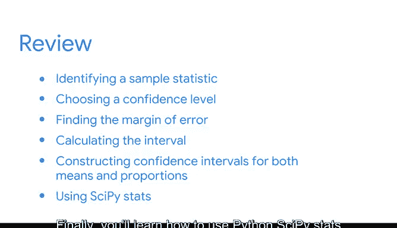

# 038：欢迎来到模块四 📊

在本节课中，我们将要学习置信区间的基本概念、重要性以及如何构建和解释置信区间。置信区间是统计学和数据分析中用于描述估计值不确定性的关键工具。

---

## 回顾学习旅程 🧭

上一节我们介绍了抽样分布和点估计。本节中，我们来看看如何量化估计的不确定性。

截至目前，您已经掌握了以下知识：

*   数据专业人员如何使用描述性统计来总结和探索数据。
*   如何使用推断性统计从数据中得出结论。
*   概率的基本规则，如加法规则和乘法规则。
*   二项分布、泊松分布和正态分布等概率分布如何帮助您对不同类型的数据进行建模。
*   抽样的主要阶段以及不同抽样方法的优缺点。
*   数据专业人员如何使用抽样分布来估计总体均值和比例。

---

## 置信区间简介 🎯

在课程的这个部分，我们将探讨如何构建和解释置信区间。

置信区间是一个**数值范围**，用于描述**估计值周围的不确定性**。

在统计学和数据科学中，有多种方法可以描述估计的不确定性。以下是两种主要方式：

*   **置信区间**
*   **可信区间**

这两个概念对应着两种不同的统计思想流派：**频率学派**和**贝叶斯学派**。置信区间是一个频率学派的概念，而可信区间是一个贝叶斯学派的概念。尽管两者的目标相似，但它们具有不同的统计定义和技术流程。

目前您无需担心细节，但需要了解不同统计方法以及数据专业人员用于分析和解释数据的工具所处的更广泛背景。

---

## 为什么学习置信区间？💡

了解如何构建和解释置信区间至关重要，至少有以下两个原因：

1.  许多数据专业人员在其日常工作中经常使用置信区间，这可能很快也会成为您工作的一部分。
2.  在未来的工作面试中，您很可能会被问到关于置信区间的问题。因此，掌握该主题的基础知识至关重要。

接下来，我们将讨论置信区间在数据驱动工作中的重要性，以及它们如何帮助您描述估计的不确定性。

---

## 置信区间的应用实例 📈

数据专业人员可能会使用置信区间来描述以下估计的不确定性：

*   股票投资组合的平均投资回报率。
*   工厂机械的平均维护成本。
*   将注册奖励计划的客户百分比。
*   将点击广告的网站访问者百分比。

然而，置信区间经常被误解，这可能导致研究得出错误结论。因此，您还将学习如何正确解释置信区间以及如何避免常见错误。

---

## 构建置信区间的步骤 🔨

我们将详细介绍构建置信区间的流程：

1.  **确定样本统计量**并**选择置信水平**。
2.  **定义边际误差**。
3.  **计算区间**。

然后，您将学习如何为**均值**和**比例**构建置信区间。

最后，您将学习如何使用 Python 的 `scipy.stats` 模块为总体均值的点估计构建置信区间。

---

## 总结 📝

本节课中，我们一起学习了置信区间的核心概念及其在数据分析中的重要性。我们了解到置信区间是描述估计不确定性的关键工具，并预览了构建置信区间的基本步骤和应用场景。

准备好学习更多内容后，我们将在下一个视频中继续。