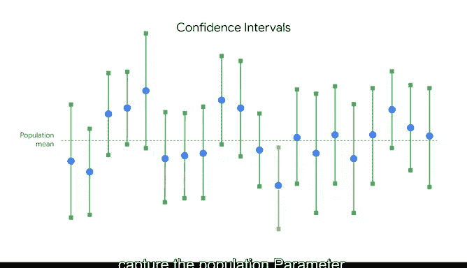

# 040：解读置信区间

在本节课中，我们将要学习如何正确解读置信区间。置信区间是统计学中用于表达结果不确定性的重要工具，但也是常被误解的概念之一。我们将通过一个具体的例子，理解其核心含义，并澄清几种常见的错误解读方式。

## 概述：什么是置信区间？

最近你了解到，数据专业人士使用置信区间来表达其结果的不确定性，以便更好地理解结果并向利益相关者有效传达信息。因此，知道如何正确解读置信区间至关重要。

置信区间是统计学中最容易被误解的概念之一，因为它是一个复杂的主题。无论是新手学生还是有经验的研究人员，有时都会对置信区间做出不准确的陈述。所以，如果你没有立刻理解这个概念，请不要担心，你并不孤单。

通过本视频的学习，你将更好地理解如何解读置信区间，并学习一些常见的误解形式以及如何避免它们。

## 案例分析：城市规划中的树木高度

让我们探索一个例子。假设你是一名数据专业人士，在一家大城市的城市规划公司工作。市政府要求你的团队设计以红枫树为特色的新公园和人行道。

为了规划目的，你的经理要求你估算该市所有约10，000棵红枫树的平均高度。你没有测量每一棵树，而是收集了50棵树的样本。样本的平均高度为50英尺，标准差为7.5英尺。

基于95%的置信水平，你计算出的平均高度置信区间在48英尺到52英尺之间。这个区间估计将帮助你的团队设计符合城市景观条例的新公园和人行道。

## 深入理解“95%置信水平”

此时，你可能想知道，选择95%的置信水平并说你对该区间估计有95%的信心，这究竟意味着什么？

之前你了解到，置信水平表达了估计过程的不确定性。让我们从更技术的角度来谈谈这意味着什么。

**95%置信意味着：如果你从总体中重复抽取随机样本，并使用相同的方法为每个样本构建一个置信区间，那么你可以预期这些区间中有95%会包含总体均值。**

你也可以预期总区间中有5%不会包含总体均值。在实践中，数据专业人士通常只选择一个随机样本并生成一个置信区间，这个区间可能包含也可能不包含实际均值。这是因为重复随机抽样通常很困难、昂贵且耗时。置信区间为数据专业人士提供了一种量化由随机抽样引起的不确定性的方法。

在我们的例子中，你有一个95%的置信区间，表明平均高度在48到52英尺之间。为了这个例子，我们假设所有10，000棵红枫树的实际平均高度是51英尺。在实践中，除非你测量了城市里的每一棵树，否则你无法知道这一点。

这意味着，如果你抽取20个50棵树的随机样本，并为每个样本计算一个置信区间，你可以预期20个区间中有19个（即总数的95%）会包含51英尺的总体均值。其中一个这样的区间就是48到52英尺这个值域。

让我们暂停一下。我知道这是很多需要消化的新信息。置信区间可能有点棘手，这就是为什么它们经常被误解。为了更好地理解“你对估计有95%的信心”意味着什么，让我们更详细地探讨我们的城市规划例子。

想象你使用相同的抽样方法，再抽取20个50棵树的随机样本。由于每个样本都是从一个大总体中随机选择的，均值会因样本而异。记住，这被称为**抽样变异性**。

对于你的第一个50棵树样本，平均高度是50英尺。对于你的第二个50棵树样本，平均高度结果是49.5英尺。对于你的第三个样本，你得到的平均高度是51.5英尺，依此类推。由于抽样变异性，任何给定样本的平均高度不一定等于实际的总体均值。置信区间有助于表达这种不确定性。

你基于每个样本均值计算的置信区间也会因样本而异，并且任何给定的区间不一定包含51英尺的总体均值。

例如：
*   你的第一个样本平均高度为50英尺，置信区间在48英尺到52英尺之间。**这个区间包含了51英尺的总体均值。**
*   你的第二个样本平均高度为49.5英尺，置信区间在47.5到50.5英尺之间。**这个区间没有包含51英尺的总体均值。**

然而，95%的置信水平意味着你可以预期20个区间中有19个（即总数的95%）会包含总体均值。换句话说，这种方法产生的区间包含总体均值的成功率为95%，这是一个相当不错的成功率。

## 常见的置信区间误解

现在你对如何解读置信区间有了更好的理解，让我们回顾一下这个概念常见的三种误解。了解这些误解将帮助你在未来避免它们。

以下是三种常见的错误解读：

1.  **误解一：认为95%的置信区间意味着数据集中95%的数据值都落在该区间内。**
    这不一定正确。例如，你的树木高度95%置信区间在48英尺到52英尺之间。说你的数据集中所有值有95%落在这个区间内可能并不准确。有可能超过5%的树木高度在区间之外，要么低于48英尺，要么高于52英尺。

2.  **误解二：认为95%的置信区间意味着所有可能的样本均值有95%落在该区间范围内。**
    这也不一定正确。例如，你的树木高度95%置信区间在48英尺到52英尺之间。想象你使用相同的抽样方法重复抽样。有可能超过5%的样本均值会小于48英尺或大于52英尺。

3.  **误解三：认为置信区间指的是你结果中唯一的误差来源。**
    虽然每个置信区间都包含一个**误差范围**，但统计分析中可能还存在许多其他类型的误差。例如，调查中的问题可能设计不佳，或者抽样偏差可能影响样本数据。误差范围是衡量不确定性的有用指标，能使你的估计更可靠，但它并不是你分析中唯一可能的误差来源。

## 总结与要点

所以，当你解读置信区间时，请记住，不确定性在于基于随机抽样的估计过程。95%的置信水平指的是该过程的成功率。换句话说，你可以预期你生成的随机区间中有95%会捕获总体参数。

知道如何正确解读置信区间将使你更好地理解你的估计，并帮助你与利益相关者分享有用且准确的信息。你可能还需要解释常见的误解以及它们为何不正确。你肯定不希望你的利益相关者产生错误的想法或基于误解做出决策。理解如何有效地向利益相关者传达你的结果是成为一名数据专业人士的重要组成部分。

在本节课中，我们一起学习了置信区间的核心含义：它描述的是**估计方法的可靠性**，而非单个区间或数据的属性。我们通过城市规划的例子，理解了“95%置信”意味着如果重复抽样构建区间，有95%的区间会包含真实参数。我们还澄清了三种常见误解，强调了置信区间只量化了随机抽样带来的不确定性，而非所有可能的误差。掌握这些知识，将帮助你更自信、更准确地进行数据分析和沟通。