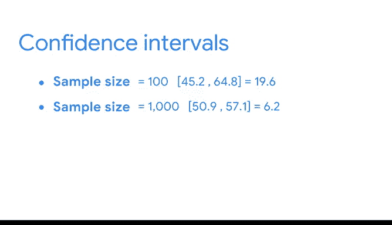

# 041：构建比例的置信区间 📊

在本节课中，我们将学习如何为总体比例构建置信区间。我们将通过一个选举民意调查的实例，逐步讲解构建置信区间的四个关键步骤。

## 概述

在之前的课程中，我们了解到数据专业人员使用置信区间来描述对总体均值或比例估计的不确定性。本节视频将重点讲解如何为比例构建置信区间。我们将通过一个涉及选举民意调查的例子，按步骤进行演示。之后，我们也会介绍均值的置信区间。

## 实例背景：选举民意调查

假设你是一家民意调查机构的数据专业人员。即将举行一场州长选举，候选人是蒂芙尼·戴维斯和玛雅·克鲁兹。

你的机构代表戴维斯竞选团队。距离选举日还有四周。戴维斯团队要求你进行一次民意调查，以了解他们的候选人目前的支持情况。

你从总共10万名选民中随机抽取了100名选民作为样本。你询问他们计划投票给哪位候选人。结果显示，55%的选民支持戴维斯，45%的选民支持克鲁兹。

这个调查结果让你的候选人感到高兴。如果在选举日戴维斯获得超过50%的选票，她就能获胜。所以55%是一个好结果。这似乎是好消息，对吗？

但你也知道，这只是从一个庞大总体中抽取的一个包含100名选民的随机样本。如果你抽取另一个100名选民的随机样本，可能会得到不同的结果。抽取第三个样本，结果可能再次不同，以此类推。换句话说，你的单个样本可能无法提供选举日将投票给戴维斯的选民的实际总体比例或百分比。

例如，在选举日，戴维斯可能获得52%（足以获胜），也可能获得49%（不足以获胜）。

因此，与其依赖一个点估计值作为你的候选人将赢得选举的证据，不如使用你的样本数据来构建一个置信区间。这将为竞选团队提供一个关于你估计值的不确定性以及可能的选举结果的更清晰概念。

## 构建置信区间的步骤

现在，让我们开始构建置信区间。首先，回顾一下构建置信区间的步骤：

1.  确定样本统计量。
2.  选择置信水平。
3.  计算误差范围。
4.  计算区间。

接下来，我们将详细讲解每一步。

### 第一步：确定样本统计量

你的民意调查代表了支持你候选人的选民百分比，即55%。这是一个**样本比例**。

### 第二步：选择置信水平

大多数选举民意调查报告95%的置信水平。戴维斯竞选团队也要求你在计算中使用95%的置信水平。

### 第三步：计算误差范围

误差范围指的是样本统计量上方和下方的数值范围。如果你处理的是正态分布和大样本量，计算误差范围的一种方法是将Z分数乘以标准误差。

让我们分解一下这个概念。

回顾一下，**Z分数**衡量的是标准正态分布中数据点与总体均值的距离。例如，Z分数为1表示高于均值1个标准差。Z分数为-1.5表示低于均值1.5个标准差。

下表显示了与常用置信水平对应的Z分数：
*   90% 置信水平对应 Z = 1.645
*   95% 置信水平对应 Z = 1.96
*   99% 置信水平对应 Z = 2.58

如果你选择95%的置信水平，则使用Z分数1.96来计算误差范围。

现在，你需要计算你的**标准误差**。你可能还记得，标准误差衡量的是样本统计量的变异性。它显示了你的样本比例可能与实际总体比例有多大差异。标准误差越大，样本的变异性就越大。

比例的标准误差公式如下：

**标准误差 = √[ p̂ * (1 - p̂) / n ]**

其中：
*   `p̂` 是样本比例
*   `n` 是样本大小

你的样本比例是0.55，样本大小是100。将这些数字代入公式，你得到标准误差约为0.05。

现在，让我们把所有部分组合起来。误差范围是你的Z分数1.96乘以你的标准误差0.05。

**误差范围 = 1.96 * 0.05 = 0.098**

### 第四步：计算置信区间

构建置信区间的最后一步是计算区间本身。

区间的上限是样本比例加上误差范围：`0.55 + 0.098 = 0.648`，即64.8%。

区间的下限是样本比例减去误差范围：`0.55 - 0.098 = 0.452`，即45.2%。

因此，你得到了一个从45.2%延伸到64.8%的95%置信区间。

## 结果解读与样本量的影响

虽然你的置信区间大部分位于50%以上，但这并不一定是为即将到来的选举感到乐观的理由，因为45.2%的下限低于50%。基于这个置信区间，输掉选举仍然是一种可能性。竞选团队可能希望增加在电视或社交媒体广告上的投入，以确保胜利。

或者，如果竞选团队希望获得更准确的选举结果估计，他们可能会要求进行另一次样本量更大的民意调查。这将提供一个更准确的估计，因为它包含了更多的选民。

假设你进行了另一次样本量为1000名选民的民意调查。新的调查显示，54%的选民支持候选人戴维斯。如果你使用这些数字计算一个95%的置信区间，你的区间将从50.9%延伸到57.1%。现在，你的区间下限高于50%。这应该能让戴维斯团队对即将到来的选举更有信心。当然，他们的候选人仍然有可能输掉选举，因为置信水平是95%，而不是100%。

你可能会注意到，随着样本量增大，置信区间会变窄。对于100的样本，区间覆盖了19.6个百分点。对于1000的样本量，区间覆盖了6.2个百分点。这是因为随着样本量的增加，你的误差范围会减小。

如果你能对总体中的每个成员进行抽样，误差范围将为0。但当然，对整个总体进行抽样或重复抽样通常成本太高且耗时。

数据专业人员通常处理的是来自庞大总体的单个随机样本。置信区间帮助数据专业人员基于现有数据提供更可靠的估计。根据你的数据，你的候选人很可能会赢得选举。

## 总结

在本节课中，我们一起学习了如何为总体比例构建置信区间。我们通过一个选举民意调查的实例，详细演练了构建置信区间的四个步骤：确定样本统计量（样本比例）、选择置信水平（如95%）、计算误差范围（使用Z分数和标准误差），最后计算置信区间的上下限。我们还讨论了如何解读置信区间结果，并理解了增加样本量可以减小误差范围，从而获得更精确的估计。置信区间是数据专业人员量化估计不确定性、做出更可靠推断的强大工具。