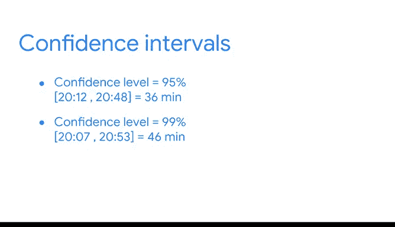

# 042：构建均值的置信区间 📊

在本节课中，我们将学习如何为均值构建置信区间。我们将通过一个关于手机电池寿命的具体案例，一步步演示计算过程，并理解置信区间在商业决策中的应用。

---

## 概述

之前我们学习了数据专业人员如何使用置信区间来表达估计的不确定性，并为一个即将到来的选举中的投票比例构建了置信区间。本节中，我们将构建另一个置信区间，但这次是为均值构建。基本流程与比例类似，但需要新的计算方法。

## 案例背景：新手机电池寿命

假设你是一家手机公司的数据专业人员。公司最近开发了一款电池续航更长的手机，设计目标是至少运行20小时无需充电。这是一个重大的电池升级，预计将促进销售。

营销团队正计划围绕新电池开展广告活动。管理层希望在广告公开前，确保关于20小时电池寿命的说法是准确的。他们要求你分析数据，并为新手机的电池寿命做出可靠的估计。

公司已生产了10万台新手机。产品工程团队随机抽取了100台手机进行测试，并记录了电池寿命数据。根据数据，你得知样本的平均电池续航时间为20.5小时，样本标准差为1.7小时。并且，根据关于电池标准制造工艺的数据，你还知道总体标准差为1.5小时。

## 构建置信区间的步骤

以下是构建置信区间的四个标准步骤。

### 第一步：确定样本统计量

你的样本代表了100部手机的平均电池续航时间。在本例中，你使用的样本统计量是**样本均值**。

### 第二步：选择置信水平

管理层要求你选择95%的置信水平，这是公司对新产品的标准要求。

### 第三步：计算误差范围

误差范围指的是样本统计量上下波动的数值范围。你可以通过将Z分数乘以标准误差来计算误差范围。

你可能还记得，使用的Z分数取决于你的置信水平。下表显示了与常用置信水平（如90%、95%和99%）对应的Z分数。95%置信水平的Z分数是**1.96**。

现在，我们来计算标准误差。标准误差衡量样本统计量的变异性，它显示了样本均值可能与实际总体均值有多大差异。标准误差越大，变异性越大。

均值的标准误差公式为：**总体标准差 / √样本容量**。

你的总体标准差是1.5，样本容量是100。将数字代入公式，得到标准误差为 **0.15**。

误差范围 = Z分数 × 标准误差 = **1.96 × 0.15 = 0.294**。

### 第四步：计算置信区间

置信区间的上限是样本均值加上误差范围：**20.5 + 0.294 = 20.794小时**（约20小时48分钟）。

置信区间的下限是样本均值减去误差范围：**20.5 - 0.294 = 20.206小时**（约20小时12分钟）。

因此，你得到了手机电池寿命的95%置信区间，范围从**20小时12分钟到20小时48分钟**。

## 结果解读与决策

这个置信区间为公司管理层提供了重要信息。区间的下限（20小时12分钟）高于公司20小时的目标。这有助于营销团队有信心地宣传手机的电池寿命至少为20小时。

你将分析结果呈现给公司的利益相关者，结果让除了营销总监之外的所有人都感到满意。营销总监在广告活动上投入了大量时间和精力，希望获得更高的置信度。他要求你使用99%的置信水平重新分析数据。

为了让营销总监满意，你使用相同的样本数据，但将置信水平从95%改为99%，重新计算结果。新的置信区间范围从**20小时7分钟到20小时53分钟**。区间的下限仍然高于20小时。这个结果应该能让公司管理层对电池寿命更有信心，并有望让营销总监满意。

你可能注意到，随着置信水平的提高，置信区间会变宽。在95%的置信水平下，区间覆盖了36分钟；在99%的置信水平下，区间覆盖了46分钟。这是因为更宽的置信区间更有可能包含实际的总体参数。

## 重要说明

在本例中，我们知道总体标准差是1.5小时。然而在实践中，总体标准差通常是未知的，必须根据样本标准差进行估计。这是因为很难获得大型总体的完整数据。如果你不知道总体标准差，置信区间的计算会发生变化。想了解更多，可以查阅相关阅读材料。

## 总结

本节课中，我们一起学习了如何为均值构建置信区间。我们回顾了构建置信区间的四个步骤：确定样本统计量、选择置信水平、计算误差范围以及计算区间本身。通过一个手机电池寿命的案例，我们看到了如何应用这些步骤，并理解了置信水平的变化如何影响区间的宽度。作为数据专业人员，你可以使用置信区间来帮助利益相关者基于准确的估计做出明智的决策。你的数据分析将有助于塑造公司的新产品发布策略，在新产品的未来成功中扮演关键角色。