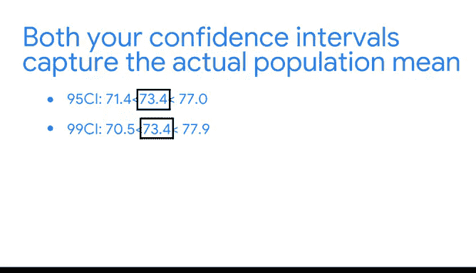

# 043：使用Python计算置信区间 📊


在本节课中，我们将学习如何使用Python为点估计构建置信区间。我们将通过一个具体的教育数据分析案例，演示如何从样本数据出发，计算并解释置信区间，从而为决策提供更可靠的统计依据。

---

## 概述

之前我们讨论了数据专业人员如何使用样本数据对总体参数进行点估计。例如，数据专业人员可能抽取墨西哥城100个房屋价格的随机样本来估计该城市所有房屋的平均价格。

点估计可以提供总体参数的大致概念，但由于抽样变异性，估计通常包含一些误差。在实践中，重复抽样以获得更精确的估计通常耗时且成本高昂。

因此，数据专业人员使用置信区间来描述估计的不确定性，并为利益相关者提供更多信息。

在本视频中，你将使用Python为点估计构建置信区间。

---

## 场景回顾

我们将继续之前的情景：你是一名为某大国教育部工作的数据专业人员。

回顾一下，你正在分析每个地区的识字率数据，并将继续使用之前处理过的数据。如果需要访问数据，请现在进行。

在之前的视频中，我们设想了教育部要求你收集地区识字率数据。你只能调查随机选择的50个地区，而不是原始数据集中包含的所有634个地区。你使用Python模拟了抽取50个地区的随机样本，并对所有地区的平均识字率进行了点估计。

现在，作为下一步，设想教育部要求你为平均地区识字率的估计构建一个95%的置信区间。

你可以使用Python来构建这个置信区间。让我们打开Jupyter Notebook并开始。

---

## 准备工作

首先，导入你计划使用的Python包：`numpy` 和 `pandas`。为了节省时间，使用缩写重命名你的包：`np` 和 `pd`。

```python
import numpy as np
import pandas as pd
```

从 `scipy` 导入 `stats` 模块。

```python
from scipy import stats
```

你也可以使用在之前视频中处理过的相同样本数据。编写代码让Python模拟相同的地区识字率数据随机样本。

首先，命名你的变量 `sampled_data`，然后输入 `sample` 函数的参数：`sample_size=50`，`replace=True`（因为你是进行有放回抽样）。对于 `random_state`，选择相同的随机数（之前使用的是31208）以生成相同的结果。

```python
sampled_data = your_dataframe.sample(n=50, replace=True, random_state=31208)
```

现在，显示你的变量值。输出显示了从数据集中随机选择的50个地区，每个地区都有不同的识字率。

---

## 置信区间构建步骤回顾

在之前的视频中，我们逐步构建了置信区间。让我们回顾一下四个主要步骤：

1.  确定样本统计量。
2.  选择置信水平。
3.  计算误差范围。
4.  计算区间。

之前，你一步一步地完成了这些步骤来构建置信区间。使用Python，你只需一行代码就可以构建置信区间，并能更快地获得结果。

---

## 使用Python函数计算置信区间

如果你处理的是大样本（例如大于30），可以使用 `scipy.stats.norm.interval` 函数为均值构建置信区间。

该函数包含以下参数：
*   `alpha`：指置信水平。
*   `loc`：指样本均值。
*   `scale`：指样本标准误。

让我们更详细地探讨每个参数。

**第一，`alpha` 或你的置信水平。**

教育部要求95%的置信水平，这是政府资助研究的公认标准。

**第二，`loc` 或样本均值。**

这是你50个地区样本的平均识字率。命名一个新变量 `sample_mean`，然后计算你样本数据的平均地区识字率。

```python
sample_mean = sampled_data['literacy_rate'].mean()
```

**第三，`scale` 或样本标准误。**

回顾一下，标准误衡量的是你样本数据的变异性。你可能还记得样本标准误的公式是：**样本标准差除以样本大小的平方根**。

你可以编写代码来表达这个公式，并让Python为你进行计算。

首先，命名一个新变量 `estimated_standard_error`。接下来，取样本数据的标准差并除以样本大小的平方根。在括号内，写入你的数据框名称，后跟 `shape` 函数和 `[0]`。

回顾一下，`shape` 函数返回数据框中的行数和列数。`shape[0]` 只返回行数，这与你的样本大小相同。

```python
estimated_standard_error = sampled_data['literacy_rate'].std() / np.sqrt(sampled_data.shape[0])
```

---

## 构建置信区间

现在你已经准备好将所有内容整合起来，使用 `stats.norm.interval` 函数构建你的置信区间。

首先，写出函数并设置参数：对于 `alpha`，设置为 `0.95`，因为你想使用95%的置信水平；对于 `loc`，输入变量 `sample_mean`；对于 `scale`，输入变量 `estimated_standard_error`。

```python
confidence_interval = stats.norm.interval(alpha=0.95, loc=sample_mean, scale=estimated_standard_error)
```

然后运行代码，你的置信区间就出来了。Python使这个过程非常高效。

你得到了一个关于平均地区识字率的95%置信区间，范围大约从 **71.4% 到 77.0%**。

教育部将使用你对平均地区识字率的估计来帮助做出向不同州分配资金的决定。

---

## 提高置信水平

现在，设想部门的一位高级主管希望对你的结果更有信心。主管希望确保你有一个可靠的估计，并建议你使用99%的置信水平重新计算区间。

要选择新的置信水平，复制并粘贴你之前的代码。将你的 `alpha` 从 `0.95` 更改为 `0.99`，以基于样本数据计算99%的置信区间。

```python
confidence_interval_99 = stats.norm.interval(alpha=0.99, loc=sample_mean, scale=estimated_standard_error)
```

现在运行代码，这是你的置信区间。

你得到了一个关于平均地区识字率的99%置信区间，范围大约从 **70.5% 到 77.9%**。

---

## 置信水平与区间宽度的关系

你可能会注意到，随着置信水平的提高，置信区间会变宽。

*   在95%的置信水平下，区间覆盖了 **5.6** 个百分点。
*   在99%的置信水平下，区间覆盖了 **7** 个百分点。

这是因为更宽的置信区间更有可能包含实际的总体参数。

在我们本视频的场景中，你只有50个地区的数据。然而，在之前的视频中，你计算了数据集中所有634个地区的平均识字率，大约为 **73.4%**。

因此，事实证明，你的两个置信区间都捕获了实际的总体均值。你的结果将帮助教育部决定如何分配政府资源以提高识字率。

---

## 总结




在本节课中，我们一起学习了如何使用Python快速构建置信区间。我们回顾了置信区间的概念和构建步骤，并通过实际代码演示了如何利用 `scipy.stats.norm.interval` 函数，根据指定的置信水平、样本均值和标准误来计算区间。我们还观察到，更高的置信水平会导致更宽的置信区间，这反映了统计估计中精度与把握度之间的权衡。掌握这一技能，将使你能够更专业地量化估计的不确定性，并为数据驱动的决策提供有力支持。