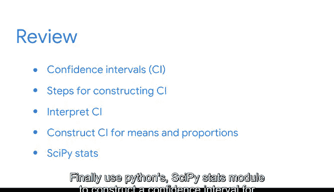

# 044：置信区间总结 🎯


在本节课中，我们将总结置信区间这一核心概念。我们将回顾置信区间在数据分析中的作用、构建步骤、解读方法，以及如何应用置信区间为决策提供支持。

---

## 置信区间简介 📊

课程开始时，我们讨论了数据专业人员如何使用样本统计量来估计总体参数。在本部分课程中，我们估计了汽车发动机的平均排放率和手机电池的平均寿命。

置信区间有助于表达估计中的不确定性，并提供一个可能结果的范围。

例如，我可以说营销活动将带来20万美元的新销售额。或者，我可以说基于95%的置信水平，我估计营销活动将带来15万至25万美元的新销售收入。两种预测可能都合理，但置信区间表达了估计中的不确定性，并为利益相关者提供了更多信息，帮助他们做出更好的决策。

---

## 置信区间的作用与价值 💡

上一节我们介绍了置信区间的基本概念，本节中我们来看看它在实际组织中的价值。

向利益相关者提供可靠的估计对组织有积极影响。例如，假设你是一家在全球运输产品的航运公司的数据专业人员。你可以使用置信区间来帮助估计经济因素，如燃料价格、运输成本、当地关税等。这些信息帮助公司领导者最小化风险、避免不必要的开支并提高效率。提高运输的速度和安全性将使依赖你公司服务的数千人受益。

---

## 置信区间的构建与解读 🔧

在本部分课程中，我们讨论了置信区间在数据分析中的作用，并回顾了构建置信区间的基本步骤。接下来，你学习了如何解读置信区间，以及如何避免对其结果的常见误解。

以下是构建置信区间的基本步骤：

1.  **识别样本统计量**：例如样本均值或样本比例。
2.  **选择置信水平**：例如95%或99%。
3.  **计算标准误差**：衡量估计的变异性。
4.  **查找临界值**：基于置信水平和分布（如Z分布或t分布）。
5.  **计算误差范围**：公式为 `误差范围 = 临界值 * 标准误差`。
6.  **指定区间**：公式为 `置信区间 = 点估计值 ± 误差范围`。

然后，你学习了如何为均值和比例构建置信区间。最后，我们使用Python的`scipy.stats`模块为总体均值的点估计构建了置信区间。

```python
# 示例：使用scipy.stats计算总体均值的置信区间
import scipy.stats as st
import numpy as np

# 假设的样本数据
sample_data = np.array([...]) # 你的数据
confidence_level = 0.95
sample_mean = np.mean(sample_data)
sample_std = np.std(sample_data, ddof=1) # 样本标准差
n = len(sample_data)

# 计算标准误差和t临界值
standard_error = sample_std / np.sqrt(n)
t_critical = st.t.ppf((1 + confidence_level) / 2, df=n-1)

# 计算误差范围和置信区间
margin_of_error = t_critical * standard_error
confidence_interval = (sample_mean - margin_of_error, sample_mean + margin_of_error)
```

---

## 总结与下一步 🚀



本节课中我们一起学习了置信区间的核心概念、构建方法、实际应用及其在支持数据驱动决策中的重要性。

很快，你将参加一次分级评估。为了准备，请查看列出了所有新术语的阅读材料，并随时重温涵盖关键概念的**视频**、**阅读材料**和其他资源。你做得很好，请继续保持。

---


