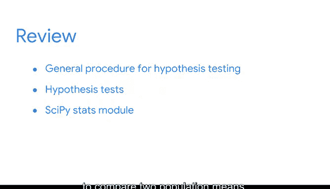

# 045：模块五导论 🎯

在本节课中，我们将学习假设检验的基本概念、一般步骤及其在数据分析中的应用，例如在临床试验中评估新药的有效性。

---

未来的数据分析师们，你们的学习之旅已经取得了长足的进步。回顾一下你们已经掌握的新技能：你们可以计算描述性统计量，如**均值**和**标准差**，来概括数据特征；可以使用**二项分布**、**泊松分布**和**正态分布**等概率分布来为不同类型的数据建模；能够运用抽样分布来估计总体均值和比例；并且可以构建**置信区间**来描述估计的不确定性。

现在，你们将为技能库增添一项新技能：**假设检验**。

假设检验是一种统计程序，它利用样本数据来评估关于总体参数的某个假设。例如，在临床试验中，假设检验常被用来判断一种新药是否能给患者带来更好的治疗效果。

设想一家制药公司发明了一种治疗普通感冒的新药。该公司随机抽取了200名有感冒症状的人进行测试。在不服用药物的情况下，典型患者的感冒症状会持续7.5天。而服用该药物的患者，平均恢复时间为6.2天。此时，公司可能会问：临床试验的结果是否具有**统计显著性**？

回忆一下，统计显著性是指测试或实验的结果不能仅用偶然性来解释。换句话说，药物是否真的对恢复时间产生了积极影响？还是说，这个结果仅仅是出于偶然或抽样变异性？

为了回答这些问题，公司可能会要求数据分析师进行假设检验。该检验有助于量化结果是更可能源于偶然，还是具有统计显著性。这一知识将帮助公司判断药物是否真正有效，以及是否应批准其公开使用。

接下来，我们将概述假设检验的一般步骤，从陈述**原假设**和**备择假设**，到选择**显著性水平**，再到计算**P值**，并最终决定是**拒绝**还是**未能拒绝**原假设。

然后，我们将探讨两种不同类型的假设检验：**单样本检验**和**双样本检验**。

最后，你将学习如何使用Python的`scipy.stats`模块进行双样本假设检验，以比较两个总体均值。

准备好学习更多内容后，我们将在下一个视频中继续。