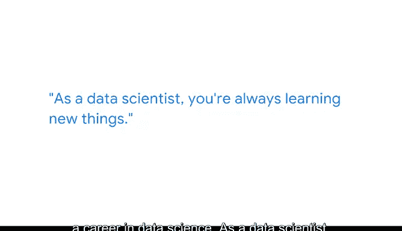

# 046：在不断变化的数据空间中持续学习 🎯

## 概述

在本节课中，我们将跟随谷歌数据科学实习生Elilia的分享，了解数据科学工作的实际应用、所需技能以及职业发展路径。课程将涵盖数据科学的核心工作内容、跨领域应用的可能性，以及持续学习的重要性。

---

大家好，我是Elilia，是谷歌的一名数据科学实习生。

我来自法国，在那里长大并完成了大部分学业。我一直对数学非常感兴趣。

在我大学教育的初期，我也发现了计算机科学，并开始培养这方面的技能。

在法国寻找第一份实习时，我一直在寻找将这两个领域应用于现实问题的方法。

我发现了数据科学实习岗位，这让我希望继续在数据科学领域发展并专攻此方向。

我一直关注数据科学在人工智能和医疗保健等领域的各种应用。

这就是为什么我对在谷歌工作非常感兴趣，特别是在Verily公司。

最让我兴奋的是能够处理与医疗保健相关的数据集，生成见解并构建模型，这些模型能对患者或整个医疗保健行业产生实际影响。

谷歌的数据科学实习生在实习期间会获得一个项目来开展工作。

我具体从事的是临床自然语言处理，基本上是使用机器学习方法从临床记录中提取相关信息，并从中生成见解。

我绝对认为我的实习为我在数据科学领域的职业生涯做了充分准备。

作为一名数据科学家，你总是在学习新事物。总会有新的最先进模型出现。

跟上它们的步伐并真正了解它们的工作原理总是非常有趣，这样你就能根据你的具体用例来调整它们。

该项目的一部分是从患者记录和笔记中提取健康的社会决定因素。

然后我探索了这些健康的社会决定因素之间的关系，并发现了一些非常有趣的关联。

有些是已知的，但我觉得能够通过自己的工作亲自观察到它们真的很酷。

我认为数据科学和数据科学家工作的伟大之处在于，数据科学可以对任何领域产生影响。

如果你对与数据科学无关的某个领域感兴趣，我相当确定你能找到与之相关的工作。

关注你感兴趣的行业，很可能那里就会有数据科学的工作岗位。

---

## 总结

本节课中，我们一起学习了数据科学实践者的真实工作体验。我们了解到，数据科学是一个结合了数学、计算机科学和领域知识的交叉学科，其核心在于从数据中提取价值并解决实际问题。无论是处理临床文本的**自然语言处理（NLP）**任务，还是探索健康的社会决定因素，数据科学工作都要求持续学习新模型和方法（例如，不断跟进 `state-of-the-art models`）。最重要的是，数据科学的应用无处不在，可以将个人兴趣与职业发展相结合，在任何你关切的领域产生积极影响。