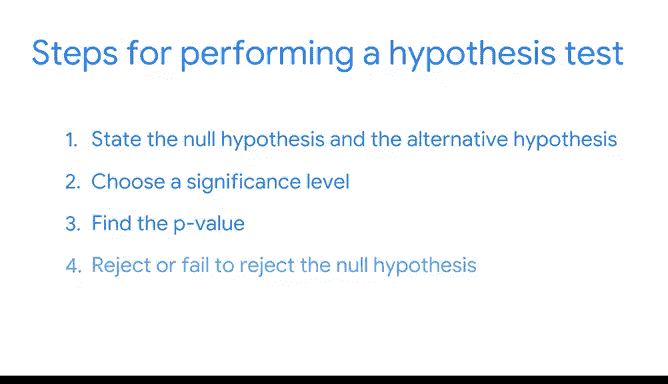
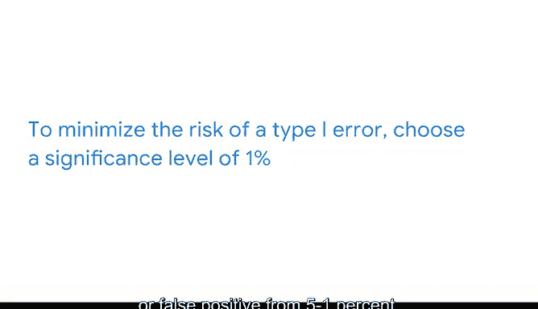

# 047：47_05_03_假设检验介绍 📊

在本节课中，我们将要学习假设检验的基本概念和步骤。假设检验是一种利用样本数据来评估关于总体参数假设的统计方法。例如，在新药的临床试验中，假设检验可以帮助你判断药物对你样本组的平均恢复时间的影响是统计显著的，还是仅仅出于偶然。

## 假设检验步骤概述 🔍

在上一节中，我们提到了假设检验的核心作用。本节中，我们来看看执行假设检验的具体步骤。以下是执行假设检验的四个主要步骤：

1.  陈述原假设和备择假设。
2.  选择显著性水平。
3.  计算 P 值。
4.  决定拒绝或无法拒绝原假设。

目前，这些概念可能有些抽象。这没关系。在本视频结束时，你会对每一个概念有更深入的了解。现在，为了阐明假设检验的步骤，让我们先探索一个例子。之后，我们将重新审视这些概念。

## 一个简单的例子：检验硬币是否公平 🪙

想象你得到一枚用于游戏的硬币。你不确定这枚硬币是公平的还是被做过手脚的。也就是说，你不知道它是一枚标准硬币，还是被特意加重以影响抛掷结果（例如，总是正面朝上）。在游戏中使用它之前，你想弄清楚这枚硬币是否公平。你决定通过连续抛掷六次并记录结果来测试这枚硬币。

正如我们之前在概率讨论中提到的，如果硬币是公平的，对于任何一次抛掷，正面或反面朝上的概率都是 0.5 或 50%。如果硬币被做了手脚总是反面朝上，那么任何一次抛掷反面朝上的概率会高得多，可能是 90% 甚至 100%。

在你开始测试之前，你需要一个基准来评估测试结果。例如，假设前两次抛掷都是反面。硬币是被做了手脚吗？

回想一下，我们将使用乘法规则来计算独立事件的概率。所以，硬币连续两次反面朝上的概率是 `0.5 * 0.5 = 0.25` 或 25%。这并非不可能。此时，你不能合理地断定硬币被做了手脚。

现在，想象硬币连续四次反面朝上。发生这种情况的概率是 `0.5 * 0.5 * 0.5 * 0.5 = 0.0625` 或 6.25%。这不太可能，但并非不可能。然而，你希望更有信心地认为这个结果不是偶然的。

你决定使用 5% 作为阈值来判断结果是否出于偶然。换句话说，如果假设硬币是公平的，那么出现该结果的概率小于 5%，你就将得出结论认为硬币实际上被做了手脚。

例如，一枚公平的硬币连续六次反面朝上的概率是 `0.5 * 0.5 * 0.5 * 0.5 * 0.5 * 0.5 = 0.0156` 或 1.56%。这太不可能了，因为可能性低于你设定的 5% 阈值。如果发生这种情况，你将断定硬币被做了手脚。

现在，你准备好进行测试了。你连续抛掷硬币六次并记录结果。硬币每次都反面朝上。你得出结论，硬币被做了手脚。不幸的是，除非你在表演魔术并且恰好需要一枚总是反面朝上的硬币，否则这枚硬币对你没什么用处。

这个例子是检验硬币是否公平的假设检验的一个简化版本。你经历了假设检验程序的每一步。

## 深入探讨假设检验步骤 📝

上一节我们通过例子了解了假设检验的流程。本节中，我们来更详细地探讨每个步骤。以下是执行假设检验的四个步骤：

1.  陈述原假设和备择假设。
2.  选择显著性水平。
3.  计算 P 值。
4.  决定拒绝或无法拒绝原假设。

### 第一步：陈述假设

首先，陈述你的原假设和备择假设。

*   **原假设** 是一个被假定为真的陈述，除非有令人信服的证据证明其相反。原假设通常假设你观察到的数据是偶然发生的。
*   **备择假设** 是一个与原假设相矛盾的陈述，只有在有令人信服的证据支持时才会被接受为真。备择假设通常假设你观察到的数据不是偶然发生的。

在我们的例子中：
*   你的**原假设** 是：硬币是公平的。拥有公平的硬币是标准或典型状态。原假设声称你的观察结果纯粹是偶然的。
*   你的**备择假设** 是：硬币不公平。备择假设声称结果是做手脚造成的，并非偶然。

### 第二步：选择显著性水平

接下来，选择你的显著性水平。这是你认为结果具有统计显著性的阈值。显著性水平也是当原假设为真时，你拒绝原假设的概率。我将在视频后面详细讨论这一点。

在我们的例子中，你使用 5% 作为阈值来判断抛硬币的结果是否出于偶然。通常，数据专业人员将显著性水平设定为 5%。

请注意，5% 并没有什么神奇之处。这是基于统计研究和教育传统的一种选择。你可以根据分析的要求调整显著性水平。其他常见的选择是 1% 和 10%。

### 第三步：计算 P 值

然后，计算你的 P 值。**P 值** 指的是当原假设为真时，观察到与所观察结果一样极端或更极端的结果的概率。

我们已经计算出一枚公平的硬币连续六次反面朝上的概率是 1.56%。所以，如果你假设原假设为真（即硬币是公平的），那么我们例子中的 P 值就是 1.56%。任何低于此值的概率都意味着有更强的证据支持备择假设。

记住，你的备择假设是硬币不公平。例如，用一枚公平的硬币连续抛掷 7 次反面的概率是 `0.5^7 = 0.0078` 或 0.78%，这低于 1.56% 的 P 值。如果你连续抛掷出七次反面，你将有更强的证据支持备择假设，即硬币不公平。

### 第四步：做出决定

最后，你必须决定是拒绝还是无法拒绝原假设。统计学家总是说“无法拒绝”而不是“接受”。这是因为假设检验基于概率，而非确定性，而“接受”意味着确定性。通常，作为数据专业人员，我们尽量避免声称基于统计方法的结果是确定的。

关于假设检验的结论，有两条主要规则：
*   如果你的 **P 值小于** 你的显著性水平，你**拒绝** 原假设。
*   如果你的 **P 值大于** 你的显著性水平，你**无法拒绝** 原假设。

在抛硬币的例子中，你的 P 值 1.56% 小于你的显著性水平 5%。因此，你拒绝原假设，并得出结论：你连续六次反面的结果具有统计显著性，并非偶然。

你的拒绝或无法拒绝的决定也取决于你的显著性水平。假设在你的测试之前，你选择了 1% 而不是 5% 作为显著性水平。在那种情况下，你将无法拒绝原假设，因为你的 P 值 1.56% 将大于你的显著性水平 1%。

## 假设检验中的错误 ⚠️

一个统计上显著的结果并不能 100% 确定地证明一个假设是正确的。因为假设检验基于概率，所以在对原假设下结论时，总是有可能得出错误的结论。在假设检验中，下结论时可能犯两种错误：**第一类错误** 和**第二类错误**。

*   **第一类错误**，也称为**假阳性**，发生在你拒绝了实际上为真的原假设时。换句话说，你得出结论认为你的结果具有统计显著性，而实际上它是偶然发生的。在我们的例子中，当硬币实际上是公平时，却断定硬币被做了手脚，这将被视为第一类错误。即使你连续得到了六次反面，这个结果仍然可能是偶然的——可能性极低，但确实可能。
*   **第二类错误**，也称为**假阴性**，发生在你未能拒绝实际上为假的原假设时。换句话说，你得出结论认为你的结果是偶然发生的，而实际上它具有统计显著性。在我们的例子中，你将会断定硬币是公平的，而实际上它被做了手脚。

之前视频中提到，你的显著性水平也是当原假设为真时拒绝它的概率。5% 的显著性水平意味着当你拒绝原假设时，你愿意接受 5% 的犯错几率。

为了降低犯第一类错误的风险，请选择较低的显著性水平。回想一下，如果你选择 1% 的显著性水平，你将无法拒绝原假设，并得出结论认为硬币是公平的。然而，选择较低的显著性水平意味着你更有可能犯第二类错误或假阴性。

作为数据专业人员，了解假设检验中固有的潜在错误以及它们如何影响你的结果是有帮助的。根据具体情况和分析目标，你可能希望最小化第一类错误或第二类错误的风险。

想象你正在为降落伞制造商测试面料的强度。你希望非常有信心你使用的材料足够坚固，能够制作出功能正常的降落伞。第一类错误或假阳性意味着你错误地认为材料足够坚固。显然，在这种情况下，你希望最小化第一类错误的风险。为此，请选择 1% 而不是标准的 5% 作为显著性水平。这一变化将第一类错误或假阳性的机会从 5% 降低到 1%。

最终，作为数据专业人员，你有责任决定需要多少证据才能断定一个结果具有统计显著性，以及第一类错误或假阳性的风险有多大。对于所有情况，并没有单一正确的答案。这需要你来决定。

## 总结 📋

本节课中我们一起学习了假设检验的核心概念和完整流程。抛硬币的例子向你展示了进行假设检验所涉及的主要概念。作为数据专业人员，你将把这些概念用于你可能想要进行的任何假设检验。

