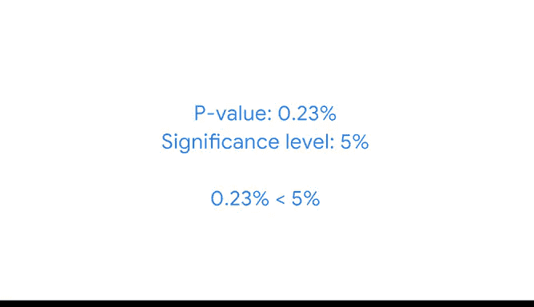

# 048：单样本均值检验 📊

在本节课中，我们将学习如何进行单样本假设检验。这是一种用于判断总体参数（如均值或比例）是否等于某个特定值的统计方法。我们将通过一个在线配送公司的实际案例，详细讲解单样本Z检验的完整步骤。

## 概述：假设检验的类型

上一节我们介绍了假设检验的基本概念。本节中，我们来看看假设检验的两种主要类型：单样本检验和双样本检验。

*   **单样本检验**：用于判断一个总体参数（如均值或比例）是否等于一个特定值。
*   **双样本检验**：用于判断两个总体参数（如两个均值或两个比例）是否彼此相等。我们将在后续课程中探讨双样本检验。

数据专业人员可能会使用单样本假设检验来确定：
*   公司的平均销售收入是否达到目标值。
*   某种医疗方法的平均成功率是否达到设定目标。
*   股票投资组合的平均回报率是否等于市场基准。

## 案例背景：在线配送公司

假设你是一名为在线配送公司工作的数据专业人员。通常，在线食品订单的平均配送时间为40分钟，标准差为5分钟。

最近，公司管理层推出了一项新的培训计划，旨在提高配送效率。在配送员完成培训后，管理层随机抽取了50个订单的样本，以了解配送所需时间。

这50个订单样本的平均配送时间为38分钟，标准差为5分钟。总体均值（40分钟）与样本均值（38分钟）之间存在2分钟的观测差异。

管理层要求你判断平均配送时间的减少是否具有**统计显著性**，还是仅仅出于偶然。如果减少是显著的，公司就计划在其他地区投资开发和实施该培训计划。

你决定进行**单样本Z检验**来分析这些数据。

## 进行假设检验的步骤

以下是进行假设检验的标准步骤：
1.  陈述原假设和备择假设。
2.  选择显著性水平。
3.  计算P值。
4.  决定拒绝或不拒绝原假设。

接下来，我们将按照这些步骤，逐一应用到我们的案例中。

### 第一步：陈述假设

首先，陈述你的原假设和备择假设。原假设是一个被假定为真的陈述，除非有令人信服的证据证明其不成立。

在单样本Z检验中，原假设声明总体均值等于一个观测值。在本案例中，你的原假设是：平均配送时间等于40分钟（即标准的平均配送时间）。

**原假设 (H₀): μ = 40**

备择假设是与原假设相矛盾的陈述。在单样本检验中，备择假设主要有三种选项：总体均值不等于、小于或大于观测值。在本案例中，你想测试培训是否降低了平均配送时间。因此，你的备择假设是：平均配送时间小于40分钟。

**备择假设 (H₁): μ < 40**

### 第二步：选择显著性水平

接着，设定显著性水平，即你认为结果具有统计显著性的阈值。这也是当原假设为真时，你错误地拒绝它的概率。

你选择5%的显著性水平，这是公司进行数据分析的标准。

**显著性水平 (α): 0.05**

### 第三步：计算P值

现在，计算P值。P值是指当原假设为真时，观测到与样本差异一样极端或更极端结果的概率。

通常，平均配送时间是40分钟。你的样本平均配送时间是38分钟。你的原假设声称这2分钟的差异是由于偶然或抽样变异性造成的。

你的P值就是：如果原假设为真，观测到2分钟或更大差异的概率。

如果这个结果的概率非常小（具体来说，如果你的P值小于5%的显著性水平），那么你将拒绝原假设。

#### P值的计算概念

作为数据专业人员，你几乎总是使用Python等编程语言或其他统计软件在计算机上计算P值。然而，让我们简要了解一下计算中涉及的概念，以便更好地理解其工作原理。

能够使用代码进行计算对你的未来职业很重要，但熟悉计算背后的概念将帮助你将这些统计方法应用到工作问题中。

P值是根据所谓的**检验统计量**计算得出的。在假设检验中，检验统计量是一个数值，它显示你的观测数据与原假设下预期的分布匹配得有多紧密。

因此，如果你假设原假设为真（平均配送时间为40分钟），那么配送时间数据服从正态分布。检验统计量显示了你的观测数据（样本平均配送时间38分钟）将落在该分布的哪个位置。

由于你正在进行Z检验，你的检验统计量是一个**Z分数**。Z分数衡量的是一个数据点低于或高于总体均值多少个标准差，它告诉你你的值在正态分布上的位置。

以下公式根据你的样本数据给出检验统计量Z：

**Z = (x̄ - μ) / (σ / √n)**

其中：
*   **x̄** 是样本均值（38分钟）
*   **μ** 是总体均值（40分钟）
*   **σ** 是总体标准差（5分钟）
*   **n** 是样本大小（50）

将数字代入公式并计算，你得到一个Z分数：**Z ≈ -2.82**

让我们看看Z分数-2.82在分布中的位置。它位于左侧很远的地方，几乎低于均值三个标准差。对于正态分布，得到小于你的Z分数-2.82的值的概率，是通过计算Z分数左侧曲线下的面积得出的。

这被称为**左尾检验**，因为你的P值位于分布的左尾。曲线这部分的面积就等于你的P值。

再次强调，你的P值是当原假设为真时，观测到与样本检验统计量一样极端或更极端结果的概率。你的备择假设声明平均配送时间减少了，这就是为什么我们关注得到任何等于或低于Z分数-2.82的值的概率。

在不同的检验场景中，你的检验统计量可能是+2.45，并且你可能关注等于或高于Z分数2.45的值。那样的话，你的P值将位于分布的右尾，你将进行右尾检验。

如果你计算P值，你会发现它是 **0.0023** 或 **0.23%**。这意味着，如果原假设为真，平均配送时间出现2分钟或更大差异的概率是0.23%。换句话说，差异是由于偶然造成的可能性极低。

### 第四步：做出决策

要对你的原假设得出结论，请将你的P值与显著性水平进行比较。

*   如果你的P值**小于**显著性水平，你得出结论：平均配送时间存在统计显著性差异。换句话说，你**拒绝原假设**。
*   如果你的P值**大于**显著性水平，你得出结论：平均配送时间不存在统计显著性差异。换句话说，你**不拒绝原假设**。

你的P值0.0023（0.23%）小于显著性水平0.05（5%）。

因此，你**拒绝原假设**，并得出结论：平均配送时间存在统计显著性差异。

## 总结与业务决策

本节课中，我们一起学习了如何执行单样本Z检验。我们从陈述假设开始，设定了显著性水平，理解了P值和检验统计量的概念，并最终根据P值与显著性水平的比较做出了统计决策。

在我们的案例中，分析结果表明，更快的配送时间很可能是培训带来的积极效果。你的分析将帮助公司领导层决定是否在未来对该培训计划进行更大投资。根据你的结果，他们很可能会这样做。