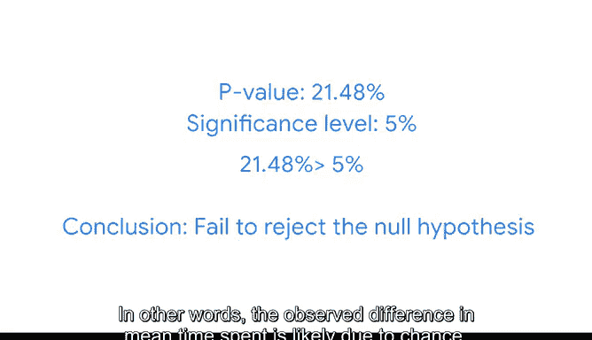

# 049：双样本均值检验

在本节课中，我们将学习如何执行**双样本均值检验**。这是一种用于比较两个独立群体均值是否存在显著差异的统计方法，在数据分析中，尤其是在A/B测试场景下应用广泛。

上一节我们介绍了单样本假设检验，用于分析单个总体均值是否等于某个特定值。本节中我们来看看**双样本检验**，它用于判断两个总体的均值是否彼此相等。

## 概述：双样本T检验的应用场景

在数据分析领域，双样本检验最常用于**A/B测试**。例如，一家在线零售店考虑为其最忠诚的会员更改着陆页。公司最关心的指标是用户每次会话在着陆页上花费的平均时间。

以下是进行此类分析的标准步骤：
1.  设置实验，将用户随机分为两组：A组使用默认着陆页，B组使用重新设计的版本。
2.  使用**T检验**比较两个着陆页的平均停留时间，以确定两个样本均值之间的差异是否具有**统计显著性**。换句话说，如果B组在着陆页上花费的时间比A组长，T检验将帮助判断这是由于偶然性还是新设计导致的。

## 双样本T检验的假设

双样本均值T检验基于以下假设：
*   两个样本彼此**独立**。
*   每个样本的数据都是从**正态分布**的总体中随机抽取的。
*   总体**标准差未知**，需要从样本数据中估计。

在实践中，由于很难获得大型总体的完整数据，总体标准差通常是未知的，因此数据专业人员通常使用**T检验**。

## T检验与Z检验的区别

*   **Z检验**：当总体标准差已知时使用，其检验统计量是**Z分数**，基于**标准正态分布**。
*   **T检验**：当总体标准差未知时使用，其检验统计量是**T分数**，基于**T分布**。

T分布的图形呈钟形，与标准正态分布相似，但其**尾部更厚**。更厚的尾部表明，在小数据集的情况下，出现异常值的频率更高。随着样本量的增加，T分布会逐渐接近正态分布。

## 实战演练：化妆品网站A/B测试

假设你是一家化妆品公司的数据专家。公司正在研究客户在其网站上花费的时间。你的团队领导要求你进行一项A/B测试，以确定将着陆页的背景色从灰色改为绿色是否会影响页面平均停留时间。

你随机选择了两组用户：
*   第一组访问灰色着陆页（版本A）。
*   第二组访问绿色着陆页（版本B）。

你从A/B测试中收集到以下数据：
*   40名用户访问版本A，平均停留时间为300秒，标准差为18.5秒。
*   38名用户访问版本B，平均停留时间为305秒，标准差为16.7秒。

观察到的均值差异为 `305 - 300 = 5` 秒。你决定进行双样本T检验来分析这些数据。

### 假设检验步骤

以下是进行假设检验的标准步骤：
1.  陈述零假设和备择假设。
2.  选择显著性水平。
3.  计算P值。
4.  决定拒绝或不拒绝零假设。

#### 第一步：陈述假设

在双样本T检验中：
*   **零假设 (H₀)**：两个总体均值之间没有差异。除非有令人信服的相反证据，否则假定此假设为真。
    *   对于本例：版本A和版本B的平均停留时间**没有差异**。
*   **备择假设 (H₁)**：与零假设相反的陈述。
    *   对于本例：版本A和版本B的平均停留时间**存在差异**。

#### 第二步：设置显著性水平

显著性水平是你认为结果具有统计显著性的阈值，即当零假设为真时拒绝它的概率。你选择5%的显著性水平，这是公司进行A/B测试的标准。

#### 第三步：计算P值

P值是在零假设为真的情况下，观察到样本均值差异达到或超过实际观测差异（5秒）的极端程度的概率。

如果这个结果的概率非常小（特别是P值小于5%的显著性水平），你将拒绝零假设。

作为数据专家，你几乎总是使用Python等编程语言或统计软件在计算机上计算P值。首先需要计算检验统计量。

由于你正在进行T检验，因此需要计算**T分数**。使用以下公式根据样本数据计算检验统计量T：

`T = (x̄₁ - x̄₂) / √( (s₁² / n₁) + (s₂² / n₂) )`

其中：
*   `x̄₁` 和 `x̄₂` 是两个组的样本均值。
*   `n₁` 和 `n₂` 是两个组的样本大小。
*   `s₁` 和 `s₂` 是两个组的样本标准差。

将本例数据代入公式计算，得到检验统计量 `T ≈ -1.2508`。

对于T检验，检验统计量在零假设下服从T分布。你的备择假设指出版本A和B的均值存在差异。观察到的差异是5秒。因此，如果你发现均值之间存在统计显著差异（无论是小于还是大于观察到的5秒差异），你都将拒绝零假设。

由于你对两个方向（小于或大于检验统计量）的值都感兴趣，因此你的P值是获得小于T分数 `-1.2508` 或大于T分数 `+1.2508` 的值的概率。P值对应于分布左尾和右尾曲线下的面积，这被称为**双尾检验**。

计算得出的P值为 `0.2148` 或 `21.48%`。这意味着，如果零假设为真，那么版本A和版本B平均停留时间之间的绝对差异达到或超过5秒的概率是 `21.48%`。

#### 第四步：得出结论

将P值与显著性水平进行比较：
*   如果 **P值 < 显著性水平**，则得出结论：两个版本之间的均值存在统计显著差异。即，**拒绝**“版本A和B平均停留时间无差异”的零假设。
*   如果 **P值 > 显著性水平**，则得出结论：两个版本之间不存在统计显著差异。即，**无法拒绝**零假设。

本例中，P值 `0.2148 (21.48%)` 大于显著性水平 `0.05 (5%)`。因此，你**无法拒绝零假设**，并得出结论：版本A和版本B的平均停留时间之间**不存在统计显著差异**。换句话说，观察到的平均停留时间差异很可能只是由于偶然性。

## 分析结论与业务建议

你的分析将帮助公司决定如何重新设计网站。既然灰色和绿色背景色在平均停留时间上没有统计显著差异，你可以建议公司：
*   测试其他颜色，例如蓝色或黄色。
*   测试其他设计功能，例如文本大小或按钮形状。
也许不同的设计更改会对客户在着陆页上的平均停留时间产生影响。

## 总结

本节课中我们一起学习了**双样本T检验**。我们了解到，这是一种用于比较两个独立群体均值的强大统计工具，尤其适用于A/B测试。我们回顾了其核心假设、与Z检验的区别，并通过一个化妆品网站的背景色A/B测试案例，完整演练了从建立假设、计算检验统计量（T分数）和P值，到最终做出统计决策的全过程。关键在于比较P值与预设的显著性水平，从而判断观察到的差异是真实的效应还是随机波动。