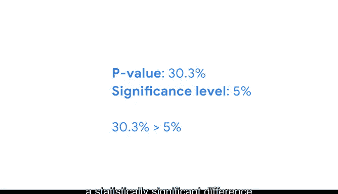

# 050：双样本比例检验 📊


在本节课中，我们将学习如何使用双样本Z检验来比较两个总体的比例。我们将通过一个具体的商业案例，一步步地完成假设检验的完整流程。

---

## 概述

之前我们学习了使用双样本T检验来比较两个总体的均值。例如，我们曾用它来比较一家化妆品公司两个不同版本着陆页的平均停留时间。

本节中，我们来看看如何比较两个总体的比例。由于技术原因，T检验不适用于比例数据，因此我们需要使用**双样本Z检验**。数据专业人员可能会使用此方法来比较两条装配线上产品的缺陷比例、两个试验组对新药的副作用比例，或两个选区注册选民对新法的支持比例。

---

## 案例背景：员工满意度调查

假设你是一家国际建筑公司的数据专业人员。公司在伦敦和北京设有办公室。人力资源团队希望了解北京办公室和伦敦办公室的员工满意度水平是否存在差异。

团队在每个办公室随机抽取了50名员工进行调查，询问他们是否对当前工作感到满意。他们要求你判断伦敦和北京满意员工的比例是否存在统计学上的显著差异。如果存在，HR团队将投入资源调查原因。

根据调查结果：
*   伦敦办公室有**67%** 的员工表示满意。
*   北京办公室有**57%** 的员工表示满意。

两地满意员工比例存在**10个百分点**（67% - 57%）的差异。你决定进行双样本Z检验来分析数据。

---

## 假设检验步骤回顾

以下是进行假设检验的标准步骤：
1.  陈述原假设和备择假设。
2.  选择显著性水平。
3.  计算P值。
4.  决定是否拒绝原假设。

接下来，我们将这些步骤应用到我们的案例中。

---

### 第一步：陈述假设

在双样本Z检验中：
*   **原假设 (H₀)** 声称两个群体的比例没有差异。除非有令人信服的证据，否则我们假定它为真。
*   **备择假设 (H₁)** 则声称存在差异。

应用到我们的案例：
*   **H₀**: 伦敦和北京满意员工的比例**没有差异**。
*   **H₁**: 伦敦和北京满意员工的比例**存在差异**。

---

### 第二步：选择显著性水平

显著性水平是你认为结果具有统计学显著性的阈值，即当原假设为真时错误地拒绝它的概率。

你选择**5%**（α = 0.05）作为显著性水平，这是公司进行员工调查的标准。

---

### 第三步：计算P值

P值是在原假设为真的前提下，观察到样本比例差异达到或超过实际观测到的差异（10个百分点）的概率。

如果这个结果的概率非常小（即P值小于5%的显著性水平），你将拒绝原假设。

作为数据专业人员，你通常会使用Python等编程语言或统计软件来计算P值。计算过程如下：

首先，计算检验统计量 **Z**。公式如下：

```
Z = (p̂₁ - p̂₂) / √[ p̂₀(1 - p̂₀) * (1/n₁ + 1/n₂) ]
```

其中：
*   `p̂₁` 和 `p̂₂` 是第一组和第二组的样本比例。
*   `n₁` 和 `n₂` 是第一组和第二组的样本大小。
*   `p̂₀` 是**合并比例**，即两个样本比例的加权平均值（具体公式此处暂不展开）。

将我们的数据（p̂₁=0.67, p̂₂=0.57, n₁=50, n₂=50）代入公式计算，得到 **Z ≈ 1.03**。

对于Z检验，在原假设下，检验统计量服从正态分布。我们的备择假设是“存在差异”，因此我们关注的是绝对值大于等于观测差异的情况。这是一个**双尾检验**。

P值对应于Z分数小于 **-1.03** 或大于 **1.03** 的概率，即正态分布曲线下左右两尾的面积之和。计算得出 **P值 ≈ 0.3030（30.3%）**。

这意味着，如果原假设为真（即两地满意度无真实差异），观察到满意度比例差异达到或超过10个百分点的概率是30.3%。

---

### 第四步：做出决策

现在，将P值与显著性水平进行比较以得出结论：
*   如果 **P值 < 显著性水平**，则拒绝原假设，认为两组比例存在统计学显著差异。
*   如果 **P值 ≥ 显著性水平**，则无法拒绝原假设，认为没有足够证据表明两组比例存在统计学显著差异。

在我们的案例中：
P值 (0.303) > 显著性水平 (0.05)

因此，我们**无法拒绝原假设**。结论是：伦敦办公室和北京办公室的满意员工比例**不存在统计学上的显著差异**。换言之，观测到的10个百分点的差异很可能是由随机抽样误差（机会）导致的。

---



## 总结

本节课中，我们一起学习了**双样本比例Z检验**的完整流程。我们通过一个员工满意度调查的案例，从建立假设、选择显著性水平，到计算检验统计量和P值，最后做出统计决策。

分析结果表明，两地办公室的满意度没有显著差异。这个结论帮助人力资源团队节省了时间和金钱，因为他们无需投入资源去调查根本不存在的“差异”背后的原因。当然，他们仍然可以致力于研究如何提升整体的员工满意度水平。


你掌握了如何使用统计方法来区分数据中的真实信号与随机噪声，从而为商业决策提供坚实的依据。