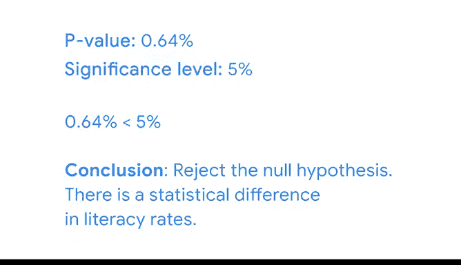

# 051：使用Python进行假设检验 📊


在本节课中，我们将学习如何使用Python进行双样本T检验，以判断两个样本均值之间的差异是否具有统计显著性，还是仅仅源于随机波动。

## 概述

上一节我们介绍了专业人士如何使用双样本假设检验。本节中，我们将通过一个具体的教育数据分析案例，使用Python来执行一次完整的双样本T检验。我们将模拟从两个州中随机抽取学区数据，并检验其平均识字率是否存在显著差异。

## 数据准备与随机抽样

首先，我们需要导入必要的Python库并加载数据。

```python
import pandas as pd
from scipy import stats
```

假设我们有一个包含各州学区识字率的数据集。我们需要筛选出州21和州28的数据。

```python
# 筛选州21的数据
state_21 = df[df[‘state_name‘] == ‘State 21‘]
# 筛选州28的数据
state_28 = df[df[‘state_name‘] == ‘State 28‘]
```

由于时间和资源有限，我们无法调查所有学区。因此，我们需要从每个州中随机抽取20个学区作为样本。

以下是进行随机抽样的步骤：

```python
# 从州21中随机抽取20个学区，设置随机种子以确保结果可复现
sampled_state_21 = state_21.sample(n=20, replace=True, random_state=13490)
# 从州28中随机抽取20个学区，使用不同的随机种子
sampled_state_28 = state_28.sample(n=20, replace=True, random_state=39103)
```

现在，我们计算两个样本的平均识字率。

```python
mean_21 = sampled_state_21[‘overall_literacy‘].mean()
mean_28 = sampled_state_28[‘overall_literacy‘].mean()
```

根据样本数据，州21的平均学区识字率约为70.8%，州28约为64.6%。观察到的差异为6.2个百分点（70.8 - 64.6）。然而，这个差异可能只是抽样变异造成的，我们需要通过假设检验来确认其统计显著性。

## 执行双样本T检验

现在我们已经准备好了数据，可以开始正式的假设检验。双样本T检验是用于比较两个独立样本均值的标准方法。

回顾一下假设检验的四个步骤：
1.  陈述零假设和备择假设。
2.  选择显著性水平。
3.  计算P值。
4.  决定是否拒绝零假设。

### 第一步：陈述假设

在双样本T检验中：
*   **零假设 (H₀)**：两个群体的均值没有差异。公式表示为：**H₀: μ₁ = μ₂**。
*   **备择假设 (H₁)**：两个群体的均值存在差异。公式表示为：**H₁: μ₁ ≠ μ₂**。

在我们的案例中：
*   H₀: 州21和州28的平均学区识字率没有差异。
*   H₁: 州21和州28的平均学区识字率存在差异。

### 第二步：选择显著性水平

教育部要求使用标准的5%（即0.05）作为显著性水平（α）。这意味着，如果零假设为真，我们错误地拒绝它的概率为5%。

### 第三步：计算P值

P值是在零假设为真的前提下，观察到样本均值差异达到或超过我们实际观测到的差异（6.2个百分点）的概率。

我们将使用SciPy库中的`ttest_ind`函数进行计算。由于我们无法获知两个州全部人口的方差，因此不假设两个样本的方差相等。

```python
# 执行双样本T检验，不假设方差相等
t_stat, p_value = stats.ttest_ind(a=sampled_state_21[‘overall_literacy‘],
                                   b=sampled_state_28[‘overall_literacy‘],
                                   equal_var=False)
```

运行代码后，我们得到P值约为0.0064（即0.64%）。

### 第四步：做出决策

现在，我们将P值与显著性水平进行比较：
*   如果 **P值 < 显著性水平 (0.05)**，则拒绝零假设，认为差异具有统计显著性。
*   如果 **P值 > 显著性水平 (0.05)**，则无法拒绝零假设，认为差异不具有统计显著性。

我们的P值（0.0064）小于0.05。因此，我们**拒绝零假设**。

## 结论与意义

我们得出结论：州21和州28的平均学区识字率之间存在**统计上显著的差异**。

这个分析结果对资源分配具有实际指导意义。由于存在显著差异，且州28的识字率较低，教育部可能会向州28分配更多政府资源，以帮助提升其识字率。



双样本T检验是探究两个样本均值差异的强大工具。数据专业人员经常使用T检验来帮助利益相关者做出数据驱动的决策。

## 总结


本节课中，我们一起学习了如何使用Python执行双样本T检验的全过程。我们从数据准备和随机抽样开始，逐步完成了假设陈述、设定显著性水平、计算P值以及做出统计决策的步骤。最终，我们根据检验结果，为教育资源分配提供了数据支持。掌握这一方法，你就能科学地评估不同群体间的差异是否真实存在。