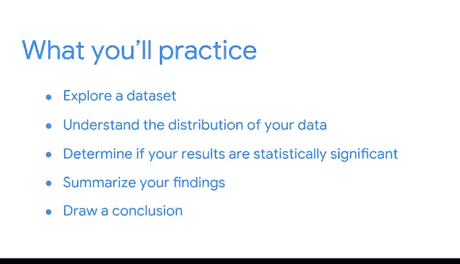

# 053：模块六项目介绍

在本节课中，我们将学习如何完成本课程的最终作品集项目。该项目旨在展示你在统计学方面的知识，并为你未来的求职面试提供具体的讨论案例。

---

大家好，我是Tiffany，再次回来与大家讨论你们的作品集项目，以及如何在求职中运用它们。

与之前的课程一样，你将完成一个独立的作品集项目。完成这个项目是向潜在雇主展示你在数据相关任务方面的知识和经验的绝佳方式。这一次，你的项目将展示你在统计学方面的所学。

这个作品集项目也是一个发展你面试技能的机会。当潜在雇主评估你时，他们可能会询问你过去如何应对挑战的具体例子。你可以利用你的作品集来讨论你解决过的数据问题。

这个项目将帮助你思考统计学如何指导数据专业工作，并为你未来的工作面试提供一个具体的讨论案例。

一些雇主可能还会要求你完成特定的任务，例如A/B测试。除了拥有作品集，创建你自己的实验设计意味着你将为这些面试做好更充分的准备。

能够使用代码和统计软件进行计算对你的未来职业至关重要，而理解如何将这些统计模型应用于工作场所的问题，是在数据领域取得成功的关键。

为了完成作品集项目，你将获得一个商业案例的详细信息。然后，你将根据指导完成你的“薪酬策略”文档中的新条目，进行一次A/B测试，以比较产品的两个不同版本并选择表现更好的那个。

你将运用统计学来探索数据集，理解数据的分布，并确定你的结果是否具有统计显著性。然后，你将用定量的方式总结你的发现，并得出一个与商业问题相关的结论。

---

完成这个项目后，你将拥有一个可以添加到作品集里的A/B测试案例。在你的“薪酬策略”文档中，你还会记录下整个过程所采取的步骤，这些记录可以用来向未来的招聘经理解释你的工作。

那么，让我们开始吧。

---

本节课中，我们一起学习了最终作品集项目的目标与结构。我们了解到，该项目不仅是一个展示统计学技能的成果，更是一个为求职面试做准备、记录分析过程并解决实际商业问题的宝贵工具。