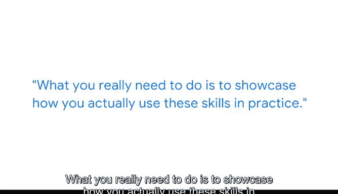

# 054：向潜在雇主展示你的才能 📊

在本节课中，我们将学习如何有效地向潜在雇主展示你在数据科学领域的才能。课程内容基于一位行业专家的分享，重点在于如何将理论知识转化为实践证据，以证明你的能力。

---

我叫肖恩，目前是YouTube Shop的产品分析师。作为一名产品分析师，我利用谷歌收集的数据来更好地理解用户如何使用我们的产品，并思考如何通过数据做出更好的产品决策，从而为用户提供更优质的服务。

让我真正进入高级数据分析领域的，其实是高中时听到的一个流行词——“大数据”。我当时认为，我们可以利用大数据来理解世界的运行方式，甚至预测未来。这对于当时还是青少年的我来说，非常有吸引力。

---

上一节我们了解了肖恩进入数据领域的初衷，本节中我们来看看他在求职方面的具体建议。他认为，在寻找数据科学工作时，最重要的事情如下：

以下是肖恩认为求职时最重要的几点：

*   **第一，展示你对数据科学理论和实践技能的理解。** 在准备证明材料时，确保你有一个Github链接或过往演示文稿的合集，用以展示你曾进行过任何与数据科学或数据可视化相关的演示。
*   **第二，在作品集或简历中展示统计技能时，要注重实践应用。** 需要注意到，这些技能在网上很容易获取，每个人都可以从YouTube、Coursera或其他在线课程平台学习。你真正需要做的是展示你如何在实践中运用这些技能。
*   **第三，解释问题与解决方案的关联。** 例如，尝试解释你试图解决的具体业务问题或研究问题是什么，并解释你为何决定使用某种模型或解决方案来解决该问题。仅仅知道理论或如何实现一个模型是不够的，你真正需要展示的是你理解为何要使用这些模型。

---

在上一节我们列出了核心要点，本节我们来深入探讨如何具体呈现。在这些情况下，确保你始终突出你试图解决的问题所对应的业务或研究目标，然后准确地解释你如何应用这些技能，以及如何评估结果。

如果你没有数据科学专业的大学学位，请不要担心，因为从在线课程中学到的技能正是行业所需要的。

---

本节课中我们一起学习了如何向雇主展示数据科学才能。核心在于超越理论知识的罗列，通过具体的项目、清晰的逻辑（解释**业务问题** -> 选择**解决方案/模型** -> 评估**结果**）来证明你的实践能力和解决问题的思维。记住，有效的展示比单纯的技能列表更有说服力。