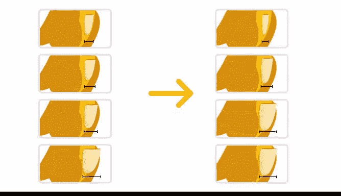

# 055：统计的力量 📊 - 期末作品集项目介绍

在本课程中，我们学习了统计学的基本概念，包括描述性统计与推断性统计、基础概率与概率分布、抽样、置信区间以及假设检验。现在，是时候将所学知识付诸实践，完成本次作品集项目了。

在之前的课程中，我们练习了用数据讲述故事。这些技能将伴随我们完成这个新项目。

---

## 项目背景与目标 🎯

上一节我们回顾了本课程的核心统计概念，本节中我们来看看期末项目的具体内容。

现在，你已经积累了一些完成作品集项目的经验，可以开始思考如何运用统计学来论证某个产品的有效性。

在本课程的这个部分，你将为一个特定公司模拟一次 **A/B 测试**。然后，使用统计方法分析数据，并解释哪个版本的产品表现更好。最后，你将根据结果，向企业提出是否应该实施产品新版本的建议。

以下是本项目的核心步骤：
1.  **设计并模拟 A/B 测试**：设定对照组（A）和实验组（B）。
2.  **收集与分析数据**：运用假设检验等统计方法。
3.  **解释结果并给出建议**：基于分析，做出商业决策推荐。

---

## 技能进阶与职业发展 🚀

在完成这个项目后，你将在课程的其他部分继续探索作为一名数据专业人士的更多内涵。你将努力发展更多技能，以帮助自己脱颖而出。

关于使用数学模型分析数据集，还有更多知识需要学习。作为一名数据专业人士，你工作的很大一部分是分析数据，从而就项目方向提出有依据的建议。

通过运用统计学来实施和分析 A/B 测试，你将帮助未来的雇主或客户就其公司产品或服务的投资做出明智的决策。

随着课程的深入，你将学习更高级的技术，如**回归分析**和**机器学习**，以展示数据分析在提升业务绩效方面的强大力量。

---

## 项目价值总结 ✨

本节课中，我们一起学习了期末作品集项目的目标与结构。这个作品集项目是一个绝佳的机会，可以向潜在雇主展示你为什么是他们团队中有价值的成员。

通过将统计理论应用于实际的 A/B 测试模拟与分析，你不仅巩固了所学知识，更构建了一份证明你能够用数据驱动决策、创造商业价值的实战作品。