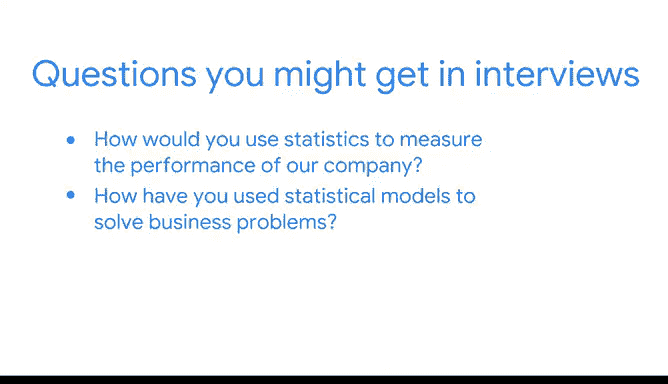

# 056：《统计的力量》课程总结与职业建议 📊

在本节课中，我们将对《统计的力量》课程进行总结，并探讨如何将所学知识应用于职业发展。课程涵盖了数据分析的核心流程、Python工具的应用以及统计方法在业务场景中的实践。

你已经出色地掌握了数据收集与分析的方法，这些方法能帮助业务决策。你学到了如何分析数据，并利用数据内在的信息，帮助相关方全面了解当前的业务状况。

至此，你的作品集中已新增了PACE策略文档、一个整洁的数据集、能讲述数据故事的可视化图表以及一次模拟的A/B测试。随着你继续完成本课程的其他项目，你的作品集将持续丰富，展示你的学习进度与技能提升。

请记住，你正在积累具体的案例，这些案例在未来与潜在雇主或招聘经理的面试中值得深入讨论。

## 课程核心内容回顾 🔍

上一节我们介绍了项目成果，本节中我们来回顾课程所涵盖的核心知识与技能。

到目前为止，你强化了对在数据职业中遵循PACE结构重要性的理解，观察了Python如何助力数据操作，以及如何组织分析数据集以讲述引人入胜的故事。此外，本课程还教授了如何使用统计方法来探索任何给定的数据集，或分析与解释通过抽样收集的数据。

以下是本课程涵盖的关键技能点：
*   **PACE工作流**： 规划、分析、构建与执行的结构化框架。
*   **Python数据分析**： 使用 `pandas`、`numpy` 等库进行数据操作与分析。
*   **统计探索**： 应用描述性统计与推断性统计理解数据。
*   **A/B测试模拟**： 设计实验并使用代码（如 `scipy.stats`）进行假设检验。

## 应对职业面试的准备 💼

在开始为未来的面试做准备时，你可能会被问到以下类型的问题。以下是你可以提前思考的方向：

*   **问题一**： 你会如何使用统计学来衡量我们公司的业绩？
*   **问题二**： 你曾如何使用统计模型解决业务问题？
*   **问题三**： 设计一个A/B测试实验需要考虑哪些不同的因素？

你也可能被要求分享你参与过的一个重要数据项目的细节，以及你如何利用统计学获得对团队或组织有益的见解。在这种情况下，你刚刚完成的这个项目将是一个绝佳的讨论话题。你使用Python为特定场景模拟了一次A/B测试。

同时请记住，A/B测试也应用于许多其他场景。尽管如此，A/B测试通常需要类似的方法，因为它们都用于比较同一事物的两个版本，无论是产品、网站、电子邮件活动还是其他。对于包括数据领域在内的许多职业而言，一项关键技能是能够灵活应用你的知识。

## 持续学习与展望 🚀

你在数据学习之旅上已经取得了长足的进步。接下来，你将全面学习回归模型。然后，你将有机会通过创建一篇博客文章来展示你的理解，并评估一个需要多元线性回归模型的业务场景。到本课程结束时，你将拥有一个坚实的作品集来展示你所完成的一切。

**本节课总结**：本节课我们一起回顾了《统计的力量》课程的核心内容，包括PACE框架、Python数据分析、统计方法及A/B测试实践。我们探讨了如何将这些知识转化为面试中的优势，并为接下来的回归模型学习做好了铺垫。持续构建你的作品集，灵活运用技能，是迈向数据职业成功的关键。