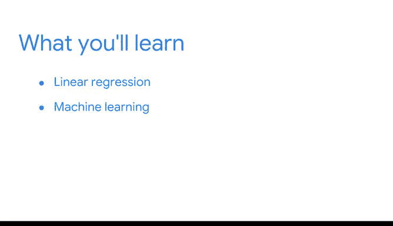

# 057：《统计的力量》课程总结 🎯

在本节课中，我们将对《统计的力量》这一部分的学习内容进行总结，回顾已掌握的核心统计概念，并展望后续课程的学习方向。

---

恭喜你完成了本项目的统计部分学习。

你对统计知识的掌握，为你未来在数据专业领域学习更高级的分析方法奠定了坚实基础。

你的统计知识也将在未来的求职面试中发挥重要作用。

对基础统计概念的深刻理解，将使你成为更具竞争力的求职者和更优秀的数据专业人士。

之前我曾提到，成为一名数据专业人士意味着在整个职业生涯中持续学习。

这正是我热爱这个领域的原因。每次遇到一个新概念，我都会充满兴奋感与重新燃起的好奇心。

学习高级数据分析，就像探索一个不断膨胀的宇宙。随着数据量的持续增长，有太多奇妙的新世界等待我们去发现，我们关于如何最佳分析和解读这些数据的知识也在同步增长。

我至今仍花费大量时间自学机器学习的最新进展，并阅读关于在数据分析中应用统计方法的新途径。

现在，你也踏上了同样的学习旅程，并且在本课程中已经学到了很多。

---

## 核心知识回顾 📚

上一节我们概述了学习成果，本节我们来具体回顾一下你已掌握的核心统计技能。

以下是你在本课程中学到的主要内容：

*   **描述性统计**：你学会了计算**均值**、**中位数**和**标准差**等描述性统计量，用以探索和总结新的数据集。
    *   **公式示例**：样本均值 `x̄ = (Σx_i) / n`
*   **概率分布**：你学会了应用**二项分布**、**泊松分布**和**正态分布**等概率分布来为数据建模。
*   **抽样分布与估计**：你学会了使用抽样分布对总体**均值**和**比例**进行点估计。
*   **置信区间**：你学会了构建**置信区间**来描述估计值的不确定性。
*   **假设检验**：你学会了进行**假设检验**，以确定结果的统计显著性。

---

## 后续学习展望 🚀

掌握了统计知识后，你已经为接下来的课程做好了充分准备。

在接下来的课程中，你将以此为基础继续构建知识体系。

下一门课程将为你的分析工具箱增添一个强大的新工具——一种名为**回归**的统计方法。

此后，你将有机会探索迷人的**机器学习**世界。

---

## 课程交接与祝福 ✨

我很高兴你将开始与下一位讲师合作。你可能还记得在本项目介绍视频中出现过的那位同事——在谷歌从事数据科学与营销交叉领域工作的**Tiffany**。

Tiffany将为你详细讲解回归分析，并帮助你朝着完成本项目、追求未来数据专业职业生涯的目标迈出下一步。

很荣幸能陪伴你走过这段学习旅程。

祝愿你在下一阶段及未来的旅程中一切顺利。祝你好运。