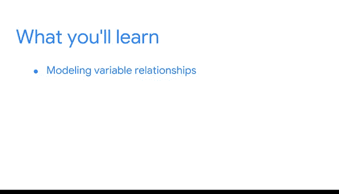

# 001：简化复杂数据关系》课程介绍 🎯

在本节课中，我们将要学习回归分析的基础知识，这是一种用于探索和量化数据变量间关系的核心统计技术。我们将了解回归模型如何帮助数据专业人员从数据中提取洞察，讲述有力的数据故事，并影响决策。

欢迎回到您作为数据专业人员的进阶之旅。我很高兴能与您同行。我们将讨论回归模型和更多的假设检验，以便您能够探索数据中的关系。

我们将一起学习的工具将使您能够揭示关于数据的强大洞察，讲述引人入胜的故事，并影响决策和战略制定。

我们在本课程中探讨的建模基础将为您在数据职业领域寻求入门级工作以及未来处理更高级的主题（如机器学习）奠定更坚实的基础。

我渴望将您迄今为止学到的所有知识串联起来。从数据科学基础和Python基础，到探索性数据分析和统计学，您已经学习了大量关于数据领域的知识。我们将一起把您当前的技能应用到您的第一个模型——回归模型中。

我叫Tiffany，是谷歌的一名营销科学主管，我的工作处于数据科学与营销的交叉点。我从小就对数学有浓厚兴趣。在大学期间，我最初并不确定主修什么专业，但被定量领域所吸引。和你们许多人可能经历的一样，我并非一开始就热爱自己的选择，并有机会尝试了几个专业，这让我接触到了各种各样的分析职业机会。在我的职业生涯中，在加入谷歌之前，我曾在金融、统计研究和数据科学咨询领域担任过职位。我处理过各种数据，包括专利、欺诈、硬件销售以及现在的营销数据。

数据专业人员的优势在于，它在大多数行业都有很高的需求，这意味着您可以在各种各样的公司、产品和国家中找到有趣的问题来解决。我喜欢这种灵活性，既能找到适合自己的位置，又能确保为我所在的任何团队创造价值。我在职业生涯中学到了很多，很高兴能与您分享我的经验。

在本课程中，我们将讨论变量之间的建模关系。为此，我们将重点介绍回归分析。回归分析或回归模型是一组统计技术，它们利用现有数据来估计一个因变量与一个或多个自变量之间的关系。我们将在后续课程中一起详细解读这个定义。

我们在本课程中学到的技术将帮助您回答各种问题，并提供可操作的步骤来实现组织目标。例如，回归模型可以帮助您理解哪些变量会影响销售额。它们还可以帮助您理解导致客户订阅新闻稿的因素。回归模型甚至可以帮助您理解用户为何持续浏览公司网站。

在我们一起学习课程的过程中，我们将继续讨论数据专业人员在做出负责任决策方面所扮演的角色，从数据处理到建模。无论一个潜在的数据故事有多好，我们如何得出这个故事才是成为诚实和有效的故事讲述者的首要任务。

Python编程对于运行和测试复杂模型、可视化数据以及传达结果至关重要。严谨的探索性数据分析将决定我们选择哪些模型以及我们如何处理建模过程。统计学将在帮助我们理解模型如何工作方面发挥重要作用，并使我们能够向利益相关者呈现可操作的结果。我们的统计工具包将使我们能够构建我们将要讨论的回归模型。

回归分析是一项相关且具有市场价值的技能。回归模型非常灵活，您可以根据拥有的数据来设计它们。此外，回归模型的结果为解释和沟通提供了机会。数据专业人员可以从这些模型中提供与可操作步骤清晰一致的见解。

例如，我们能够构建回归模型来识别网站上的哪些行为是高价值客户的指标。例如，访问促销页面、观看视频或注册电子邮件的客户，有很大可能在一年内进行多次购买。其中一些指标可能看起来很明显，但拥有一个能够识别和量化这种关系的回归分析是非常强大的。我们能够在营销活动中利用这些信息来吸引新客户。

我们将一起探索回归分析，将其作为构建更复杂机器学习模型的坚实基础。我很高兴向您展示回归工具包中的每一个工具。您将获得大量的Python实践。我们将解释如何确定模型是否适合数据、如何运行模型以及如何理解计算机的结果。我们还将讨论一些数学知识，并逐步回顾概念。您也可以随时复习课程资源。我非常高兴能开始学习回归分析，让我们开始吧。

---

**本节课总结**

在本节课中，我们一起学习了回归分析课程的基本介绍。我们了解了回归分析的核心目标——量化变量间关系，以及它在数据科学领域的重要性。课程讲师Tiffany分享了她的职业背景，并阐述了回归模型的灵活性和应用价值，例如识别高价值客户行为。我们明确了本课程将结合Python编程、探索性数据分析和统计学知识，为后续构建和解释回归模型打下坚实基础。