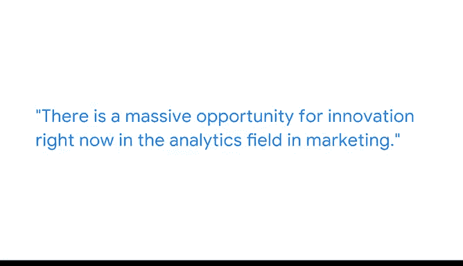

# 002：通过回归模型获得可操作的见解 📊

在本节课中，我们将跟随谷歌营销科学主管Tiffany，学习如何构建和解读回归模型，以从复杂数据中提取可操作的商业见解。我们将了解回归模型在预测客户价值、优化营销预算等方面的强大应用。

---

大家好，我是Tiffany，是谷歌的营销科学主管。

我从小就对数学和统计学充满热爱。这可能是因为这是我学生时代为数不多擅长的科目。我记得，在我大约一年级时，比我大两岁的哥哥为数学作业发愁，我会坐下来帮助他。

在我的职位上，我构建了许多回归模型来预测各种情况，例如**谁将成为高价值客户**，或者**如何在不同营销活动间最佳地分配预算**。回归模型是非常重要的强大工具，使用不同类型的回归模型，你将能够回答各种各样的问题。

最近，我一直在构建模型并尝试解读系数。具体来说，我构建了许多回归模型来识别诸如**高价值客户**，或**一年内会进行多次购买的用户**。这是通过分析网站行为实现的。

我们真正希望深入探究的是，用户在网站上访问的**哪些页面**或采取的**哪些行为**，能够表明他们是高价值客户或会在一年内多次购买。

我热爱处理大量数据并解决重大问题。最近，我与一位客户合作，他希望了解如何优化其数百万美元的营销预算在不同渠道间的分配。

通过构建一个回归模型，我们能够帮助他们优化支出，从而提升销售额。

我们当前面临的一些机遇是第三方Cookie即将消失。我相信你们都曾在互联网上遇到过跟踪式广告。这功能正是由第三方Cookie实现的。

随着第三方Cookie的消失，我们迎来了一个全新的机遇，去开发**不同类型的模型**和**不同的分析方法**，以完成那些过去借助第三方Cookie和追踪系统能轻易实现的事情。因此，目前在营销分析领域存在着巨大的创新机会。

事物在不断变化，外界信息如此之多，你永远无法知晓所有需要知道的知识。因此，保持开放的心态和持续学习的态度至关重要。要知道，有大量资源可供你研究学习，你可以在实践中不断进步。

---

本节课中，我们一起学习了回归模型在商业分析中的核心应用。我们了解到，回归分析不仅能预测像客户价值这样的关键指标，还能指导像预算分配这样的重大决策。面对数据追踪方式的变化，回归分析等建模技术为我们提供了持续创新的基础。保持学习和探索的心态，是应对这个快速变化领域的关键。