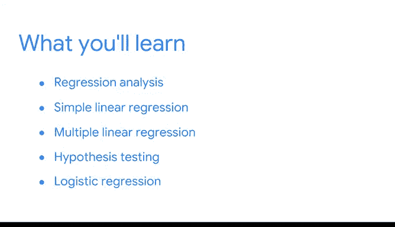

# 003：03_01_05_欢迎来到模块1

## 概述

在本节课中，我们将一起学习回归分析。我们将了解数据专业人员如何运用回归分析技术，从问题出发，最终获得可执行的见解。

## 回归分析简介

回归分析的核心在于理解变量之间的关系。我们将使用 **PACE** 框架来指导整个课程的学习。PACE 代表 **计划（Plan）、分析（Analyze）、构建（Construct）和执行（Execute）**。

## 简单线性回归

上一节我们介绍了回归分析的基本概念，本节中我们来看看第一个要深入探讨的模型：简单线性回归。

我们将有机会应用 PACE 框架来处理简单线性回归问题。我们会使用不同的场景和数据，从头到尾走完整个分析流程。

简单线性回归的模型公式如下：
`y = β₀ + β₁x + ε`
其中，`y` 是因变量，`x` 是自变量，`β₀` 是截距，`β₁` 是斜率，`ε` 是误差项。

## 多元线性回归

接下来，我们将仔细研究多元线性回归。

多元线性回归在很大程度上扩展了简单线性回归的概念，使我们能够解决更多样化的问题。我们将重点关注一些更细致的主题，例如变量选择和模型解释。

以下是多元线性回归模型：
`y = β₀ + β₁x₁ + β₂x₂ + ... + βₙxₙ + ε`

## 假设检验

此外，我们还会考虑一些假设检验，例如卡方检验和方差分析（ANOVA）。

这些检验将帮助我们探索数据中的不同分组，从而获得有价值的见解。

## 逻辑回归基础

最后，我们将回顾逻辑回归的基础知识。这是最后一个也是最复杂的模型，它将为你学习后续的机器学习课程打下良好的基础。

逻辑回归用于处理分类问题，其核心公式为：
`p = 1 / (1 + e^-(β₀ + β₁x))`
其中，`p` 是事件发生的概率。

## 总结

本节课中，我们一起学习了回归分析的课程概述。我们介绍了 PACE 框架，并预览了即将深入学习的简单线性回归、多元线性回归、相关假设检验以及逻辑回归。准备好后，我们就可以开始观看下一个视频了。