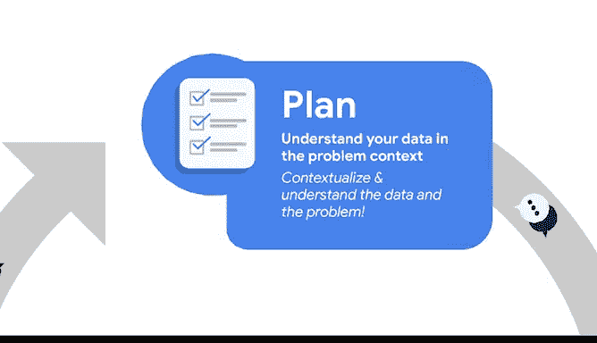
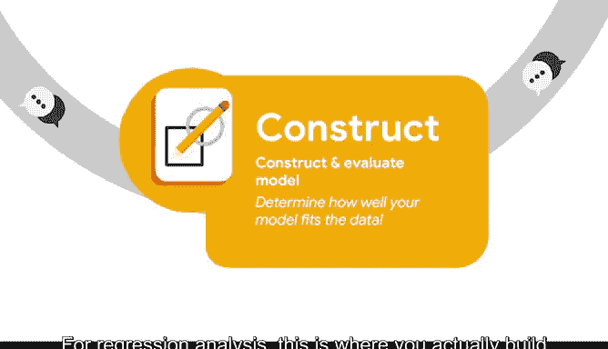
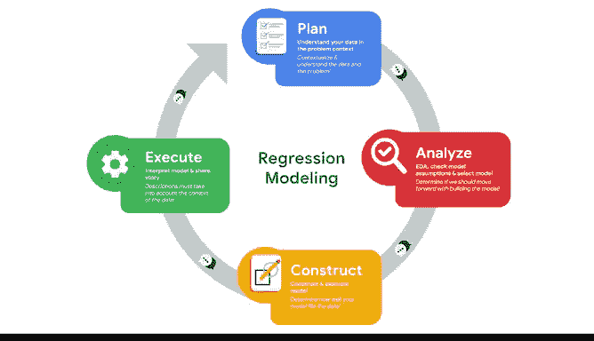
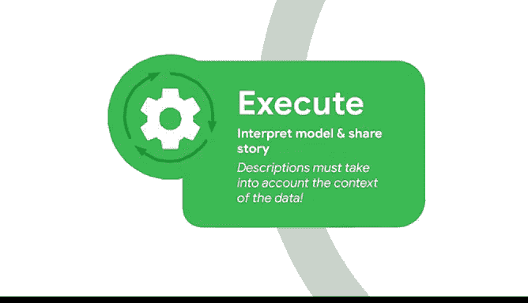

# 004：回归分析中的节奏 🧩

在本节课中，我们将学习回归分析的基本概念，并介绍一个用于组织分析工作的结构化框架——PACE。我们将了解回归模型的目标，并预览PACE框架的四个阶段：计划、分析、构建与执行。

---

你可能听说过机器学习模型或回归分析这些术语。如果没有，本课程正适合你。接下来，我们将开启学习之旅。

首先，我们将讨论几个关键术语和定义。回归模型建立在统计学基础之上。数据职业领域使用的模型是一系列技术，它们依赖现有信息或数据点来预测其他数据点的可能情况。

其核心目标始终是揭示数据中变量之间的关系，并以此讲述一个“故事”。这个故事将帮助利益相关者调整其业务战略和决策。

建模是一个迭代的过程。你可能熟悉其他框架，例如数据生命周期或探索性数据分析的六个步骤。在本课程中，我们将使用本课程前面概述的PACE框架来介绍建模过程的每一步。

PACE——计划、分析、构建与执行——为我们进行回归分析提供了基础框架。让我们花点时间预览一下PACE在回归分析中是如何运作的。

## 计划阶段 📋

在回归建模中，计划阶段是关于理解你的数据和问题背景。你从行业或其他地方带来的知识在计划阶段至关重要。通过考虑你可以访问哪些数据、数据是如何收集的以及业务需求是什么，你将能够战略性地分析、构建和执行后续工作。计划阶段将指导PACE的其他三个阶段。

## 分析阶段 🔍

计划之后，你必须进行分析。在这个阶段，你需要更仔细地检查数据，以便选择一个或几个你认为可能合适的模型。

在进行回归分析时，你需要在此阶段使用Python执行探索性数据分析，并根据需要检查模型假设。模型假设是关于数据的陈述，必须为真才能证明使用特定数据技术的合理性。作为数据专业人士，你将使用统计学来检查模型假设是否得到满足。对统计学的深入理解，赋予数据专业人士构建有意义模型的能力。

## 构建阶段 ⚙️

分析之后，你必须进行构建。对于回归分析，这就是你实际使用Python或你选择的编程语言构建模型的地方。

此步骤涉及选择变量、根据需要转换数据以及编写代码。尽管你在构建模型之前检查了模型假设，但许多模型假设需要在模型构建后重新检查。因此，你将在构建阶段根据需要完成这项工作。

构建阶段的最后一部分是评估模型结果。此时，你正在回答这个问题：我的模型有多好？你将选择评估指标、比较模型并获得初步结果。然后，基于你的评估，你可以利用探索性数据分析来相应地优化模型。

## 执行阶段 📤

当然，作为数据专业人士，你首先必须是一个诚实的故事讲述者。😊

研究回归产生的结果将揭示数据内部的关系，并帮助你发现洞察，以讲述完整的故事。这引出了PACE的最后一部分：执行。你将解释从分析和构建中学到的一切，以分享这个故事。

你将准备正式的结果和可视化图表，并与利益相关者分享。😊

为此，你需要将模型统计量转化为描述数据中变量之间关系的陈述。这些描述必须考虑计划阶段的背景和初始问题。

一切的核心都是数据，而PACE框架帮助数据专业人士保持条理。数据专业人士产生的洞察必须是数据驱动且准确的，并且在给定的业务或社区背景下必须言之成理。

我们将在课程后面的示例中详细介绍这些步骤，但PACE是迭代的。随着你成长为一名数据专业人士，你的经验将帮助你决定何时在PACE的各阶段之间转换。根据具体情况，你可能会调整顺序或重复某些步骤。

---

既然我们已经理清了建模拼图的各个部分，接下来可以讨论相关性与回归是如何关联的。然后，我们将探索两个基础的回归模型：线性回归和逻辑回归。这些模型将在后续视频中更深入地讲解，本次概述将为你打下坚实的理解基础。😊

是时候开始拼凑我们的拼图了。别忘了带上你的统计语法工具，你会需要它们的。

---

**本节课总结**：我们一起学习了回归分析的目标是揭示数据关系并讲述故事，并掌握了组织回归分析工作的PACE框架，该框架包含计划、分析、构建与执行四个迭代阶段，为后续深入学习具体回归模型奠定了基础。