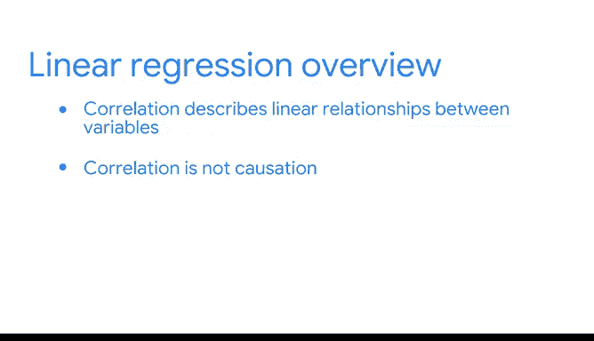

# 005：线性回归介绍 📈

在本节课中，我们将要学习回归分析中的第一个建模技术：**线性回归**。我们将了解它的基本概念、核心术语，以及如何在现实世界中识别和应用线性关系。

---

上一节我们介绍了回归分析是用于估计一个因变量与一个或多个自变量之间关系的技术。本节中，我们来看看第一种具体的建模方法：**线性回归**。

许多你在日常生活中观察到的模式都可以用线性回归模型来表达。例如：
*   随着某个软件版本变旧，其在线搜索量可能会下降。
*   随着一位社交媒体名人粉丝数量的增加，其书籍销量也会上升。

这些关系都可以用线性回归来建模。“线性”一词指的是我们可以在图表上可视化的那种关系：**一条直线**。直线是向两个相反方向延伸的无限多个点的集合。在图表中，这些点呈现为一条线，而我们通常只看到这条线的一部分。

线性回归是一种用于估计一个**连续型因变量 Y** 与一个或多个**自变量 X** 之间线性关系的技术。例如，我们可以建模产品价格与销量之间的关系。我们的 Y 变量是销量，X 变量是价格。

在之前的课程中，你学习了连续型变量和分类型变量的区别。作为回顾：
*   **连续型变量**是指在其最小值和最大值之间可以取任何实数值的变量。例如，产品销量、车辆速度和网页停留时间都是连续型变量。
*   **分类型变量**则具有有限数量的可能值，例如产品类型和教育水平。

线性回归允许我们数据分析师估计连续型因变量。当然，也存在其他回归模型用于估计分类型变量，我们将在后续课程中学习。

在本课程中，我们将频繁讨论因变量和自变量：
*   **因变量**是给定模型所要估计的变量，有时也称为响应变量或结果变量，通常用字母 **Y** 表示。我们假设因变量的变化通常基于自变量的值。
*   **自变量**也被称为解释变量或预测变量，通常用 **X** 表示。

例如，假设你在蛋糕店工作，试图了解影响蛋糕销量的因素。那么，因变量 Y 就是任何一天售出的蛋糕切片数量。一个自变量 X 可以是当天售出的咖啡杯数。也许随着购买的咖啡增多，购买的蛋糕也会增多。

在线性回归中，你可能会遇到另外两个术语：**斜率**和**截距**。
*   **斜率**指的是当自变量 X 每增加一个单位时，我们预期因变量 Y 增加或减少的量。
*   **截距**指的是当自变量 X 等于 0 时，因变量 Y 的值。

回到蛋糕和咖啡的例子：
*   斜率就是每售出一杯咖啡，预期会售出多少片蛋糕。
*   截距就是当咖啡销量为 0 杯时，售出的蛋糕切片数量。

当两个变量 X 和 Y 以线性方式相关时，我们说它们是**相关**的。利用统计学，我们实际上可以计算 X 和 Y 之间线性关系的强度。

有两种类型的相关性：**正相关**和**负相关**。
*   **正相关**是指两个变量倾向于一同增加或减少的关系。例如，售出的咖啡杯数越多，售出的蛋糕切片也越多。
*   **负相关**则是指两个变量之间的反向关系。当一个变量增加时，另一个变量倾向于减少，反之亦然。

例如，假设你仍在蛋糕店工作，正在估算需要多久补充一次冰咖啡。你可以建模热咖啡销量和冰咖啡销量之间的关系。随着热咖啡销量增加，你可能会注意到冰咖啡销量趋于减少。或者，假设你在媒体公司工作，分析读者阅读完成率。随着新闻文章长度的增加，读完文章的人数可能会减少，这也是负相关的一个例子。

识别这些关系在工作场所和日常生活中都非常有用。确定线性关系有助于我们回答诸如以下问题：
*   哪些因素与产品销量的增加或减少相关？
*   哪些因素促使社会服务提供商在特定地区增加资源？
*   哪些因素导致公共交通需求增多或减少？

在上述情况下，回归线的**斜率大小**告诉我们销量、资源分配和公共交通需求增加或减少的程度。使用线性回归，你可以在任何行业帮助回答类似的问题。

然而，必须注意：**相关性不等于因果性**。例如，在你的蛋糕店，人们购买咖啡并不**导致**蛋糕销量增加。在建模变量关系时，数据科学家必须注意其结论的限度。**因果性**描述的是一种直接的因果关系，其中一个变量以特定方式直接导致另一个变量发生变化。从统计学上证明因果性需要比证明相关性更严格的方法和数据收集。

对于数据专业人士来说，在呈现结果时，区分相关性和因果性尤为重要。例如，虽然我们可以说随着一个人年龄增长，其去过的地方数量趋于上升，但我们不能必然地说一个人的年龄**导致**了其去过的地方数量增加。可能还有其他因素（例如探访家人或因公出差增多）促使旅行更多，这些因素恰好与年龄增长相关，但很难说是年龄还是其他因素导致了旅行。

阐明“相关性不等于因果性”是数据专业人士最佳实践和道德工具箱的一部分。相关关系和因果关系都能提供有用的见解，回归分析帮助数据分析师讲述细致入微的故事，而无需证明因果性。

---

以上是对你的第一个建模技术的高层次概述。总结一下：
*   **线性回归**是一种对线性关系进行建模的方法。
*   **因变量**根据自变量的变化而变化。
*   **斜率**标识了自变量每变化一个单位，因变量变化多少。
*   **正相关和负相关**描述了变量之间的线性关系。
*   在解释回归结果时，**务必注意相关性不等于因果性**。

世界上和各行各业中存在许多线性关系。本视频仅提供了几个例子，但还有更多。本节内容到此结束，接下来我们将探讨线性回归背后的数学原理。你不断增长的统计学基础将帮助你以最清晰的方式解释回归结果。