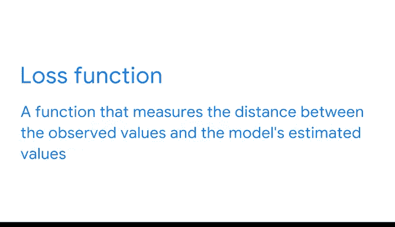

# 006：线性回归的数学原理 📈

在本节课中，我们将要学习线性回归的数学基础。我们将探讨如何利用样本数据来估计总体关系，并理解回归方程中各个参数的含义及其计算方法。

---

## 总体与样本

在理想情况下，你会希望拥有与你试图回答的问题相关的每一个数据点。在之前的课程中，你了解到数据专业人士将此称为**总体**。

让我们假设你在一家出版公司工作。你想了解作者的社交媒体粉丝数与他们的图书销量之间的关系。为此，你将需要每一位图书作者、所有社交媒体粉丝账户以及有史以来每一笔图书销售的数据。这是一个不可能完成的任务。

但幸运的是，你实际上并不需要整个总体来进行有意义的回归分析。你可以通过一个具有代表性的**样本**获得合理的估计。

样本是总体的一部分，这只是统计学的说法，意味着样本是你可能拥有的部分数据。

---

## 观测值与变量

如果你有一组样本数据，每个数据点都可以用其自身的一组属性或 X 和 Y 值来表示。在这种情况下，样本并不包含数据总体中所有可能的值。

**观测值**或**实际值**是现有的数据样本。该样本中的每个数据点都由一个因变量的观测值和一个自变量的观测值表示。

在出版公司的例子中，因变量是图书销量，自变量是作者在社交媒体上的粉丝数。你的数据集中可能有一个观测值是：X（粉丝数）= 10,000，Y（图书销量）= 500。

回归分析的目标是从数学上定义样本 Y 和 X 之间的关系，以理解这两个变量如何相互作用。

---

## 线性关系的核心：均值、斜率和截距

你可以想象，在每个 X 值处，Y 都可能取许多不同的值。为了简化理解，线性回归分析关注的是给定特定 X 值时的 Y 的**均值**。

这个 Y 的均值就是线性回归直线上的值，用一个看起来像小写字母 m 的希腊字母表示。你可以记住 M 代表均值。这个希腊符号是 **μ**。

如前所述，为了定义线性关系，我们需要一个**斜率**和一个**截距**。在统计学中，我们将截距写作 **β₀**（有时称为 beta not），将斜率写作 **β₁**。

μ 和 β 有时被称为**参数**。参数是总体的属性，而不是样本的属性，因此我们永远无法知道它们的真实值，因为我们无法观测整个总体。但是，我们可以使用样本数据来计算参数的**估计值**。

为了区分总体参数和参数估计值，我们用“帽子”符号（^）来表示估计值。计算结果是 **β̂₀**、**β̂₁** 和 **μ̂**，它们都是参数估计值。

尽管认识到 μ 的符号很有价值，但在本课程的剩余部分，我们将使用一个简化的符号：**Y = β₀ + β₁ * X**。

---

## 回归系数与预测

例如，假设我们估计 β₀ 为 -1，β₁ 为 5。现在，让我们输入一些 X 值：
*   如果 X = 0，我们得到 Y = -1，这就是 Y 轴截距 β₀。
*   如果 X = 1，我们得到 Y = 4。
*   如果 X = 2，我们得到 Y = 9。
*   如果 X = 3，我们得到 Y = 14。

仅从四个数据点，就出现了一个模式：X 每增加 1 个单位，Y 就增加 5 个单位。回想我们的方程，5 就是我们的斜率 β₁。斜率告诉我们，X 每增加一个单位，Y 会增加多少。

这些估计的 β 值也被称为**回归系数**。所以，现在每当你看到帽子符号（^），你就知道这是在估计 β，也就是回归系数。

在上面的公式中，回归系数是斜率和截距。它们描述了在样本数据中发现的线性关系。

---

## 如何找到最佳直线：普通最小二乘法

为了输入 X 值并获得 Y 的估计值，我们假设了 β₀ 为 -1，β₁ 为 5。但我们是如何得出这些回归系数的呢？

计算线性回归系数最常用的方法之一是**普通最小二乘估计**，简称 **OLS**。我们将在课程后面讲解 OLS 背后的数学原理，不过现在，让我们讨论一下 OLS 的工作原理概述。

在线性回归分析中，我们作为数据专业人士，试图最小化一个叫做**损失函数**的东西。损失函数是一个衡量观测值与模型估计值之间距离的函数。

理论上，我们可以画出无数条线来模拟我们拥有的数据。但我们不想找到任意一条线，我们想找到**最佳拟合线**，因此我们希望最小化损失函数。

---

## 总结与展望

有了关于线性回归如何工作的基础理解，我们将能够讨论之前提到的线性回归分析中的“PACE”框架。

在本节课中，我们一起学习了：
1.  **总体与样本**的区别，以及为何样本足以进行回归分析。
2.  如何用**观测值**表示数据点。
3.  线性关系的核心是**均值（μ）**、**截距（β₀）** 和**斜率（β₁）**。
4.  我们使用带“帽子”（^）的符号来表示根据样本数据计算出的参数**估计值**（回归系数）。
5.  回归方程 **Y = β₀ + β₁ * X** 允许我们进行预测。
6.  寻找最佳拟合线的核心方法是**普通最小二乘法**，其目标是**最小化损失函数**。

在接下来的课程中，我们将基于视频中涵盖的概念，进一步学习回归的工作原理、何时使用线性回归、其方差以及在 Python 中实现 OLS。