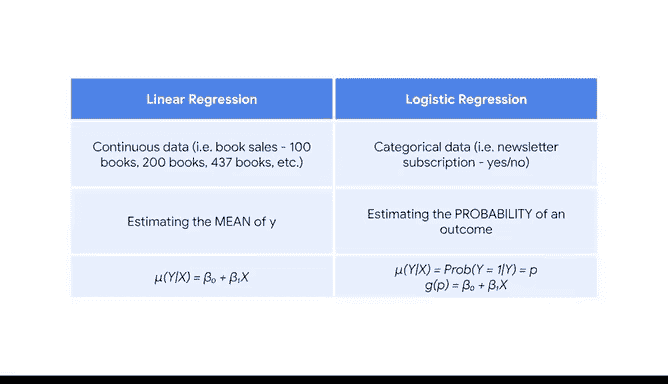

# 007：简化复杂数据关系》 - 逻辑回归介绍 🎯

在本节课中，我们将要学习逻辑回归的基础知识。逻辑回归是一种用于处理分类问题的强大统计方法，它可以帮助我们理解不同因素如何影响一个特定事件发生的概率。我们将从简单的例子入手，逐步理解其核心概念，并将其与之前学过的线性回归进行比较。

## 从抛硬币到数据建模 🪙

我仍然记得在运动队时，需要通过抛硬币来决定哪支队伍先攻或先守。硬币出现正面的概率是多少？出现反面的概率又是多少？每个事件发生的概率都是0.5或50%。这是一个经典的概率问题。

在数据分析领域，我们可以使用一种名为逻辑回归的技术来建模更为复杂的概率问题。例如：
*   哪些因素会导致某人订阅或不订阅新闻简报？
*   在什么情况下，某人会在在线视频或社交媒体帖子下发表评论？
*   给定某些因素，某人续订组织会员资格的可能性有多大？

所有这些问题都在处理离散事件或分类数据。存在一组特定的可能结果：订阅或不订阅、评论或不评论、续订或不续订。为了回答这类问题，数据专业人员会使用一种名为逻辑回归的模型。

## 什么是逻辑回归？ 🤔

逻辑回归是一种基于一个或多个自变量对分类变量进行建模的技术。因变量可以有两个或更多可能的离散值。

假设你的公司有一份新闻简报，并希望增加读者数量。在公司网站上，用户有机会订阅该简报。与订阅相关的一个因素可能是用户在离开网页前停留的分钟数。

*   我们的因变量 **Y** 有两种可能性：用户不订阅（用0表示）或用户订阅（用1表示）。
*   我们的自变量 **X** 是连续的，衡量用户在离开网页前停留的分钟数。

让我们像进行探索性数据分析（EDA）时那样，将假设的数据绘制在散点图上。我们可以观察到数据点大致分布在两条水平线上。
*   较高的那条线表示用户订阅了（此时 y = 1）。
*   较低的那条线表示用户没有订阅（此时 y = 0）。
*   X轴表示用户在网站上停留的分钟数。

由于X和Y之间的关系不是一条简单的直线，我们需要一种新的数学方法来表达X和Y之间的关系。逻辑回归将允许我们建模用户订阅新闻简报的概率。

## 核心概念：概率与均值 🔑

关键概念是：**给定X时Y的均值，等于给定X时Y等于1的概率**。

让我们探讨一下这个想法。目前，我们观察到的y值只是一堆0和1。为了求均值，我们会将所有观测值相加，然后除以观测总数。因为有些观测数据是0，所以在求和时，所有的0加起来还是0。因此，所有观测值的总和等于1的总数。然后我们除以观测总数，这就等于y等于1的概率，即某人成为订阅者的概率。

在这种情况下，我们知道 **给定X时Y的均值 = 给定X时Y等于某个结果的概率**。有时，给定X时Y的概率被写作 **P**，以强调概率的概念。为了帮助你记忆，可以认为 **P代表概率**。

现在，我们希望了解哪些变量有助于解释这些概率。从数学上讲，我们需要一种方法将X变量与y等于1的概率联系起来。

想象我们只有一个自变量，那么我们需要将 **y等于1的概率** 与 **β₀ + β₁X** 联系起来。在逻辑回归中，我们使用一个**连接函数**来表达X与y等于某个结果的概率之间的关系。连接函数是一个非线性函数，它在数学上将因变量与自变量连接或“链接”起来。

我们将在后面更详细地讨论逻辑回归和连接函数的工作原理，但现在只需知道，这是线性回归模型和逻辑回归模型之间的一个区别示例。

## 线性回归与逻辑回归的异同 📊

上一节我们介绍了逻辑回归的核心概念，本节中我们来看看它与线性回归的异同。以下是两种建模方法的一些异同点：

首先，线性回归涉及一个连续的y，例如图书销量；而逻辑回归涉及一个分类的y，例如新闻简报订阅。选择哪种模型取决于你拥有的数据类型。你都可以回答关于哪些因素影响感兴趣结果的类似问题。

其次，由于线性回归对连续变量建模，我们估计的是y的均值。但逻辑回归对分类变量建模，因此我们建模的是某个结果的概率，例如y等于1或y等于0的概率。

最后，对于线性回归，我们可以直接将Y表达为X的函数。但对于逻辑回归，我们需要一个连接函数来将Y的概率与X联系起来。

## 总结与展望 🚀

本节课中我们一起学习了逻辑回归的基础知识。我们主要关注只有两个类别的逻辑回归（如订阅问题），但也存在更复杂的逻辑回归版本，可以建模多个结果或类别，例如人们购买的护肤品类型或人们接受的服务类型。

在本视频中，我们涵盖了逻辑回归的基础知识，并比较和对比了线性和逻辑回归模型。在本课程后面，我们将介绍一种用于逻辑回归的估计技术，称为**最大似然估计**，并会揭示更多的数学原理。目前，只需知道计算机非常强大，使我们作为数据从业者能够更少地关注数学，更多地关注数据故事的讲述。

课程的其余部分将为你提供扎实的理解，让你知道你那台强大的机器内部正在发生什么。