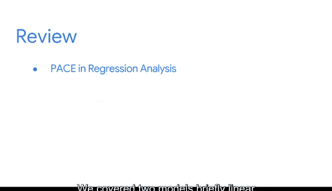

# 008：课程总结 1

## 概述 📋

在本节课中，我们将对已学习的高阶回归分析概念进行总结。我们已经涵盖了许多重要内容，你应该为自己掌握了这些新概念而感到自豪。开启回归分析的学习之旅是一个令人兴奋的起点。

## 知识回顾与连接 🔗

在之前的课程中，你学习了数据职业领域、数据驱动工作中沟通的重要性、数据管理的考量、Python编程作为数据工具的价值，以及探索性数据分析和统计学知识。

在本课程中，我们开始将这些概念联系起来，为你构建第一个模型做好准备。

## PACE框架与回归分析 🧩

到目前为止，我们讨论了PACE框架和回归分析。

*   **规划阶段**：让你能够考量数据是如何收集的，以及在特定场景下的业务需求是什么。
*   **分析阶段**：你执行探索性数据分析，这有助于你在构建模型时判断一个模型是否比另一个更合适。
*   **构建阶段**：你会惊叹于计算机和Python编程语言的力量。通过模型构建，你将在数据可视化和回归模型可视化中发挥创造力。
*   **执行阶段**：你必须再次依靠统计学和数学来评估遇到的任何模型。最后，在执行阶段，当你解释模型结果时，必须专注于沟通。

通过结合PACE的四个步骤，你将很快开始创建数据驱动的故事。

## 两种核心回归模型 📊

我们简要介绍了两种模型：**线性回归**和**逻辑回归**。

这些模型能够估计我们在个人和职业生活中观察到的变量之间的常见关系。回归模型帮助我们回答关于哪些因素与感兴趣的变量相关，以及相关程度如何的问题。数据始终引导我们提出可以询问和回答的问题。

以下是两种模型的核心区别：

*   **线性回归**需要一个**连续**的因变量，因此它可以帮助对任何可测量和可量化的东西进行建模。其公式通常表示为：
    `Y = β₀ + β₁X₁ + β₂X₂ + ... + βₙXₙ + ε`
    其中Y是连续型因变量。
*   **逻辑回归**需要一个**分类**的因变量，因此它可以确定某事发生的**概率**。其核心公式涉及逻辑函数：
    `P(Y=1) = 1 / (1 + e^-(β₀ + β₁X₁ + ... + βₙXₙ))`
    其中P(Y=1)是事件发生的概率。

线性回归关注正相关或负相关。逻辑回归模型使用一个**连接函数**来关联自变量X和分类因变量Y。

## 后续学习路径 🚀

之后，我们将学习如何在Python中使用真实数据进行估计技术，并探讨更多的回归用例。

尽管在学习过程中你会遇到许多公式，但请记住，最终目标是弄清楚数据试图讲述的故事。

本课程为你提供了许多可用的资源。

## 总结 🎯

在本节课中，我们一起回顾了回归分析的核心概念，将PACE框架与建模过程相结合，区分了线性回归与逻辑回归的应用场景与数学基础，并展望了后续的实践学习。

祝你顺利完成本部分剩余内容，对自己保持耐心。非常高兴下次能再次与你一同学习。😊

