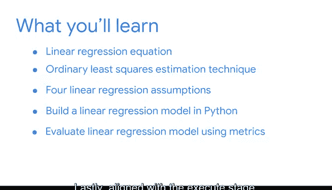

# 009：09_02_01_欢迎来到模块2

## 📚 课程概述

在本节课中，我们将学习如何设置、构建、评估和解释我们的第一个回归模型。我们将回顾模型假设、构建、评估和解释的过程。课程将遵循PACE框架（计划、分析、构建、执行），并通过具体示例引导你完成整个过程。

## 🔄 回顾与引入

欢迎回到谷歌的回归模型课程。很高兴再次与你一起学习。

上一节我们概述了回归分析以及两个核心的基础回归模型：线性回归和逻辑回归。在本节课程中，我们将深入探讨如何设置、构建、评估和解释我们的第一个回归模型。

我们之前定义了许多新概念，如果你需要重新梳理思路，请记住PACE框架：计划、分析、构建、执行。PACE的每个部分都对应回归分析过程的一个环节。有时我们需要重复某些步骤，但这些是需要牢记的阶段。我们将一起通过具体示例来学习这个过程。

## 📈 线性回归核心概念

首先，我们来回顾线性回归。线性回归是一种估计连续因变量与一个或多个自变量之间线性关系的技术。

自变量是其趋势与因变量相关的变量，通常用字母 **X** 表示。因变量是模型试图估计的变量，也称为结果变量，通常用字母 **Y** 表示。

本节课我们将重点学习**简单线性回归**。简单线性回归是一种估计**一个**自变量 **X** 与**一个**连续因变量 **Y** 之间线性关系的技术。

我们在这里回顾的模型假设、代码、评估指标和解释技巧，将直接延伸到更复杂的模型，如多元线性回归。通过巩固简单线性回归的基础，你将准备好应对更高级的模型，以回答不同行业和商业背景中更复杂的问题。

## 🛠️ 你将运用的技能

在学习简单线性回归的过程中，你将综合运用之前掌握的多种技能，包括Python编程、探索性数据分析（EDA）和统计学。

这些工具将使你能够构建一个简单的线性回归模型，帮助你在任何公司或组织中影响战略和决策。我们在这些视频中一起探讨的关键术语、活动和学习资源，在本课程后续部分也将非常重要，届时会回顾我们对简单线性回归的讨论。

## 🗺️ 学习路径规划

我们将按照PACE的所有阶段来学习回归建模。

以下是本模块的主要学习步骤：

*   **计划阶段**：我们将首先回顾线性回归方程，然后学习使用普通最小二乘法估计参数。
*   **分析阶段**：我们将定义简单线性回归的四个关键假设，并使用Python和EDA来验证我们的数据是否满足这些假设。
*   **构建阶段**：我们将一起在Python中构建你的第一个回归模型。你也将有机会独立练习Python和EDA。
*   **执行阶段**：我们将学习几种评估指标和一种帮助你量化模型好坏的技术。最后，我们将使用这些指标来练习向利益相关者和非技术受众解释我们的结果。

我已经迫不及待要开始简单线性回归建模了，让我们开始吧！

## 🎯 本节总结

本节课中，我们一起回顾了线性回归的核心概念，明确了简单线性回归的定义，并规划了遵循PACE框架的学习路径。我们了解到，掌握简单线性回归是理解更复杂模型的基础，并且将综合运用编程、数据分析和统计技能来完成模型的构建与评估。