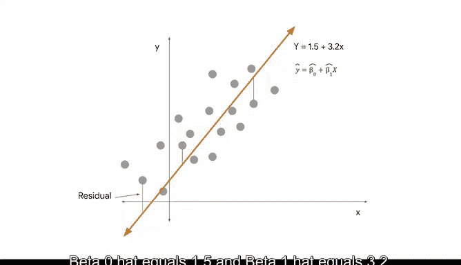

# 011：普通最小二乘估计 📊

在本节课中，我们将学习简单线性回归的核心概念，并深入探讨如何通过**普通最小二乘法**找到数据的最佳拟合线。我们将理解误差的衡量方式，以及计算机如何自动计算出最优的回归参数。

---

## 回顾简单线性回归

在之前的视频中，我们提到了**简单线性回归**。这是一种回归技术，用于估计一个自变量 **X** 和一个连续因变量 **Y** 之间的线性关系。

“线性”一词指的是当数据绘制在 X-Y 坐标平面上时，呈现为一条直线。在简单线性回归中，我们只关注两个变量：一个 X 和一个 Y。

回归线的方程是：
**y = 截距 + 斜率 × x**
用数学符号表示为：
**y = β₀ + β₁ × x**

由于任何给定问题都有多个数据点，我们可以画出许多可能拟合数据的直线。然而，我们的目标是找到**最佳拟合线**，即通过最小化损失函数或误差来最贴合数据的直线。

---

## 衡量误差：残差

为了找到最佳拟合线，我们需要测量误差。我们可以将误差视为我们拥有的数据（观测值）与给定模型生成的预测值之间的差异。

预测值是模型为每个 x 计算出的估计 y 值。观测值（或实际值）与回归线预测值之间的差异称为**残差**。

残差值的公式是：
**残差 = 观测值 - 预测值**

每个数据点都有一个残差。使用数学符号，单个数据点的残差方程为：
**εᵢ = yᵢ - ŷᵢ**
（其中 ε 是一个希腊字母，类似于字母 E，代表 Error/误差）

我们可以为每个数据点计算单独的残差，但需要注意一个重要特性：对于 OLS 估计量，**残差之和始终等于零**。

为了捕捉模型中总误差的汇总，我们将每个残差平方，然后对所有数据点的残差求和。这被称为**残差平方和**。

残差平方和（SSR）是每个观测值与其相关预测值之间**平方差**的总和。

---

## 普通最小二乘法

对于线性回归，我们将使用一种称为**普通最小二乘法**的技术来获得最佳拟合线。

普通最小二乘法，也称为 **OLS**，是一种通过最小化残差平方和来估计线性回归模型中参数的方法。

使用 OLS，我们可以利用样本数据的特性来计算 **β₀̂** 和 **β₁̂**。请记住，“帽子”符号（^）表示它是参数的估计值。我们永远无法知道确切的参数。参数（或 β）是总体的特征，由于我们永远只有样本数据，我们的目标是获得参数的合理估计。

---

## 寻找最佳拟合线的过程

假设我们有一个特定的数据样本，现在想确定一条拟合数据的线。

*   **第一次尝试**：我们设斜率为 1，截距为 2.5。
    *   要计算残差平方和，首先计算每个 x 的预测值。
    *   然后，我们可以找到图上每个 X 观测值的残差。残差是每个观测值与直线预测值之间的差异。
    *   这条线还可以，但让我们尝试更接近数据点。

*   **第二次尝试**：这次，我们设斜率等于 1.25，截距等于 3。
    *   同样，我们必须绘制残差并从图中计算残差平方和。
    *   从图上看，我们似乎更接近了，但很难判断是否得到了最好的线。

我们可以继续尝试不同的线，通过反复试验，挑选一条我们认为最接近数据点的线。但这非常耗时。

好消息是，在 Python 中，计算机将使用 **OLS** 估计技术来测试许多条线，并识别出哪一条是最佳拟合线。

通过 OLS 估计，我们发现 **β₀̂ = 1.5**，**β₁̂ = 3.2**。

我们估计的直线代表了模型对数据的**最佳拟合**。稍后，我们将讨论使用 P 值和置信区间的不确定性，以帮助解释结果。

---

## 总结与过渡

现在我们已经介绍了什么是简单线性回归以及如何通过 OLS 找到最佳拟合线，我们将回归到回归分析框架的节奏中。

接下来，我们将**检验模型假设**，即数据需要满足哪些条件，我们才能在回归工具箱中使用这个强大的新工具。