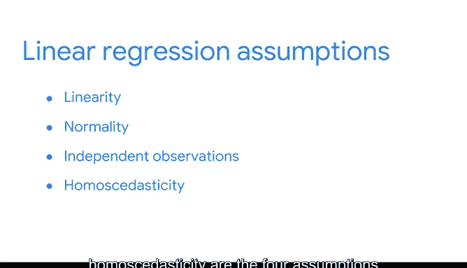

# 012：建立线性回归假设 📊

在本节课中，我们将要学习线性回归分析的核心前提——模型假设。我们将了解四种关键假设的含义，并学习如何使用数据可视化来检验这些假设是否成立。理解并验证这些假设是确保模型有效性和结果可靠性的关键步骤。

---

## 检查模型假设：PACE框架的分析阶段

上一节我们介绍了PACE框架，本节中我们来看看在分析阶段的首要任务：检查简单线性回归模型的假设。

除了模型的技术要求，你还需要考虑所处理问题的商业背景。这将在后续的“计划”阶段进行。之前，我将模型假设定义为关于数据必须为真的陈述，以证明使用特定建模技术的合理性。确保我们根据现有数据使用了正确的模型，能使我们对模型产生的结果充满信心。

可以将模型假设视为PACE框架中“分析”阶段和“构建”阶段之间的桥梁。换句话说，尽可能在构建阶段之前检查假设。某些假设只能在模型构建后才能检查，因此请确保在应用模型后检查这些假设，以确认模型是否有效。

数据可视化可以作为判断模型假设是否满足的工具。幸运的是，Python将在生成这些可视化方面为你提供巨大帮助，我也会在此全程指导你。

以下是简单线性回归的四个关键假设：

*   **线性**
*   **正态性**
*   **观测值独立性**
*   **同方差性**

目前，我们将重点理解每个假设的含义，以及如何使用数据可视化进行检查。

---

## 假设一：线性关系 📈

线性回归的第一个假设恰好是最容易检查的，即线性假设。你已经知道，线性回归中的“线性”源于数据在XY坐标平面上绘制时的样子——一条直线。

为了检测此假设是否满足，你只需确保散点图上的点看起来大致沿一条直线分布。如果可视化图像看起来像一团随机云朵或更接近一条曲线而非直线，那么该假设被视为不成立，意味着该模型不能很好地拟合数据。对于这个数据集，你可能需要一个不同或更复杂的模型。

相反，如果散点图显示数据点聚集在一条线周围，则表明线性回归是代表X和Y之间关系的合适模型。

---

## 假设二：误差正态性 🔔

接下来检查列表中的是正态性假设。该假设认为残差值（即误差）是正态分布的。

由于这个假设是关于残差的，你只能在模型构建后才能检查它。但一旦模型构建完成，你可以创建一个特定的图形，称为残差的**分位数-分位数图**。

如果图上的点看起来形成一条笔直的对角线，那么你可以认为满足正态性，并将此假设从列表中勾选掉。

---

## 假设三：观测值独立性 🔗

第三个是观测值独立性假设，它声明数据中的每个观测值都是独立的。

在这里，利用关于数据收集和所使用变量的背景信息来确定这一点是否成立会很有帮助。如果假设成立，我们期望拟合值与残差的散点图类似于一团随机的数据点云。如果存在任何模式，那么我们可能需要重新检查数据。

---

## 假设四：同方差性 ⚖️

最后但同样重要的是列表上的第四个假设：同方差性。这个听起来很复杂，但了解其字面含义会有所帮助——同方差性意味着具有相同的散布。

在检查同方差性时，散点图再次派上用场。回到拟合值与残差的散点图，沿着因变量的值应该具有恒定的方差。如果你在散点图中没有观察到清晰的模式，那么这个假设就成立。

有时你会听到这被描述为一团随机的数据点云。例如，如果你观察到一个锥形图案，那么该假设就不成立。

---

## 总结与展望

本节课中我们一起学习了简单线性回归的四个核心假设：**线性**、**正态性**、**观测值独立性和同方差性**。在继续前进之前，不必觉得需要立即记住所有这些材料。请记住，数据分析是一个迭代的过程。你可以回顾这些概念，检查假设是否与你的数据相符，然后继续推进回归过程。在本课程中，你将有很多机会来练习和磨练这些技能。

现在，让我们应用你在这里学到的一切，尝试使用Python在一个数据集上进行实践。😊