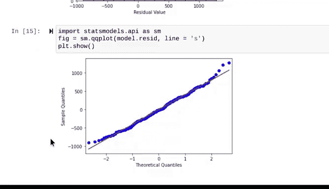

# 013：使用Python探索线性回归 🐧📈


在本节课中，我们将学习如何将简单的线性回归理论应用于实际数据。我们将使用Python，通过一个关于企鹅体重的具体案例，来实践从数据探索到模型构建与评估的完整流程。

---

## 概述

我们将从一个实际问题出发：动物园管理员希望了解企鹅的某些身体特征（如喙长）是否与其体重相关，以便更好地安排喂养计划。我们将使用Python的`pandas`、`seaborn`和`statsmodels`库，通过以下步骤完成分析：数据导入与探索、可视化线性关系、构建线性回归模型、检查模型假设，并最终解释结果。

---

## 数据导入与初步探索

首先，我们需要导入必要的Python包并加载数据集。

```python
import pandas as pd
import seaborn as sns
```

Python的`seaborn`等库内置了一些数据集，方便我们直接调用而无需下载文件。现在，我们加载企鹅数据集并将其保存为一个名为`penguins`的变量。

```python
penguins = sns.load_dataset('penguins')
```

`load_dataset`函数返回一个数据框（DataFrame），因此`penguins`现在是一个数据框。我们可以使用`head`函数查看前几行数据。

数据集中包含几个连续变量（以毫米为单位的喙长、喙深、鳍肢长度，以及以克为单位的体重）和几个离散变量（物种、岛屿、性别）。由于我们进行简单线性回归，因此将重点关注连续变量。

为了简化分析，我们对数据进行了清理：只保留两个企鹅物种，并删除了几行缺失数据。清理后的数据保存在名为`penguins_final`的数据框中。

---

## 可视化变量关系

在构建模型前，我们需要通过可视化来识别变量之间是否存在线性关系。

以下是创建散点图矩阵的代码：

```python
sns.pairplot(penguins_final)
```

`seaborn`的`pairplot`函数会创建一系列散点图，展示每对变量之间的关系。对角线则显示每个连续变量的分布情况，这有助于我们验证数据是否满足线性回归的线性假设。

通过观察散点图矩阵，我们发现了几个看似存在线性关系的变量对：
*   喙长与体重似乎呈正相关。
*   鳍肢长度与喙长似乎呈正相关。
*   体重与鳍肢长度似乎也相关。

---

## 检查线性回归假设

上一节我们通过可视化初步观察了变量关系。本节中，我们将更系统地检查构建线性回归模型所需满足的假设。

我们已知满足了第一个假设——**线性**。幸运的是，散点图矩阵的对角线也显示了每个变量的分布。我们观察到喙长和体重都接近正态分布，这暗示着模型的残差很可能也是正态分布的，从而满足**正态性**假设。

第三个假设是**观测值独立**。由于每一行数据都来自不同的企鹅，我们没有理由认为一只企鹅的喙长或体重与其他企鹅相关。

最后一个关于**同方差性**的假设，我们可以在构建模型后通过绘制残差图来确认。

现在，让我们进一步提取出我们感兴趣的两个变量：喙长和体重。

```python
penguins_subset = penguins_final[['bill_length_mm', 'body_mass_g']]
```

请注意使用双括号，这告诉Python我们想要选择哪些列。

---

## 构建线性回归模型

现在我们已经准备好数据和目标变量，可以开始构建线性回归模型了。

首先，以计算机能理解的格式写出回归公式，并将其保存为名为`formula`的变量。请仔细注意列名，必须精确指定以便计算机运行回归模型。

```python
formula = 'body_mass_g ~ bill_length_mm'
```

公式中，`~`符号让计算机知道其后的变量是我们的自变量X。空格不是必需的，但有助于提高清晰度。

接下来，我们使用`statsmodels`模块中的`OLS`函数创建一个OLS对象。

```python
import statsmodels.formula.api as smf

ols = smf.ols(formula=formula, data=penguins_subset)
```

然后，使用OLS对象的`fit`方法将线性回归模型拟合到数据上，并将结果保存为变量`model`。

```python
model = ols.fit()
```

最后，打印出普通最小二乘估计的结果，该方法是`OLS`函数用于构建线性回归模型的技术。我们使用模型的`summary`方法，它将打印出一个包含许多不同统计量的表格。

```python
print(model.summary())
```

这个表格包含大量信息。在本课程中，我们将先关注表格底部详细说明模型确定的最佳拟合线系数的部分。

由于我们使用的是简单线性回归模型，因此有两个系数：一个截距（β₀）和一个斜率（β₁）。
*   你可以在系数列（表中缩写为`coef`）的`Intercept`行找到最佳拟合线的Y轴截距。在本例中，它是-1707.2919。
*   你可以在系数列的`bill_length_mm`行找到斜率。最佳拟合线的斜率是141.1904。

让我们将其重写为一个线性方程，这将有助于我们后续解释结果。

首先，将变量代入线性方程：**y = 截距 + 斜率 * x**。其中，y是企鹅的体重（克），x是企鹅的喙长（毫米）。

将截距和斜率四舍五入到小数点后两位，我们得到方程：
**体重 = -1707.29 + 141.19 * 喙长**

这意味着，平均而言，喙长每增加一毫米，企鹅的体重就会增加141.19克。请记住，我们仍然需要检查关于残差的一些假设来双重验证这个结论。

---

## 评估模型与检查残差

我们已经成功将线性回归模型拟合到数据上。为了完成对模型假设的检查，现在需要计算并分析残差。

首先，使用模型的`predict`方法计算一些拟合值。然后，你可以通过模型变量访问残差。残差是指使用模型的`resid`属性得到的实际值与拟合值之间的差异。

```python
fitted_values = model.predict(penguins_subset['bill_length_mm'])
residuals = model.resid
```

接下来，创建几个图表来确认我们的发现。

1.  **回归拟合图**：使用`seaborn`的`regplot`函数绘制带有最佳拟合回归线的数据图。你可以观察到变量之间的线性关系、最佳拟合线以及线周围表示模型估计不确定性的小阴影区域。

2.  **残差与拟合值散点图**：创建拟合值相对于残差的散点图。这是处理线性回归时检查各种假设非常常见的图形。从这个图中，你可以观察到残差似乎是随机分布的，这意味着可以假设**同方差性**。一个看起来随机的散点图表明独立性假设未被违反，但这并非我们相信其成立的唯一原因。你可以检查输入并进行更高级的统计测试来确认这一点。

3.  **残差直方图**：创建残差的直方图，以确定残差是否服从正态分布。如果残差呈正态分布，遵循经典的钟形曲线形状，那么你就可以确认**正态性**假设也得到了满足。在本例的直方图中，残差略有偏斜。

4.  **Q-Q图**：为了进一步验证正态性，你可以使用`statsmodels`的`qqplot`函数创建Q-Q图。图中有一条向上的直线对角线，在极端值处有轻微弯曲。你可能想进一步探索这一点，但就目前而言，这很好地确认了正态性假设。

---



## 总结

本节课中，我们一起学习了使用Python进行简单线性回归分析的完整流程。我们从导入和探索企鹅数据集开始，通过可视化初步识别了变量间的线性关系。接着，我们系统地检查了线性回归的假设，并成功构建了一个预测体重与喙长关系的模型。最后，我们通过分析残差图评估了模型的有效性，并确认了关键假设基本得到满足。

现在你已经确认所有假设基本满足，可以说回归模型的结果很可能是合理的。请记住，你随时可以回顾我们所涵盖的内容以及代码和文档。做得很好！😊