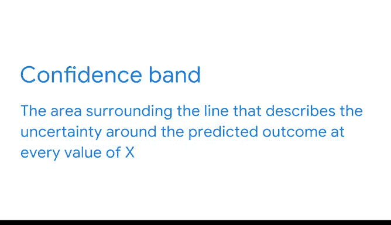

# 014：评估回归分析中的不确定性 📊

在本节课中，我们将要学习如何评估回归分析中的不确定性。我们将探讨如何解读模型结果中的关键指标，如P值和置信区间，并理解它们如何帮助我们负责任地报告模型的局限性。

---

到目前为止，在处理本地动物园的企鹅问题时，我们已使用数据分析流程像数据专家一样思考。

我们通过仔细思考问题并适当筛选可用数据来完成了规划阶段。

我们如何更好地理解企鹅解剖结构与体重之间的关系？

在分析阶段，我们进行了探索性数据分析并检查了模型假设。

然后进入构建阶段，作为提醒，该阶段包含两个部分。

我们构建了模型，并能够提取出一些参数估计值。

现在，我们将专注于构建阶段的下一步：**模型评估**。

模型评估是数据分析中的重要实践。仔细评估和解释回归模型有助于理解其性能和准确性。

---

## 回顾模型结果

上一节我们介绍了模型的构建，本节中我们来看看如何评估其不确定性。

首先，让我们回顾一下回归模型的结果。根据结果摘要，我们知道普通最小二乘法已确定最佳拟合线的截距为 **-1707.29**，斜率为 **141.19**。

然而，随机性和不可预测性是每个回归模型的特征，这使得我们难以以100%的确定性预测结果。毕竟，观测值与预测值之间仍然存在差异。

你刚刚找到的是你最确定的模型。为了进一步探讨不确定性的概念，让我们将注意力转向OLS摘要表中关于截距和喙长的其余行。

---

## 理解P值与置信区间

摘要表中有一列标记为 **P > |t|**。这表示与系数估计值相关的**P值**。

P值列右侧的两列表示围绕系数估计值的**95%置信区间**。

以下是评估简单线性回归结果时的关键点：
*   在评估简单线性回归结果时，你会较少关注截距行，而更多地关注涉及你感兴趣的独立变量的行。在本例中，即“喙长”。
*   因此，你可以说喙长的系数估计值为 **141.19**，P值为 **0.000**，置信区间为 **[131.788, 150.592]**。

---

## 置信区间的含义

之前学习假设检验时，置信区间被定义为一个描述估计值周围不确定性的数值范围。

在线性回归的情况下，我们估计的是参数。因此，**95%置信区间意味着该区间有95%的几率包含斜率的真实参数值**。

如果斜率和截距略有不同会怎样？让我们在图上画出几条斜率和截距都略有不同、但都在置信区间内的线。

我们会在回归线周围得到一个区域，该区域在中心附近较窄，并向线的两端略微展开。这个形状可能看起来很熟悉，你之前使用Seaborn的`regplot`函数绘制过它。

这些线构成了回归线周围的阴影区域。本质上，参数估计值周围的置信区间揭示了我们所说的**置信带**。

> 置信带是围绕回归线的区域，描述了在每个x值处预测结果的不确定性，通常以散点图上最佳拟合线周围的阴影区域表示。置信带揭示了回归线上每个点的置信区间。

置信带只是负责任地报告你发现的另一种方式。

---

## 总结与反思

本节课中我们一起学习了如何评估回归分析中的不确定性。

简单线性回归是任何数据专家工具箱中的强大工具。无论你是在分析流媒体服务价格上涨的财务影响，还是在为时装精品店预测销售额，回归分析都可以帮助你发现并理解数据背后的关系。

但我们必须记住，数据是嘈杂的，在使用简单线性回归等回归模型时，结果可能具有不确定性。即使是最好的数据也无法讲述完整的故事。

作为一名数据分析专家，你的目标不仅应该是评估模型的性能和准确性，还应该报告不确定性。沟通置信区间和置信带是成为一名负责任的数据专家的一部分。这些指标也将帮助你理解模型在多大程度上能够揭示数据背后的故事。